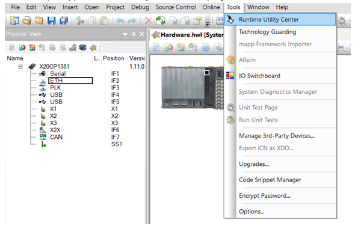
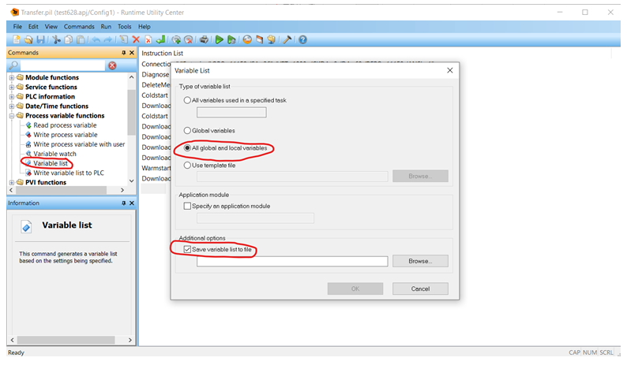

# 037CPU进入了Servicemode，还有办法看到内部变量的实际值吗
## 问题描述

CPU进入了Servicemode，还有办法看到内部变量的实际值吗

## 解决方案

PLC进入Service Mode后，可以通过RUC手动导出变量信息，方法如下：
1.	进入RUC，选择Create、modify and execute projects
 

选择路径，保存至本地即可查看变量

