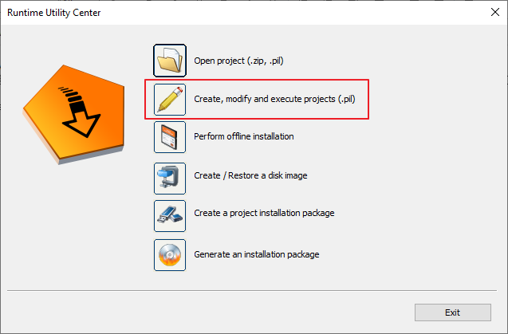
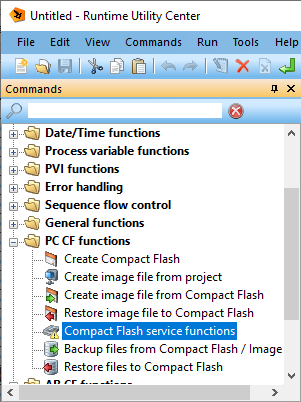
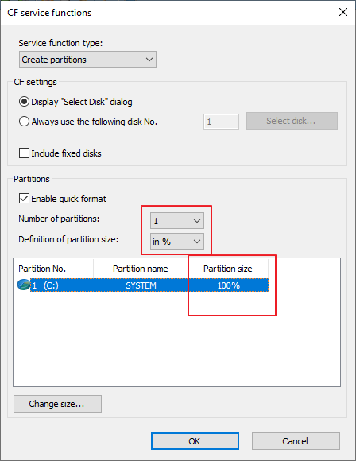
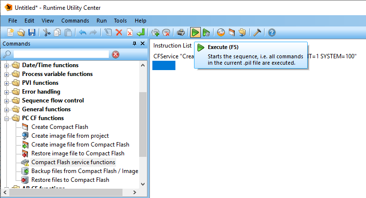
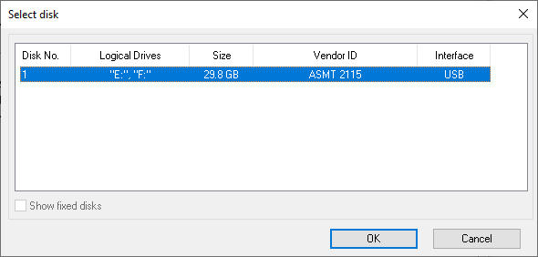

# 使用烧卡功能误将程序下载U盘，导致U盘空间变小，如何恢复
## 问题描述
用AS Offline Installation 烧卡时，错误的选择自己的U盘，导致U盘空间变小，如何恢复？

## 解决方案
这是因为采用了B&R安全分区模式，将CF/CFast卡自动分为系统分区（C盘），项目应用分区（D和E盘）及用户分区（F盘，需要额外配置），其中分给C盘的空间较小，且其他盘符的格式Windows无法识别，故感觉CF/CFast卡在烧卡后变小了。如果误操作将U盘当成了CF/CFast卡，那么U盘空间也会变得很小导致无法使用。

可以使用Runtime Utility Center对CF/CFast进行恢复：

1. 选择Create, modify and execute projects(.pil)

2. 在Commands中选择PC CF functions... -> Compact Flash service functions

3. 注意要将Number of partitions设为1、Definition of partition size选为100%

4. 选择Excute

5. 选中待恢复的CF/CFast卡点击OK即可恢复

注意：此方法仅能恢复U盘空间，无法恢复因误操作导致的丢失数据！