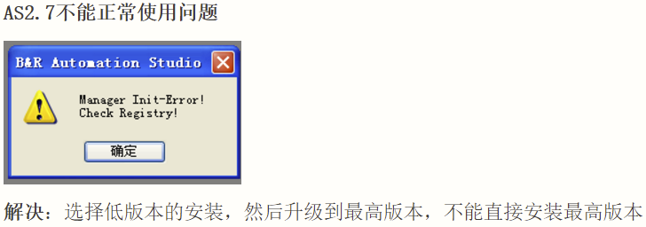
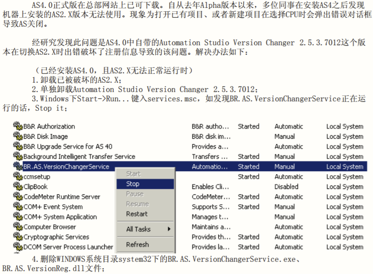

# 041AS2.7安装后出现的问题
## AS2.7支持在什么操作系统上安装？
- Win7 32位或者Windows XP,建议使用Windows XP
---
## 启动报错Runtime Error
- 
- 答：这个是系统版本的问题。
- 建议：XP安装AS2.7，需要安装AS2.7UP17以前的版本，win7需要安装AS2.7UP17及以后的版本。!

---
## 启动报错Manager Init-Error
- 
- 在Windows XP上需要先安装AS2.7 SP17以前版本，建议安装AS2.7 SP7版本
- 
- 安装完成后再安装SP18的补丁包
- 

---

- 关于安装AS4.0之后，AS2.X不能正常打开的问题
- 
