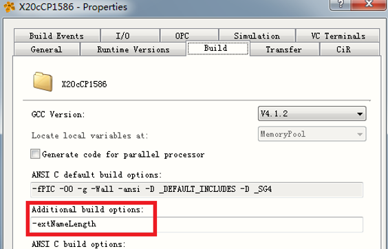
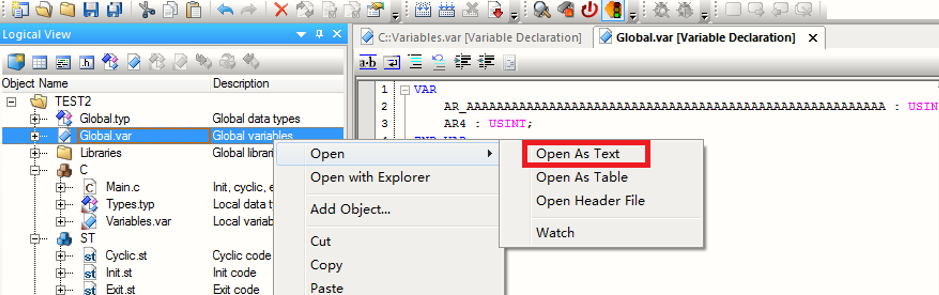
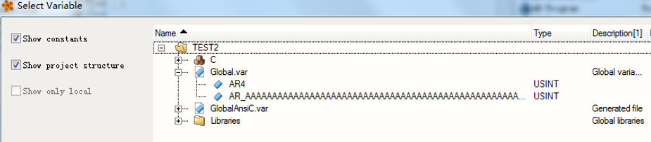
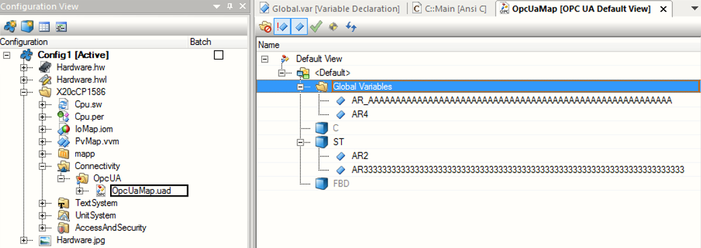
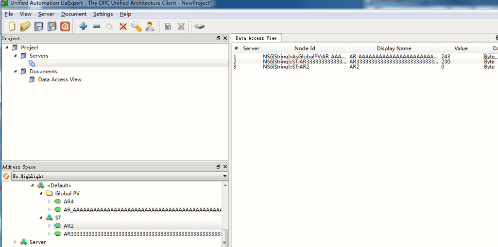
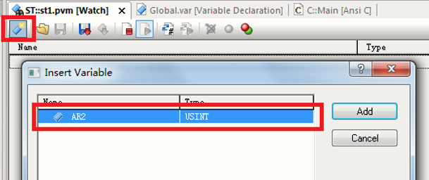
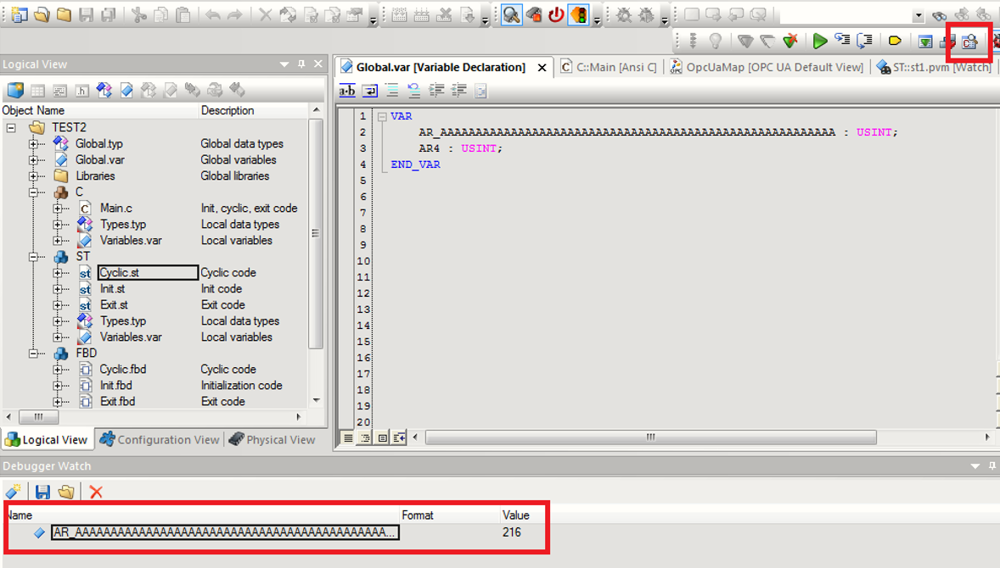
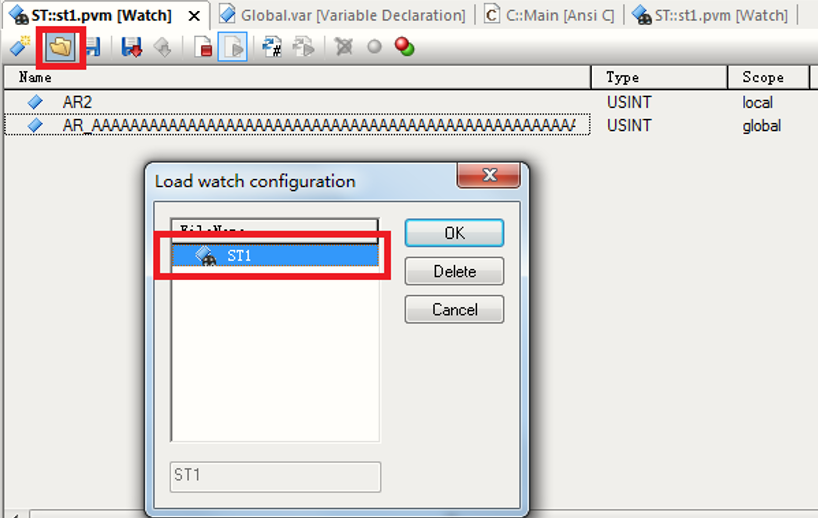
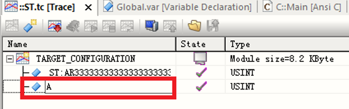
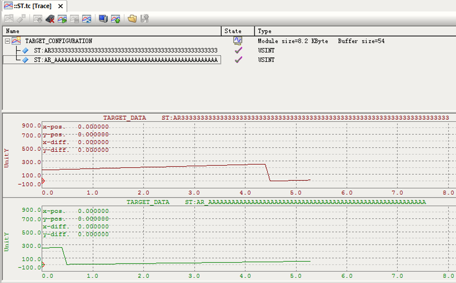

# 042AS4.2以上版本如何支持长度超32字符变量
## 问题
- AS4.2 ~ AS4.11目前默认支持声明的变量的字符长度为32个字符，但有些项目的变量命名规则较为特殊，请问如何解决？

## 解决方式

### 软件配置
- 默认情况下AS4.2中变量字符长度被限定为最大32个字符，可通过Project/change ruantime versions/option中添加 “-extNameLength”来实现长度超32字符的变量定义。
- 

### 变量定义
- 定义字符长度超32的变量时，不能以Table的形式打开变量表进行定义，要以Text的形式打开进行定义。同时变量表中定义了超32字符的变量，该变量表也只能以Text的形式打开进行编辑查看，以Table的形式无法打开。
- 
- 在AS4.3各种编程语言下均可通过以下图标来选择查找长字符变量
    - 

### OPC UA测试
- OPC UA配置中也可正常选择长字符变量，并利用客户端软件测试通讯状态正常。
- 
- 

### Watch功能测试
- Watch功能下，变量选择表里无法显示长字符变量，可通过两种方式实现对长字符变量的Watch。
- 
- 利用debug watch的方式对变量进行断点调试
- 
- 手动添加长字符变量到Watch文件，并在Watch中打开添加好的Watch文件。
- 

### Trace功能
- Trace功能下在变量选择列表里同样不显示长字符变量，但是可以直接输入长字符变量名来进行Trace变量添加
- 
- 

