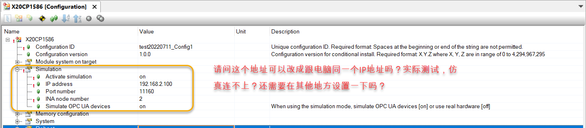
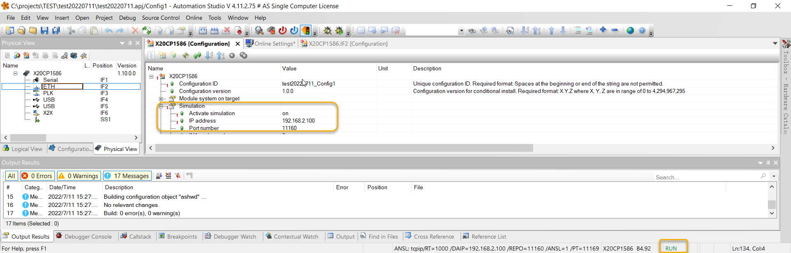
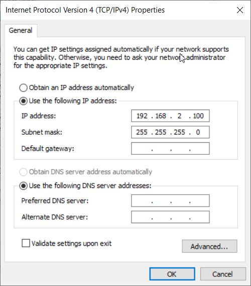
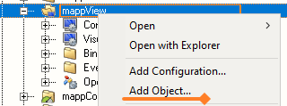
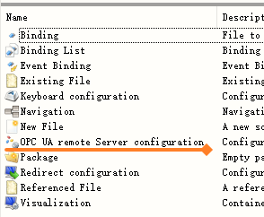
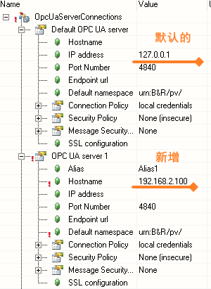

# 045仿真状态下如何更改IP
## 需求说明
- 很多项目为了演示方便，在Windows上开启ARSim，在一个网络下，可以让其他的笔记本通过此电脑的IP地址，访问此电脑上的mappView画面
- 在AS4.7之前，默认配置下，mappView画面可以直接被其他电脑通过访问
- 在AS4.7开始，默认配置下，mappView画面无法显示。

## 问题1，AS4.7及更高版本，如何使其他电脑访问到mappView画面？

### 解决方法

需要插上网线，激活网口

## 问题2，由于修改了系统配置默认的Simulation的IP地址，mappView的OPC UA通讯失联，如何解决？

### 解决方式
- 在Configuration View下，在mappView添加OPC UA remote Server
- 
- 
- 设置为Simulation中被调整的IP地址
- 

