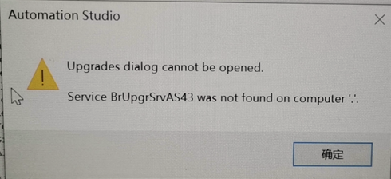
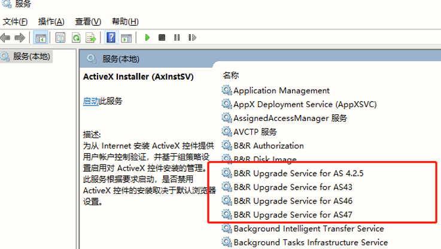
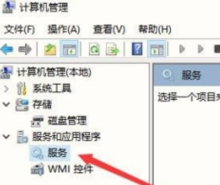

> 052AS无法升级固件Upgrades_dialog_cannot_be_opened

> Tags: #固件安装 #AS

- [1 问题描述](#1%20%E9%97%AE%E9%A2%98%E6%8F%8F%E8%BF%B0)
- [2 问题原因](#2%20%E9%97%AE%E9%A2%98%E5%8E%9F%E5%9B%A0)
- [3 解决方法](#3%20%E8%A7%A3%E5%86%B3%E6%96%B9%E6%B3%95)

# 1 问题描述

- 升级固件时弹出如下画面
- 

# 2 问题原因

- 升级服务没有启动
- 

# 3 解决方法

- 这类的服务都要打开，如果没有这个服务就是安装的时候被安全软件禁止了,得重装AS.
- 
- 
