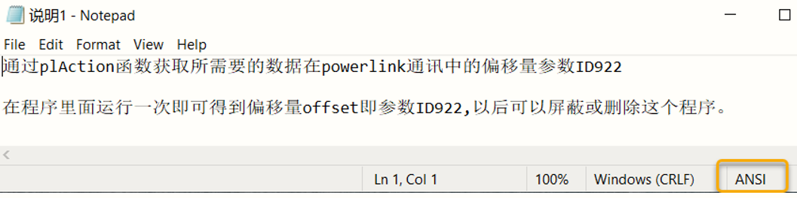

# 054AS工程里的文本文件打开乱码
## 问题描述：
- 电脑上新建的文本文件，拖拽到工程内在线打开乱码，拖放到电脑上正常显示。
- 
## 问题原因:
- 默认新建的文本文件编码格式是UTF-8，需要改成ANSI编码格式。
## 解决办法：
- 在txt文件的另存为窗口中可以设置文本文件的编码格式，由默认编码UTF-8更改为ANSI，具体操作请参照以下步骤。
- 1、在电脑上打开或新建一个TXT文本文件，输入文本内容。
- 2、然后在界面的上方工具栏中找到“文件”选项，进行点击。
- 3、然后在出现的下拉框中，点击“另存为”选项。
- 
- 4、然后在出现的窗口中，将编码选项设置为“ANSI”
- 
- 5、然后设置好文件名，点击保存按钮即可。完成以上设置后，即可修改一个txt文本文件的编码格式为ANSI
- 
- 
