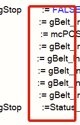
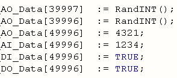
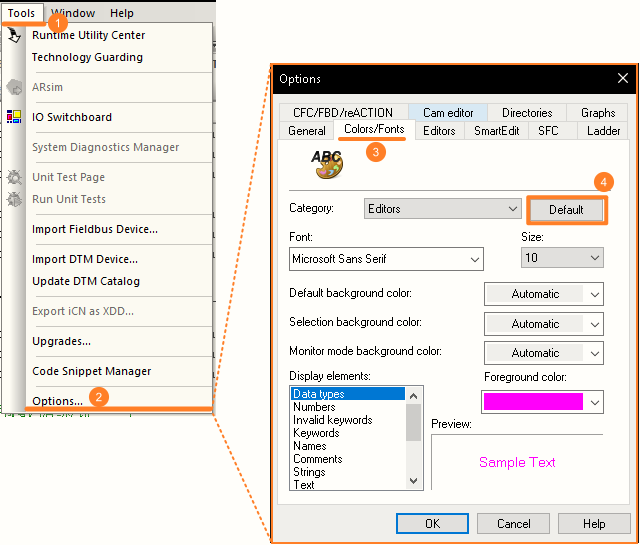
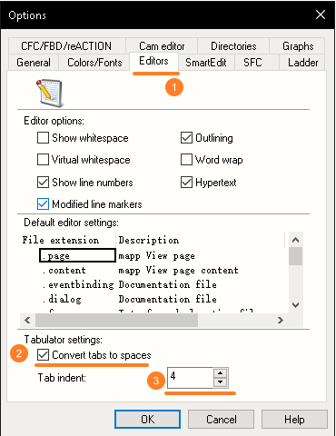

# 057如何设置使AS代码用Tab排布整齐
## 需求
- 如何使得代码用Tab对齐，提升代码可读性？
- 不期望的效果
    - 
- 期望的效果
    - 

## 调整方式
- AS设置页面，Tools - Options中，选择Colors/Fonts的Tab页，点击Default按钮。
- 
- 为便于代码的显示调整，建议按照以下设置。
- 
- 在代码编辑页面，使用`Tab`键即可使每行代码按期望对齐，提升代码可读性。
