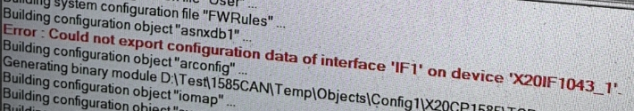
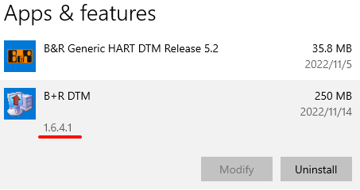
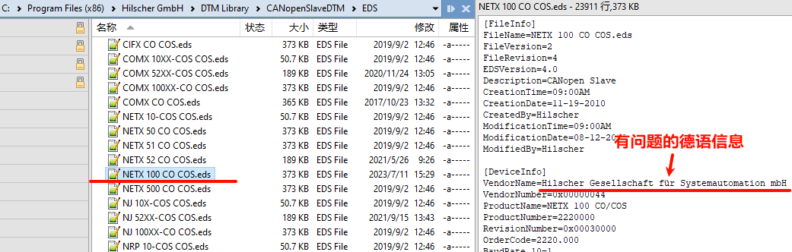
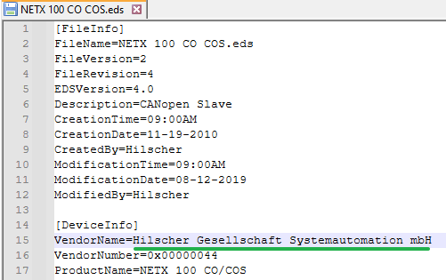
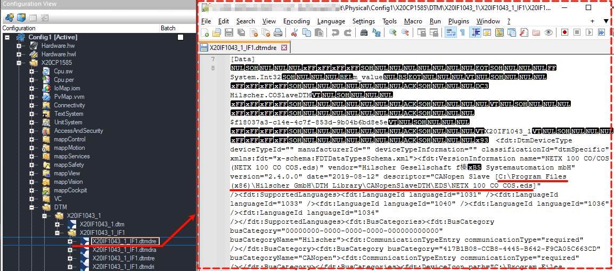
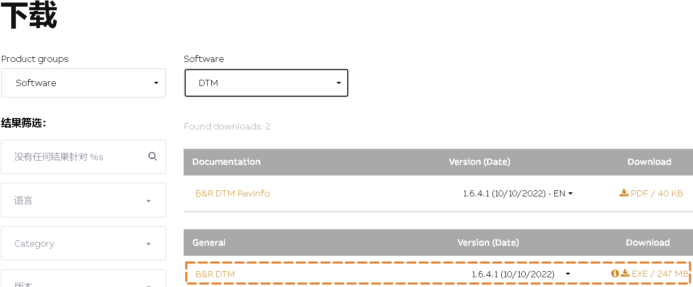

> Tags: #DTM #AS
- [1 B01.059.AS中插入X20IF1043-1模块后编译报错 Could not export configuration data of interface 'IF1' on device 'X20IF1043_1'](#_1-b01059as%E4%B8%AD%E6%8F%92%E5%85%A5x20if1043-1%E6%A8%A1%E5%9D%97%E5%90%8E%E7%BC%96%E8%AF%91%E6%8A%A5%E9%94%99-could-not-export-configuration-data-of-interface-if1-on-device-x20if1043_1)
- [2 现象](#_2-%E7%8E%B0%E8%B1%A1)
- [3 根本原因](#_3-%E6%A0%B9%E6%9C%AC%E5%8E%9F%E5%9B%A0)
- [4 解决方式一：修改eds文件](#_4-%E8%A7%A3%E5%86%B3%E6%96%B9%E5%BC%8F%E4%B8%80%EF%BC%9A%E4%BF%AE%E6%94%B9eds%E6%96%87%E4%BB%B6)
	- [4.1 原因分析](#_41-%E5%8E%9F%E5%9B%A0%E5%88%86%E6%9E%90)
- [5 解决方式二](#_5-%E8%A7%A3%E5%86%B3%E6%96%B9%E5%BC%8F%E4%BA%8C)

# 1 B01.059.AS中插入X20IF1043-1模块后编译报错 Could not export configuration data of interface 'IF1' on device 'X20IF1043_1'

# 2 现象

- 在AS项目中插入X20IF1043-1模块正常，编译即报错Could not export configuration data of interface 'IF1' on device 'X20IF1043_1'.
- 
- 无论使用哪个AS软件版本，4.7,4.12均出现此问题。
- 不使用X20IF1043-1模块，换用X20IF1061-1等模块均正常。

# 3 根本原因

- 1.6版本DTM中X20IF1043-1模块描述信息文件中包含德文字符
- 

# 4 解决方式一：修改eds文件

- 1___找到 DTM软件安装位置 `C:\Program Files (x86)\Hilscher GmbH\DTM Library\CANopenSlaveDTM\EDS`
    - 其中 `NETX 100 CO COS.eds` 文件即为 X20IF1043-1 硬件模块的EDS文件
    - 
- 2___使用Notepad++软件，使用管理员权限打开软件
- 3___将此EDS文件进行修改，将导致问题的德语部分信息进行删除，保存文件
    - 
- 4___将AS项目中的X20IF1043-1模块删除，重新导入配置

## 4.1 原因分析

- 贝加莱的通信模块例如X20IF1043-1的导入，均是导入硬件配置信息后，自动从DTM系统中引入相关的文件，将配置信息以二进制文件的方式存储在 Configuration View → 对应配置名 → 对应PLC名称 → DTM → 对应通信模块名称文件夹下
- 而系统编译时报错提示的无法导出数据，是在X20IF1043_1模块上，通过查找，可以对应名称为DTM相关内容
- 而经过测试，只有X20IF1043-1模块有问题，而其他通信模块均正常，则可以定位至X20IF1043-1模块所对应的EDS文件等相关配置文件有问题
- 通过X20IF1043_1_IF1.dtmdre 文件中引用的文件可知，引用的eds文件真实名称为 NETX 100 CO COS.eds，并且此文件中确实有显示异常的德语信息。
- 

# 5 解决方式二

- 从B&R官网下载安装1.5版本DTM并替换安装
- 🔴 实在没办法可以这样调整，不过需要注意，切换DTM版本，可能会导致项目在其他其他人电脑上编译异常
- 安装位置
    - 
