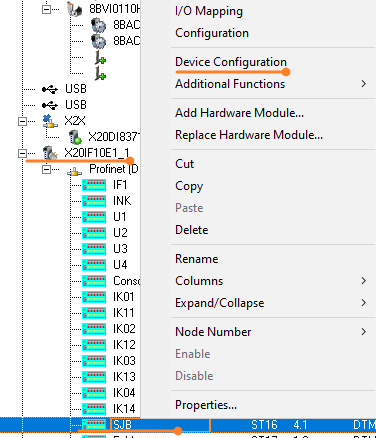
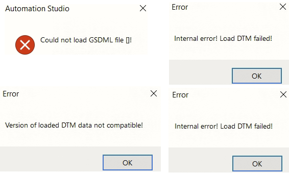
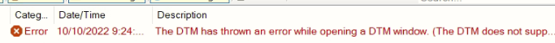
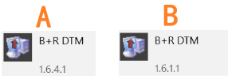

# 060可以编译通过但无法配置其他人电脑中正常的DTM模块从站
# 现象
- AS中配置了DTM模块，例如X20IF10E1-1模块，配置了从站模块。
- 开发人员A电脑中能够正常进行Device Configuration，进行从站配置的修改。
- 
- 开发人员B拿到开发人员A的AS项目，能够正常编译，但当对DTM的从站进行配置时，系统即开始报错
- 
- Output窗口提示
- 

# 原因
- 检查了不同电脑之间的DTM版本，发现了原因，开发人员A与B电脑中安装的B+R DTM版本不一致。
- 
- 开发人员A之前安装了AS4.12,因此B+R DTM的版本升级至了1.6.4.1，而开发人员B的电脑中最高的AS版本是4.10，B+R DTM版本还是1.6.1.1。
- 使用高版本的DTM编译后，项目中的DTM从站文件信息更新，低版本的DTM不兼容。

# 解决方式
## 方法一 
- 开发人员A降低自己的B+R DTM版本。
- 前往贝加莱官网，下载并安装。
- 
- 重新编译项目后，将项目交给开发人员B

## 方法二
- 开发人员B在自己电脑上安装和开发人员A一样的B+R DTM版本

