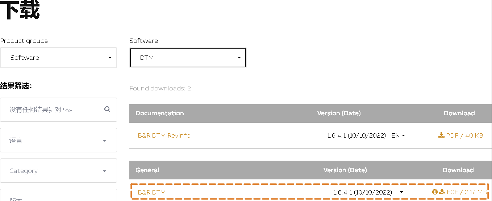

- [1 B01.060.可以编译通过但无法配置其他人电脑中正常的DTM模块从站](#_1-b01060%E5%8F%AF%E4%BB%A5%E7%BC%96%E8%AF%91%E9%80%9A%E8%BF%87%E4%BD%86%E6%97%A0%E6%B3%95%E9%85%8D%E7%BD%AE%E5%85%B6%E4%BB%96%E4%BA%BA%E7%94%B5%E8%84%91%E4%B8%AD%E6%AD%A3%E5%B8%B8%E7%9A%84dtm%E6%A8%A1%E5%9D%97%E4%BB%8E%E7%AB%99)
- [2 现象](#_2-%E7%8E%B0%E8%B1%A1)
- [3 原因](#_3-%E5%8E%9F%E5%9B%A0)
- [4 解决方式](#_4-%E8%A7%A3%E5%86%B3%E6%96%B9%E5%BC%8F)
	- [4.1 方法一](#_41-%E6%96%B9%E6%B3%95%E4%B8%80)
	- [4.2 方法二](#_42-%E6%96%B9%E6%B3%95%E4%BA%8C)

# 1 B01.060.可以编译通过但无法配置其他人电脑中正常的DTM模块从站

# 2 现象

- AS中配置了DTM模块，例如X20IF10E1-1模块，配置了从站模块。
- 开发人员A电脑中能够正常进行Device Configuration，进行从站配置的修改。
- 
- 开发人员B拿到开发人员A的AS项目，能够正常编译，但当对DTM的从站进行配置时，系统即开始报错
- 
- Output窗口提示
- 

# 3 原因

- 检查了不同电脑之间的DTM版本，发现了原因，开发人员A与B电脑中安装的B+R DTM版本不一致。
- 
- 开发人员A之前安装了AS4.12,因此B+R DTM的版本升级至了1.6.4.1，而开发人员B的电脑中最高的AS版本是4.10，B+R DTM版本还是1.6.1.1。
- 使用高版本的DTM编译后，项目中的DTM从站文件信息更新，低版本的DTM不兼容。

# 4 解决方式

## 4.1 方法一

- 开发人员A降低自己的B+R DTM版本。
- 前往贝加莱官网，下载并安装。
- 
- 重新编译项目后，将项目交给开发人员B

## 4.2 方法二

- 开发人员B在自己电脑上安装和开发人员A一样的B+R DTM版本
