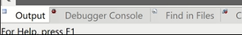
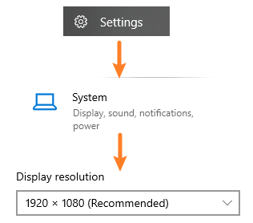
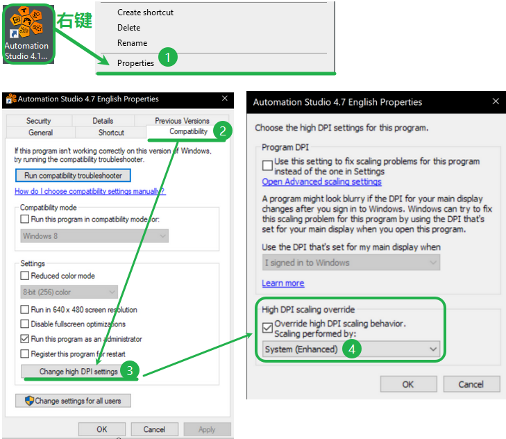

> Tags: #AS

- [1 B01.064.在4K分辨率下使用AS软件图标显示异常](#_1-b01064%E5%9C%A84k%E5%88%86%E8%BE%A8%E7%8E%87%E4%B8%8B%E4%BD%BF%E7%94%A8as%E8%BD%AF%E4%BB%B6%E5%9B%BE%E6%A0%87%E6%98%BE%E7%A4%BA%E5%BC%82%E5%B8%B8)
- [2 原因](#_2-%E5%8E%9F%E5%9B%A0)
- [3 解决方式一：调整分辨率](#_3-%E8%A7%A3%E5%86%B3%E6%96%B9%E5%BC%8F%E4%B8%80%EF%BC%9A%E8%B0%83%E6%95%B4%E5%88%86%E8%BE%A8%E7%8E%87)
- [4 解决方式二：使用DPI参数设置](#_4-%E8%A7%A3%E5%86%B3%E6%96%B9%E5%BC%8F%E4%BA%8C%EF%BC%9A%E4%BD%BF%E7%94%A8dpi%E5%8F%82%E6%95%B0%E8%AE%BE%E7%BD%AE)

# 1 B01.064.在4K分辨率下使用AS软件图标显示异常

- 现在在4K分辨率情况下，Automation Studio软件的图标显示异常，影响使用
- 

# 2 原因

- 因为贝加莱Automation Studio的图标是位图，不是SVG图，因此在4K分辨率下显示异常
- 影响范围为AS3，AS4所有版本
- 图标存储的位置：`AS软件安装路径所在文件夹\AS412\AS\Images`

# 3 解决方式一：调整分辨率

- 调整电脑的分辨率，设置为1920 x 1080的分辨率
    - 
- 设置完成后，重启电脑后生效

# 4 解决方式二：使用DPI参数设置

- 对要打开的AS软件，右键 → 属性 → Compatibility → Change high DPI settings → High DPI scaling override
    - 打勾选项，并选择 System(Enhanced)
- 
