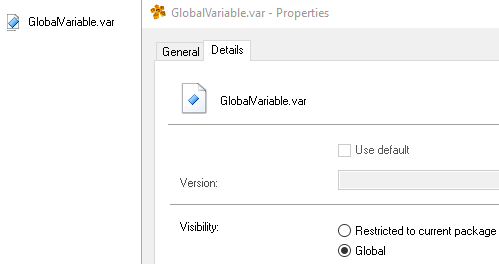

# 贝加莱变量声明类别
- 全局变量
    - 在申明的变量，所有程序都可以访问
    - 图标为全白
    - 只能在Pakage（包）下创建，可在包限定变量与全局变量两种属性切换
    - 
- 包限定变量
    - 对于包中的声明文件，特殊的可见性属性(可见性:"Restricted to current package")可以将范围限制到此包。
    - 文件中使用此可见性定义的所有名称的作用域在相应包中的所有源文件中都有效。
    - 但是，这些类型的名称在整个系统中仍然必须是唯一的
    - 图标为有蓝色箭头
    - 只能在Pakage（包）下创建，可在包限定变量与全局变量两种属性切换
    - 
- 局部变量
    - 
    - 图标为有棕色箭头
    - 只能在任务下创建且只能为局部变量

# 变量声明文件在AS的项目文件中是如何体现的
- 

## 全局变量与包限定变量判断方式
- 同级路径下有.pkg文件
- .pkg文件中描述了.var文件的属性
    - `有 Private="true" ` 为 包限制变量申明表
    - `没有 Private="true" `为 全局变量申明表
- 
## 局部变量判断方式
- 同级路径下有.prg文件
- .prg文件中标注的.var属性中包含有`Private="true" ` (此属性可供参考，添加与否不影响局部作用域属性)
- 