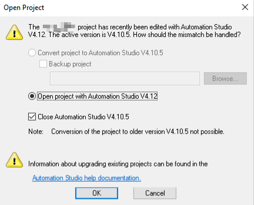
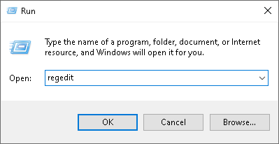
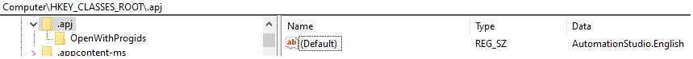
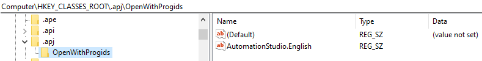
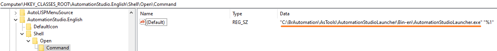
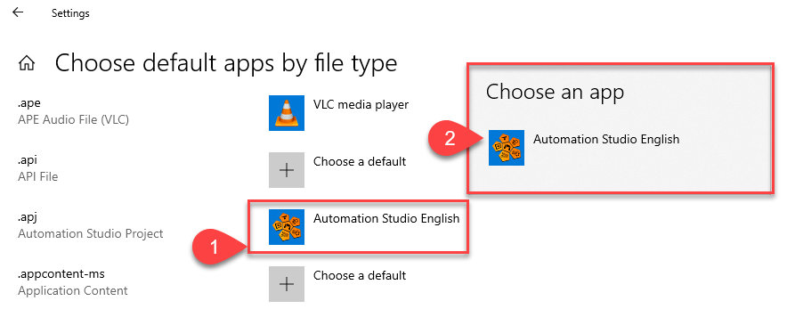

## 现象
- 如果同一台电脑上安装了多个AS版本软件，常见的现象为：双击任何的AS版本项目的.apj文件，均是以最后安装的那个AS软件打开。
- 例如，电脑上先后安装了AS4.7,AS4.12,AS4.10，如果双击打开AS4.12的项目下的.apj文件，则会自动以最后安装的AS4.10版本软件打开，并提示如下信息，需要我们再点击一下OK，才能再自动以AS4.12打开。
- 
- 这会在一定程度上浪费我们的时间，但我们可以通过修改注册表来修正这个问题。
- 此问题在我们安装一个旧的AS软件版本时会出现。

## 修正方式
- 1.打开`运行（RUN）`命令，输入`regedit`进入注册表编辑器
- 
- 2.将默认值更改为“AutomationStudio.English”
- 

- 3.将`HKEY_CLASSES_ROOT\.apj\OpenWithProgids`中的 .apj 文件条目更改为`AutomationStudio.English”=“`
- 

- 4.检查并将`HKEY_CLASSES_ROOT\AutomationStudio.English\Shell\Open\Command`更改为Automation Studio Launcher的路径
- 

- 5.重启系统

- 6.[ 可选 ] 若打开后仍是错误的AS软件打开，打开 Windows 设置“按文件类型选择默认应用程序”并找到 .apj。选择一个不同的选项（这个选项可能显示为同名选项）
    - 点击Automation Studio English
    - 选择其他可用应用

- 

## 可用的reg文件信息
- 文件名：FixAutomationStudioLauncer.reg
```
Windows Registry Editor Version 5.00
 
[HKEY_CLASSES_ROOT\.apj]
@="AutomationStudio.English"
 
[HKEY_CLASSES_ROOT\.apj\OpenWithProgids]
"AutomationStudio.English"=""
 
[HKEY_CLASSES_ROOT\AutomationStudio.English]
@="Automation Studio Project"
 
[HKEY_CLASSES_ROOT\AutomationStudio.English\DefaultIcon]
@="C:\\BrAutomation\\AsTools\\AutomationStudioLauncher\\Bin-en\\AutomationStudioLauncher.exe"
 
[HKEY_CLASSES_ROOT\AutomationStudio.English\Shell]
 
[HKEY_CLASSES_ROOT\AutomationStudio.English\Shell\Open]
 
[HKEY_CLASSES_ROOT\AutomationStudio.English\Shell\Open\Command]
@="\"C:\\BrAutomation\\AsTools\\AutomationStudioLauncher\\Bin-en\\AutomationStudioLauncher.exe\" \"%1\""
```

> 复制内容至一个后缀为.reg的文件，核对并修改AS软件安装路径，双击执行。

## 参考链接
- [Fix: Opening the correct Automation Studio version - Global Application Platform - Confluence (br-automation.com)](https://confluence.br-automation.com/display/RDGO/Fix%3A+Opening+the+correct+Automation+Studio+version)
- 