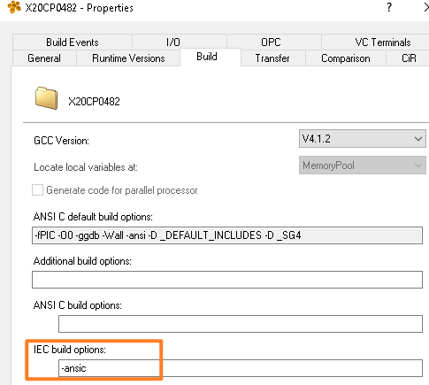

## 机制
- 所有的IEC代码（st代码、梯形图代码、SFC代码）均是先被AS软件转换为C代码，再被编译至.br文件中

## 编译出C代码的设置方式
- 在`Project - Change Runtime Version`处，选择Tab页`Bulid`，找到`IEC build options`，添加以下参数
    - -ansic
    - 
## 获取地址
- `.\Temp\Objects\CONFIGURATION_NAME\CPU_NAME\TASK_NAME\FILENAME[.st](http://main.st/).c`

- IEC代码与生成的C代码对比
- 
## 参考链接
- [Transpile IEC to C - Global Application Platform - Confluence (br-automation.com)](https://confluence.br-automation.com/display/RDGO/Transpile+IEC+to+C)

