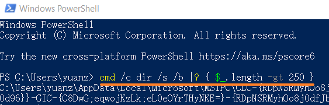

## 现象
- 将mappView项目存放在复杂或较长命名的的文件夹中，这会导致编译问题。
- 

- Windows 将路径名总长度限制为 260 个字符，而在编译 mappView时很容易达到，这给我们开发造成很多不便，不得不改变项目的存放位置。
  
- 如果文件的路径字符总数超过 260，则AS项目无法编译生成或传输。存在以下选项用以解决：
    -  将项目移动到较短的项目根路径，例如放在D盘根目录下。
    -  缩短作为路径一部分的配置或 CPU 名称
    -  在 Windows 10 上，您可以禁用 260 个字符的限制。

## 解决方式
- 运行PowerShell，并输入 `cmd /c dir /s /b |? { $_.length -gt 250 }`
- 
- 