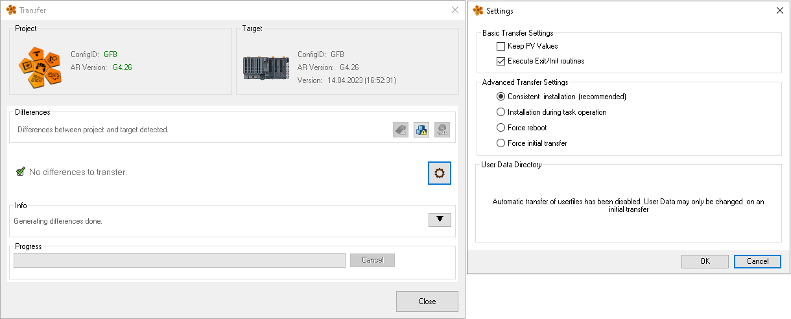

## 在线更新有什么选项

### Basic Installation Settings

|参数|默认值 |描述|
|:-----|:-----|:-----|
|Keep PV values|No |选择该选项后，待安装程序的本地PV变量值将在安装完成后保留  此选项对未更新的程序的全局PV和本地PV没有影响 - 它们的值始终保留。  如果在传输过程中发生重新启动，则非掉电保持变量的值将丢失。因此，在设置“Keep PV values”后，在重新启动后只保留掉电保持变量的值|
|Execute exit/init subroutines|Yes  推荐|如果选择此选项，则在更新程序时，将执行目标系统上现有程序的退出子例程和新程序的初始化子例程。 退出/初始化子例程旨在确保程序执行初始任务，例如请求资源或初始化 pv 一次(init 子例程)或清理资源(退出子例程)。 此设置仅影响现有程序的更新。当程序第一次安装时，无论是否选择此设置，它的初始化子例程总是被执行。当一个程序被卸载(删除)时，不管是否选择了这个设置，它的退出子例程总是被执行。 |

### Advanced installation settings
- 指定了重新启动和程序安装的行为。

|参数|默认值|描述|
|:-----|:-----|:-----|
|Consistent installation|Yes  推荐|在安装过程中，所有程序都被停止，即使是未改变的程序。这可以确保永远不会出现旧的和新安装的程序同时运行的情况。  程序停止的时间尽可能短，在此期间，PV和I/O通道不被刷新（仅在传输模块被传输并做了准备之后）。然而，每个程序的持续时间比任务运行期间的安装程序要长。 |
|Installation during task operation	|No|不受安装直接影响的程序（不会被更新）在安装过程中继续运行不受影响，而要更新的程序则被一个接一个地替换。  出于兼容性的考虑，这些安装方案应该只用于现有的项目。这种安装变体的问题是，要被替换的现有程序在目标系统上继续与已经被换掉的其他程序同时运行。如果这些程序有依赖关系，这很容易导致不一致的状态（例如，如果它们对相同的数据进行操作）。|
|Force restart|No|目标系统不只是在需要时重启（如其他安装方案），而是一直重启。在启动时（在程序运行之前），新程序被安装。之后，继续正常启动，并执行所有程序的初始化子程序。  如果用户程序在运行过程中不能正确处理更新，可以使用这种安装方案（例如，如果在初始化子程序中请求资源，但在退出子程序中不再释放）|
|Force initial installation	|No|强制初始化安装|

## 什么时候需要重启？
- 当发生变化，例如对SYSCONF或ARCONFIG数据产生影响时，需要重新启动。
- 这些变化由Automation Studio监控，Automation Studio会通知用户是否需要重启。

- 以下变化会导致目标机的重新启动：
    - 硬件结构的变化（添加、删除或替换硬件模块）；
    - 硬件模块版本的变化；
    - 影响目标机在运行时行为的硬件和系统配置参数的变化（循环系统、内存配置...）；
    - 隐含地或明确地添加二进制模块，携带项目安装后强制重新启动的信息。例如，由 motion legacy 或 mappMotion 引入的一些系统扩展。像这样的模块会在软件不匹配对话框中被特别标注，可以从项目安装对话框中打开。

## PV 变量值应用
对 Process Variable 变量值应用的要求
在安装过程中，在某些条件下可以保留现有的 PV 值（即安装后保留 PV 的数值）。如果不满足这些条件，那么变量值将被重新初始化。

只有在以下条件下才能保留变量值：
- 局部变量 PV (volatile or remanent)，如果在被更新的程序中已经在目标系统上使用了，则可以保留这些 PV。
- 全局变量 PV (volatile, remanent or permanent)，如果在目标系统上安装之前已经在任何程序中使用过，则可以保留。

如果满足这些基本要求（即如果 PV 变量值在安装前已经存在），则根据安装设置，保留以下变量类型的值（标记为 "是"）或不保留但重新初始化（标记为 "否"）：

|      |Local volatile PV|Global volatile PV|Local remanment PV|Global remanent PV|Permanent PV|
|:-----|:-----|:-----|:-----|:-----|:-----|
| 更新后不重启  Keep PV = Yes|Yes|Yes|Yes|Yes|Yes|
| 更新后不重启  Keep PV = No|`*`|`**`|`*` |`**` |Yes|
| 更新后重启   Keep PV = Yes|No|No|Yes|Yes|Yes|
| 更新后重启  Keep PV = No|No|No|`*`|`**`|Yes|
|Initial installation|No|No|No|No|No|

- (`*`) 正在更新的程序中使用的 PV 值被重新初始化。在未受安装影响的程序中使用的 PV 值将被保留。
- (`**`) 如果PV的数据类型没有变化，则保留该PV的值。如果数据类型有变化，则PV被初始化。例如，如果一个新的成员被添加到一个属于结构的PV中，整个PV（结构的所有成员）将被重新初始化。

### 特殊情况： PV 变量配置变化
如果用户改变了 PV 内存区域的大小，重建项目或导出和导入没有二进制文件的项目，就不能保证 PV 值会被应用。
如果 PV 变量值始终被应用对应用程序很重要，那么就不允许用户改变 PV 变量存储区的大小或重建项目。当导出一个项目时，二进制数据也必须导出。

## 变量值的应用规则
如果在线更新后， PV 变量值保留（如上表所示），那么 PV 值将按照以下规则应用。

- 具有基本数据类型的 PV
    - 只要名称、IEC 数据类型和范围（本地/全局）没有改变，具有 IEC 基本数据类型（无数组、无结构等）的 PV 的值就会被应用。
    - 改变内存类别（易失性、持久性、永久性）或 IEC 数据类型子范围对数值应用没有影响。

- Struct 结构体
    - 对于结构体，具有基础数据类型的 PV 的数值应用规则适用于每个单独的成员 PV。
    - 例如，即使在添加新的结构成员时，也会根据规则应用现有结构成员的值，并对新添加的结构成员进行初始化。
- Array 数组
    - 改变范围限制（如数组的大小）会应用重叠范围的数据；新范围被初始化。数组中数据的数值应用是在逐个元素的基础上进行的。因此，适用于基本数据类型 PV 的规则也适用于此。
    - 如果数组的维度被改变，则不进行数值应用。
- Strings 字符串
    - 字符串的处理与数组类似，但被截断的字符串会明确地以空值为终点。
- Enumerations 枚举 
    如果一个枚举器的类型名称保持不变，并且如果该枚举器先前存在的命名的值是改变后的枚举器的值的子集，那么就可以应用变量值。换句话说，只允许将值添加到枚举器中以进行变量值应用；不允许删除任何值。
- Derived data types 衍生的数据类型
    - 衍生层次被解析到最低层次。因此，适用于基本类型的相同规则。
    - 如果用户将 PV 的类型从派生数据类型改为另一种语法相同的数据类型（例如，将派生数据类型 X 的 PV 改为 UINT，其中数据 X 是从 UINT 派生出来的），那么数值应用将不会发生。
- Value applied from references
    - REFERENCE_TO 类型的 PV 值在安装过程中不被应用，因为 PV 的内存范围在安装过程中会发生变化，在安装后应用该值时，REFERENCE_TO PV 会指向一个无效的内存区域。因此，应在每个周期内将内存地址重新分配给 REFERENCE_TO PV，以确保安装后参考也是有效的。
    - 分配应该在每个周期进行，而不仅仅是在初始化子程序中进行，因为所有任务的PV地址（不仅仅是那些因项目安装而改变的）在项目安装过程中通常会发生变化。因此，即使相关任务没有被修改，也没有执行初始化子程序，PV地址也会发生变化。
