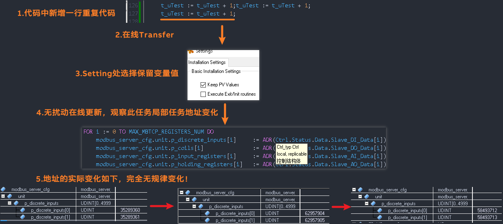
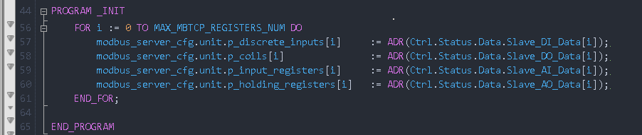
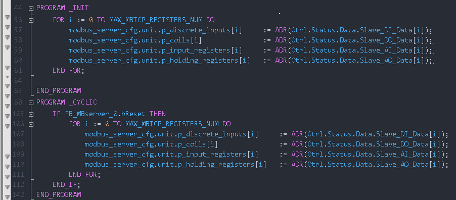

### 结论: 代码写法不佳时，会
- 如果代码写法特殊，仅在 INIT 段进行了变量的取地址赋值操作，Keep PV Value 设置为勾选，即会直接导致内存溢出
- 详情可参考 [071在线更新Transfer参数说明与变量保留规则](071在线更新Transfer参数说明与变量保留规则.md) 中 **变量值的应用规则** 的 **Value applied from references** 相关说明

### 在线更新后变量变化特点
- 在线更新程序，且 PLC 不重启，且 Keep PV Value 设为勾选
- 被更新的程序中
    - 变量数值会保留。
    - 变量的实际地址全部变化！

### 测试案例
- 

### 注意事项
- 如果仅在 INIT 初始化段进行地址的映射，在循环段没有增加机制更新此地址映射，则在在线 Transfer 时，Keep PV Value 设置为勾选，Execute exit/init subroutines 设置为不勾选，则会导致地址错乱，会直接导致内存溢出
- 

### 解决方式
- 在循环段增加机制，更新地址映射，并在使用流程上增加保护。
- 

