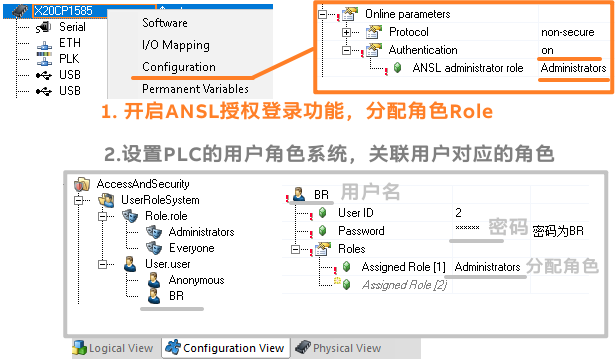
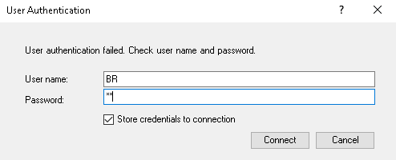

# 需求
- 在得知 PLC 的 IP 地址后，任何安装了 Automation Studio 的电脑，均可通过 PVI 在线连接此 PLC，Watch 与 Trace 此 PLC 内所有数据。
- 如果此 PLC 设置了防火墙，则可以通过关闭 11169 端口来阻止所有 PC 访问通过 ANSL 协议访问获取数据，也可以指定放行 IP，只允许设定好的特殊 IP 访问。详情可参考  [025贝加莱防火墙Firewall配置案例](../B02_技术_AutomationRuntime/025贝加莱防火墙Firewall配置案例.md)
- ❓ 有没有办法不通过防火墙的方式，直接设置用户名与密码，只有通过正确的用户名密码才能正常访问此 PLC？
# 实现
- 自 Automation Studio 4.7 ，贝加莱 PLC 支持此功能
- 设置方式如下
- 
- 设置完成后，使用 AS 软件连接对应的 PLC，会发现提示如下弹框
- 
- 用户名密码为 `AccessAndSecurity` 中被分配了 `Administrators` 角色的用户的用户名与密码，在以上设置中，即用户名为 `BR`，密码为 `BR`
