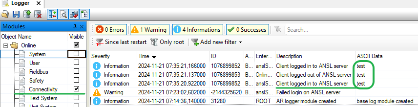
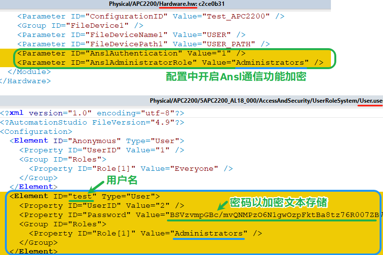
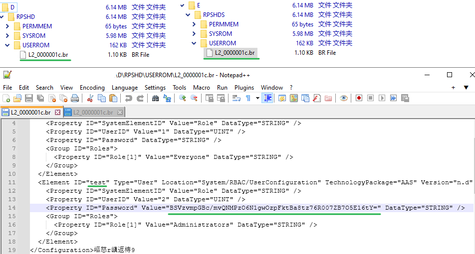

> Tags: #AS #SSL

- [1 B01.074.使用AS连接PLC需要输入密码怎么实现](#_1-b01074%E4%BD%BF%E7%94%A8as%E8%BF%9E%E6%8E%A5plc%E9%9C%80%E8%A6%81%E8%BE%93%E5%85%A5%E5%AF%86%E7%A0%81%E6%80%8E%E4%B9%88%E5%AE%9E%E7%8E%B0)
- [2 实现](#_2-%E5%AE%9E%E7%8E%B0)

# 1 B01.074.使用AS连接PLC需要输入密码怎么实现

- 在得知 PLC 的 IP 地址后，任何安装了 Automation Studio 的电脑，均可通过 PVI 在线连接此 PLC，Watch 与 Trace 此 PLC 内所有数据。
- 如果此 PLC 设置了防火墙，则可以通过关闭 11169 端口来阻止所有 PC 访问通过 ANSL 协议访问获取数据，也可以指定放行 IP，只允许设定好的特殊 IP 访问。详情可参考 [025贝加莱防火墙Firewall配置案例](../B02_技术_AutomationRuntime/025贝加莱防火墙Firewall配置案例.md)
- ❓ 有没有办法不通过防火墙的方式，直接设置用户名与密码，只有通过正确的用户名密码才能正常访问此 PLC？

# 2 实现

- 自 Automation Studio 4.7 ，贝加莱 PLC 支持此功能
- 设置方式如下
    - 
- 设置完成后，使用 AS 软件连接对应的 PLC，会发现提示如下弹框
    - 
- 用户名密码为 `AccessAndSecurity` 中被分配了 `Administrators` 角色的用户的用户名与密码，在以上设置中，即用户名为 `BR`，密码为 `BR`
- 每次登录后，在贝加莱日志Logger系统中的Connectivity条目，可见不同的用户名登录的条目
    - 

# 3 登录账号密码存储方式

## 3.1 在Automation Studio项目中

- 

## 3.2 在CF卡存储的实际内容

- 用户账号信息会以.br文件的形式，分别存储在D盘与E盘的RPSHD与RPSHDS文件夹的USERROM文件夹下。但这些明文信息只是存放信息，PLC实际核对的账号密码信息以二进制的方式存储在其他地方。
- 🔴 经过测试（AR4.93），把不同用户名密码（例如用户名B，密码为B）的PLC的CF卡中的对应.br文件拷贝替换当前的PLC的对应文件（例如当前的用户名为A，密码为A）。重启PLC后，被修改过文件的PLC，仍只能以用户名A密码A来访问。
- 

# 4 更新日志

| 日期         | 修改人 | 修改内容   |
| :--------- | :-- | :----- |
| 2023-08-03 | YZY | 初次创建   |
| 2024-11-22 | YZY | 补充存储方式 |
