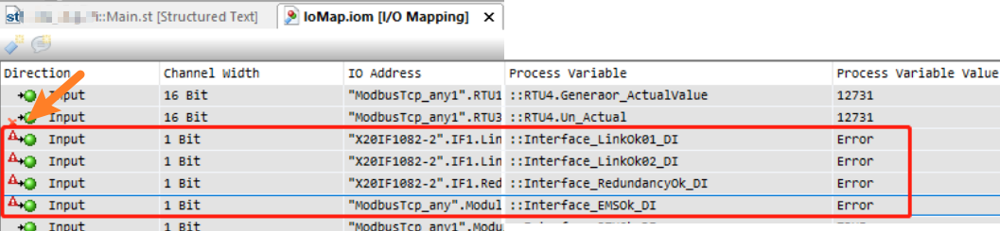
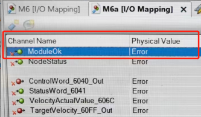

> 075IOmapping中在monitor下有红色感叹号

> Tags: #AS #Monitor

> AS Help对应的Guid：7d6ce28d-2433-4a59-847e-63da23949dc7

- [1 现象一：红色感叹号](#1%20%E7%8E%B0%E8%B1%A1%E4%B8%80%EF%BC%9A%E7%BA%A2%E8%89%B2%E6%84%9F%E5%8F%B9%E5%8F%B7)
	- [1.1 原因](#1.1%20%E5%8E%9F%E5%9B%A0)
- [2 现象二：红色❌](#2%20%E7%8E%B0%E8%B1%A1%E4%BA%8C%EF%BC%9A%E7%BA%A2%E8%89%B2%E2%9D%8C)
	- [2.1 原因](#2.1%20%E5%8E%9F%E5%9B%A0)

# 1 现象一：红色感叹号

- 在 Monitor 下，看到感叹号，Process variable Value 的值是 Error
- 

## 1.1 原因

- 此通道绑定的变量（即 Process variable 通道中绑定的值），并没有在程序中调用。

# 2 现象二：红色❌

- 

## 2.1 原因

- 此标识符，用于标识PLC上不存在指定通道的I/O映射。
- 意味着实际PLC上，这些通道没有识别到/不存在。
- 一般常见在于与外部设备通信，当前AS项目中软件配置的I/O通道信息，在实际的硬件链接验证中无法被找到
- 建议重新导入EDS/GSD/XDD等配置文件后全编译项目后重新烧卡。
