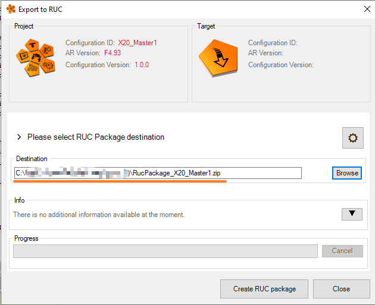
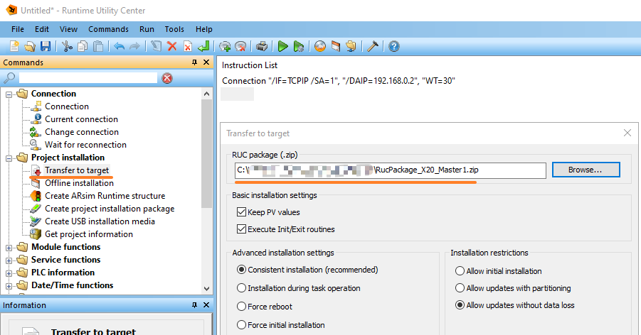

> Tags: #程序更新

- [1 B01.077-使用二进制包在线更新 PLC 程序](#_1-b01077-%E4%BD%BF%E7%94%A8%E4%BA%8C%E8%BF%9B%E5%88%B6%E5%8C%85%E5%9C%A8%E7%BA%BF%E6%9B%B4%E6%96%B0-plc-%E7%A8%8B%E5%BA%8F)
- [2 背景](#_2-%E8%83%8C%E6%99%AF)
- [3 总结](#_3-%E6%80%BB%E7%BB%93)
- [4 二进制 `.br` 文件生成流向](#_4-%E4%BA%8C%E8%BF%9B%E5%88%B6-br-%E6%96%87%E4%BB%B6%E7%94%9F%E6%88%90%E6%B5%81%E5%90%91)
- [5 AR < 4.3 使用 RUC Download 命令下载一个 `.br` 文件](#_5-ar--43-%E4%BD%BF%E7%94%A8-ruc-download-%E5%91%BD%E4%BB%A4%E4%B8%8B%E8%BD%BD%E4%B8%80%E4%B8%AA-br-%E6%96%87%E4%BB%B6)
	- [5.1 注意事项：报错 11156](#_51-%E6%B3%A8%E6%84%8F%E4%BA%8B%E9%A1%B9%EF%BC%9A%E6%8A%A5%E9%94%99-11156)
	- [5.2 AS 新增一个任务，单独 Transfer 一个 `.br` 文件，不通过 AS 更新](#_52-as-%E6%96%B0%E5%A2%9E%E4%B8%80%E4%B8%AA%E4%BB%BB%E5%8A%A1%EF%BC%8C%E5%8D%95%E7%8B%AC-transfer-%E4%B8%80%E4%B8%AA-br-%E6%96%87%E4%BB%B6%EF%BC%8C%E4%B8%8D%E9%80%9A%E8%BF%87-as-%E6%9B%B4%E6%96%B0)
- [6 AR >= 4.3 使用 RUC 包更新](#_6-ar--43-%E4%BD%BF%E7%94%A8-ruc-%E5%8C%85%E6%9B%B4%E6%96%B0)
	- [6.1 💬注意：可以自行通过替换 RUC 压缩包的 `.br` 文件实现单独更新](#_61-%E6%B3%A8%E6%84%8F%EF%BC%9A%E5%8F%AF%E4%BB%A5%E8%87%AA%E8%A1%8C%E9%80%9A%E8%BF%87%E6%9B%BF%E6%8D%A2-ruc-%E5%8E%8B%E7%BC%A9%E5%8C%85%E7%9A%84-br-%E6%96%87%E4%BB%B6%E5%AE%9E%E7%8E%B0%E5%8D%95%E7%8B%AC%E6%9B%B4%E6%96%B0)
	- [6.2 ⚠️注意：使用 RUC 压缩包不能单独更新一个 `.br` 文件](#_62-%E6%B3%A8%E6%84%8F%EF%BC%9A%E4%BD%BF%E7%94%A8-ruc-%E5%8E%8B%E7%BC%A9%E5%8C%85%E4%B8%8D%E8%83%BD%E5%8D%95%E7%8B%AC%E6%9B%B4%E6%96%B0%E4%B8%80%E4%B8%AA-br-%E6%96%87%E4%BB%B6)
	- [6.3 通过 RUC 包更新，在什么情况下可实现无扰动更新](#_63-%E9%80%9A%E8%BF%87-ruc-%E5%8C%85%E6%9B%B4%E6%96%B0%EF%BC%8C%E5%9C%A8%E4%BB%80%E4%B9%88%E6%83%85%E5%86%B5%E4%B8%8B%E5%8F%AF%E5%AE%9E%E7%8E%B0%E6%97%A0%E6%89%B0%E5%8A%A8%E6%9B%B4%E6%96%B0)
- [7 常见问题](#_7-%E5%B8%B8%E8%A7%81%E9%97%AE%E9%A2%98)
	- [7.1 其他电脑上可用的 RUC 包更新的时候提示 The target system needs to be repartitioned, but this is not allowed due to transfer restrictions.](#_71-%E5%85%B6%E4%BB%96%E7%94%B5%E8%84%91%E4%B8%8A%E5%8F%AF%E7%94%A8%E7%9A%84-ruc-%E5%8C%85%E6%9B%B4%E6%96%B0%E7%9A%84%E6%97%B6%E5%80%99%E6%8F%90%E7%A4%BA-the-target-system-needs-to-be-repartitioned,-but-this-is-not-allowed-due-to-transfer-restrictions)

# 1 B01.077-使用二进制包在线更新 PLC 程序

# 2 背景

- 更新 PLC 程序时，有时候希望能够实现在线更新 PLC 程序，在线更新有如下好处
    - 特别对于无卡的 PLC，可以远距离更新，无需使用 U 盘更新
    - 在一个网络下，可以远程批量更新
    - 程序逻辑的小改动，可以做到无扰动在线更新

# 3 总结

- 不同的 AR 版本，使用在线更新的方式不同，均使用 Runtime Utility Center 软件
    - 前往贝加莱官网 www.br-automation.com ,搜索 `PVI Development Setup`, 或者访问 [PVI Development Setup | B&R Industrial Automation (br-automation.com)](https://www.br-automation.com/zh/downloads/software/automation-netpvi/pvi-development-setup/) 下载对应的版本（注意，建议使用与 AS 相同的大版本 PVI 版本，例如 AS 使用 4.7，则 PVI 使用 4.7）
- AR < 4.3，可使用 PIL 文件在线下载一个单独的 `.br` 文件
- AR >= 4.3，需要使用 RUC 烧卡包的方式更新整体项目，PLC 会自动检测判断是否会自动重启。

# 4 二进制 `.br` 文件生成流向

- 每个 Task 任务，在 `CPU.sw` 文件中会被调整为 10 个字符以内的任务名，然后每个任务会被单独编译成一个 `.br` 文件
- 当编译完成后，我们可以在项目 `Binary / 对应配置/ PLC型号` 文件夹中找到生成出的 `.br` 文件
- 在 `AR4.3` 之前的 AR，我们通常可以通过 RUC 软件直接 Transfer 文件到 PLC 中更新项目中的功能块
- 

# 5 AR < 4.3 使用 RUC Download 命令下载一个 `.br` 文件

- 使用方式类似：[028如何使用RUC在线备份无卡PLC以及SGC与SG3系统](../B02_技术_AutomationRuntime/028如何使用RUC在线备份无卡PLC以及SGC与SG3系统.md)
- 1. 安装 PVI 软件后，打开安装后附带的 Runtime Utility Center 软件，选择 Create, edit and execute projects
- 
- 2. 调整笔记本的 IP，确保能够与 PLC 通过 RUC 建立通信
- 
- 3. 选择左侧命令中的 Download Transfer Module（老的 AS 例如 3.09 可以选择 Download），选择需要传输的 `.br` 文件
- 
- 4. 在 Automation Studio 4.2 下，使用 AR `O4.26` 版本，使用 Download 命令，验证成功
- 

## 5.1 注意事项：报错 11156

- 若被传输的 PLC 版本过高（AR >= 4.3），则在传输过程中会提示 11156 报错，这意味着 AR 已经不支持使用这种方式更新了，需要使用 RUC 包来更新。
- 

## 5.2 AS 新增一个任务，单独 Transfer 一个 `.br` 文件，不通过 AS 更新

- ✅可行
- AS 项目中新建一个 Task，此任务中新建一些变量
- 编译完成后获得 `.br` 文件，直接使用 RUC 软件，使用 Download 命名进行传递
- **PLC 不重启**，加载此任务并运行。
- 

# 6 AR >= 4.3 使用 RUC 包更新

- 1. 编译完成项目，AS 菜单栏选择 `Project - Export to Runtime Utility Center`
- 
- 2. 选择导出的 RUC 包存储的位置，选择 `Create RUC package`
- 
- 3. 打开 Runtime Utility Center 软件，一般建议先 Open 对应的 RUC 包
- 
- 4. 输入连接命令后，选择 Project installation 中的 Transfer to target 命令，并选择导出的 RUC 包
- 
- 5. 点击执行与确认
- 
- 6. 正常生成之后的信息
- 

## 6.1 💬注意：可以自行通过替换 RUC 压缩包的 `.br` 文件实现单独更新

- 调整程序，重新生成 `.br` 文件，替换压缩文件中 `FileToTransfer\Data0` 文件夹中的 `.br` 文件后重新打包后可以直接更新。
- 

## 6.2 ⚠️注意：使用 RUC 压缩包不能单独更新一个 `.br` 文件

- `RUCPackage.Zip` 文件中必须包含项目的完整程序，PLC 会自行判断文件更新与否。
- 因此在没有源程序的情况下，不能对项目新增单独的程序

## 6.3 通过 RUC 包更新，在什么情况下可实现无扰动更新

| 测试项目                | 更新成功后 PLC 是否重启 |
|---------------------|--------------|
| 任务中新增或删除代码（无论是否申明新局部变量与全局变量） |不重启 ✅|
| 修改硬件配置信息|重启 ❌|
| 导入新库并调用库函数          |重启 ❌|
| 导入新库不调用库函数          |不重启 ✅|
| 删除库及调用库函数程序段        |不重启 ✅|
| 修改CPU Configuration|重启 ❌|

# 7 常见问题

## 7.1 其他电脑上可用的 RUC 包更新的时候提示 The target system needs to be repartitioned, but this is not allowed due to transfer restrictions.

- **现象**
    - 
- **原因**
    - 在使用 RUC 做在线更新时，AS 电脑已经开着并开启仿真
