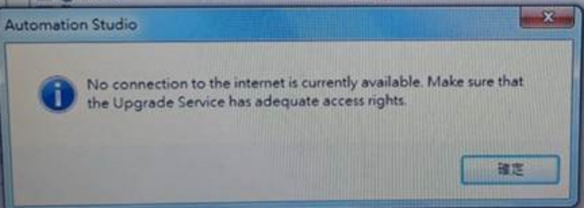
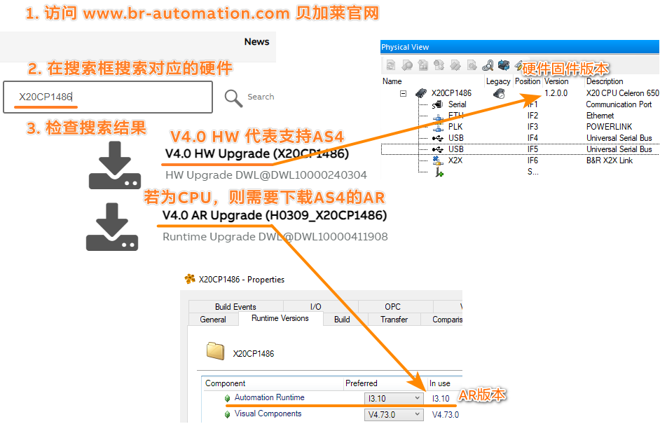
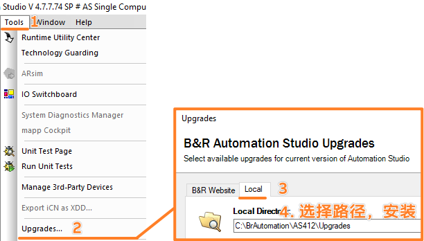
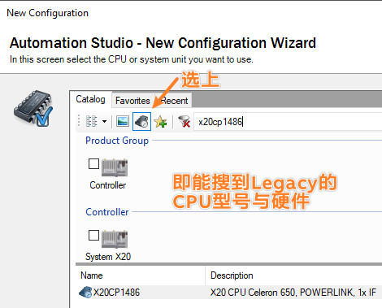
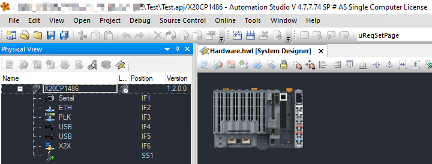
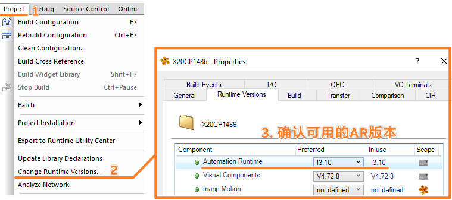

> Tags: #AS

- [1 B01.078.高版本AS软件使用已停产硬件_需手动下载安装硬件固件与相关软件](#_1-b01078%E9%AB%98%E7%89%88%E6%9C%ACas%E8%BD%AF%E4%BB%B6%E4%BD%BF%E7%94%A8%E5%B7%B2%E5%81%9C%E4%BA%A7%E7%A1%AC%E4%BB%B6_%E9%9C%80%E6%89%8B%E5%8A%A8%E4%B8%8B%E8%BD%BD%E5%AE%89%E8%A3%85%E7%A1%AC%E4%BB%B6%E5%9B%BA%E4%BB%B6%E4%B8%8E%E7%9B%B8%E5%85%B3%E8%BD%AF%E4%BB%B6)
- [2 问题一：找不到对应硬件](#_2-%E9%97%AE%E9%A2%98%E4%B8%80%EF%BC%9A%E6%89%BE%E4%B8%8D%E5%88%B0%E5%AF%B9%E5%BA%94%E7%A1%AC%E4%BB%B6)
- [3 问题二：无法通过在线方式下载安装硬件固件](#_3-%E9%97%AE%E9%A2%98%E4%BA%8C%EF%BC%9A%E6%97%A0%E6%B3%95%E9%80%9A%E8%BF%87%E5%9C%A8%E7%BA%BF%E6%96%B9%E5%BC%8F%E4%B8%8B%E8%BD%BD%E5%AE%89%E8%A3%85%E7%A1%AC%E4%BB%B6%E5%9B%BA%E4%BB%B6)
- [4 解决方式](#_4-%E8%A7%A3%E5%86%B3%E6%96%B9%E5%BC%8F)
	- [4.1 确认可行性：先确定此硬件是否支持 AS4版本](#_41-%E7%A1%AE%E8%AE%A4%E5%8F%AF%E8%A1%8C%E6%80%A7%EF%BC%9A%E5%85%88%E7%A1%AE%E5%AE%9A%E6%AD%A4%E7%A1%AC%E4%BB%B6%E6%98%AF%E5%90%A6%E6%94%AF%E6%8C%81-as4%E7%89%88%E6%9C%AC)
	- [4.2 安装资源：打开对应的 AS 软件，进行安装](#_42-%E5%AE%89%E8%A3%85%E8%B5%84%E6%BA%90%EF%BC%9A%E6%89%93%E5%BC%80%E5%AF%B9%E5%BA%94%E7%9A%84-as-%E8%BD%AF%E4%BB%B6%EF%BC%8C%E8%BF%9B%E8%A1%8C%E5%AE%89%E8%A3%85)
	- [4.3 项目创建：在创建项目时，勾选 Legacy 按钮](#_43-%E9%A1%B9%E7%9B%AE%E5%88%9B%E5%BB%BA%EF%BC%9A%E5%9C%A8%E5%88%9B%E5%BB%BA%E9%A1%B9%E7%9B%AE%E6%97%B6%EF%BC%8C%E5%8B%BE%E9%80%89-legacy-%E6%8C%89%E9%92%AE)
	- [4.4 效果：正常使用](#_44-%E6%95%88%E6%9E%9C%EF%BC%9A%E6%AD%A3%E5%B8%B8%E4%BD%BF%E7%94%A8)
	- [4.5 调整：核对正常的 AR 版本](#_45-%E8%B0%83%E6%95%B4%EF%BC%9A%E6%A0%B8%E5%AF%B9%E6%AD%A3%E5%B8%B8%E7%9A%84-ar-%E7%89%88%E6%9C%AC)
- [5 注意事项](#_5-%E6%B3%A8%E6%84%8F%E4%BA%8B%E9%A1%B9)

# 1 B01.078.高版本AS软件使用已停产硬件_需手动下载安装硬件固件与相关软件

# 2 问题一：找不到对应硬件

- 需要使用高版本的 Automation Studio （例如 AS 4.7）维护早已停产的硬件项目（例如 X20CP1486）
- 在创建项目的时候，搜不到对应的硬件

# 3 问题二：无法通过在线方式下载安装硬件固件

- 在2024年3月1 号之后，<= AS 4.6的版本，将无法通过自带的Tools Upgrades进行更新，只能通过官网下载手动更新。
- 使用AS 4.6及之前版本，若点击 Tool → Upgrades 希望更新固件，则会弹框提示
- No connection to the internet is currently available.
- 

# 4 解决方式

## 4.1 确认可行性：先确定此硬件是否支持 AS4版本

- 确认此硬件是支持 AS4的
- 

## 4.2 安装资源：打开对应的 AS 软件，进行安装

- 硬件均需要安装固件，即 HW Upgrade
- 硬件中的 PLC/CPU，还需要安装操作系统文件（Automation Runtime），即 AR Upgrade
- 

## 4.3 项目创建：在创建项目时，勾选 Legacy 按钮

## 4.4 效果：正常使用

## 4.5 调整：核对正常的 AR 版本

# 5 注意事项

- 贝加莱操作系统的功能是跟随着操作系统（Automation Runtime）的，例如 OPC UA 协议是 AR B4.26 及以上的版本开始支持，若使用老版本的 AR，则无法使用此功能
- 使用高版本的 Automation Studio 开始进行维护老项目，由于部分库与组件存在变更，请务必充分测试，验证功能的一致性。
