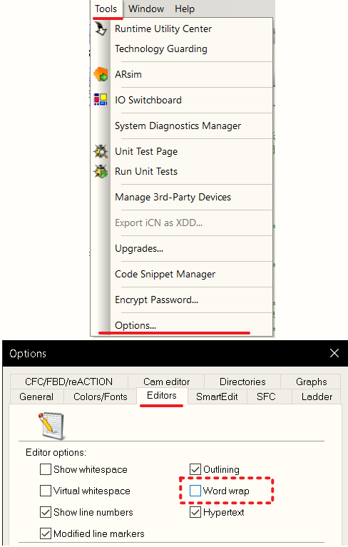
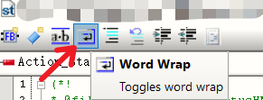
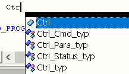
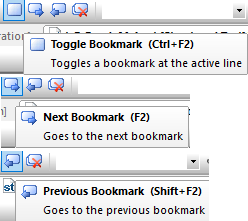
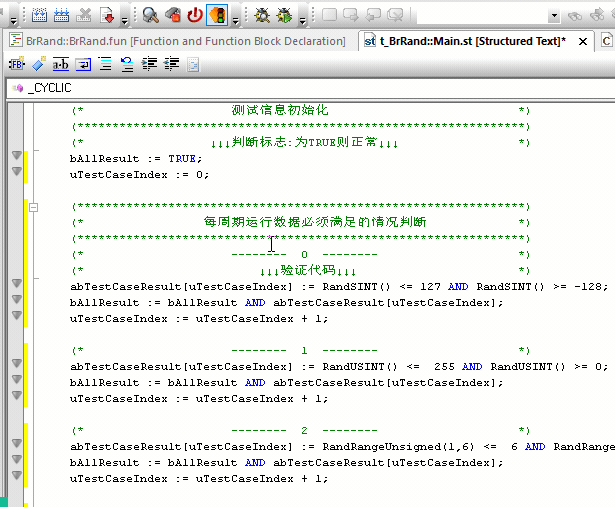

> Automation Studio软件使用技巧

> Tags: #工具 #AS #使用技巧

- [1 软件常用设置](#1%20%E8%BD%AF%E4%BB%B6%E5%B8%B8%E7%94%A8%E8%AE%BE%E7%BD%AE)
	- [1.1 如何设置代码显示超过边框自动换行](#1.1%20%E5%A6%82%E4%BD%95%E8%AE%BE%E7%BD%AE%E4%BB%A3%E7%A0%81%E6%98%BE%E7%A4%BA%E8%B6%85%E8%BF%87%E8%BE%B9%E6%A1%86%E8%87%AA%E5%8A%A8%E6%8D%A2%E8%A1%8C)
- [2 快捷键使用](#2%20%E5%BF%AB%E6%8D%B7%E9%94%AE%E4%BD%BF%E7%94%A8)
	- [2.1 代码自动补全](#2.1%20%E4%BB%A3%E7%A0%81%E8%87%AA%E5%8A%A8%E8%A1%A5%E5%85%A8)
- [3 软件功能使用](#3%20%E8%BD%AF%E4%BB%B6%E5%8A%9F%E8%83%BD%E4%BD%BF%E7%94%A8)
	- [3.1 Toggle Bookmarker在同一页代码中跳转](#3.1%20Toggle%20Bookmarker%E5%9C%A8%E5%90%8C%E4%B8%80%E9%A1%B5%E4%BB%A3%E7%A0%81%E4%B8%AD%E8%B7%B3%E8%BD%AC)

# 1 软件常用设置

## 1.1 如何设置代码显示超过边框自动换行

- 系统全局设置
    - 
- 单独一页代码设置
    - 

# 2 快捷键使用

## 2.1 代码自动补全

- CTRL + ALT + SPACE
    - 

# 3 软件功能使用

## 3.1 Toggle Bookmarker在同一页代码中跳转

- CTRL + F2 创建切换书签
- F2下一个
- SHIFT + F2 上一个
    - 
- 效果大致演示
    - 
