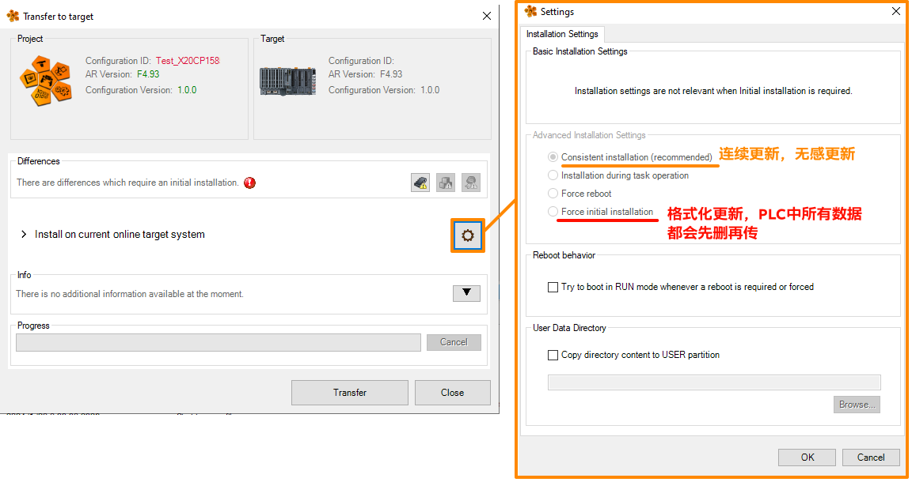

> Tags: #在线更新

- [1 080每次在线下载程序都会把CPU的配方数据模块覆盖掉或删除](#1%20080%E6%AF%8F%E6%AC%A1%E5%9C%A8%E7%BA%BF%E4%B8%8B%E8%BD%BD%E7%A8%8B%E5%BA%8F%E9%83%BD%E4%BC%9A%E6%8A%8ACPU%E7%9A%84%E9%85%8D%E6%96%B9%E6%95%B0%E6%8D%AE%E6%A8%A1%E5%9D%97%E8%A6%86%E7%9B%96%E6%8E%89%E6%88%96%E5%88%A0%E9%99%A4)
- [2 原因](#2%20%E5%8E%9F%E5%9B%A0)
- [3 更新日志](#3%20%E6%9B%B4%E6%96%B0%E6%97%A5%E5%BF%97)

# 1 080每次在线下载程序都会把CPU的配方数据模块覆盖掉或删除

- PPC3100运行 mappView
- 使用AS4.12，每次下载程序都会把 CPU 的配方数据模块覆盖掉，或者删掉

# 2 原因

- 因为在线更新的时候没有注意到设置中的参数 Advanced Installation Settings → Force initial installation 被默认选择了，选择了Force initial installation即会导致每次在线更新，PLC先彻底格式化后再更新程序
- 建议选择 **Consistent installation** (recommended)
- 

# 3 更新日志

| 日期     | 修改人     | 修改内容     |
|:-----|:-----|:-----|
| 2024-01-20     | YuanZhiyi     | 初次创建     |
