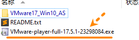
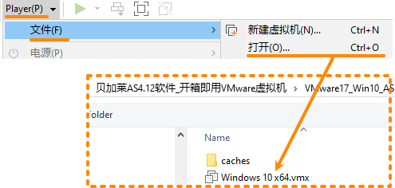
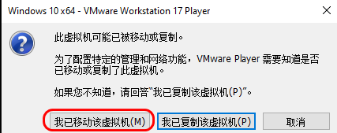
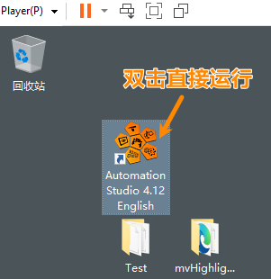
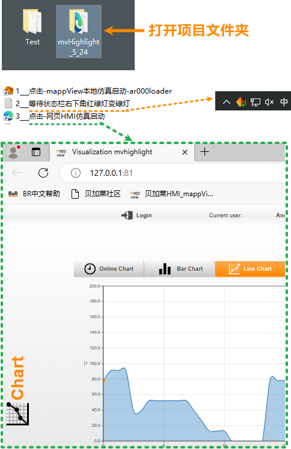
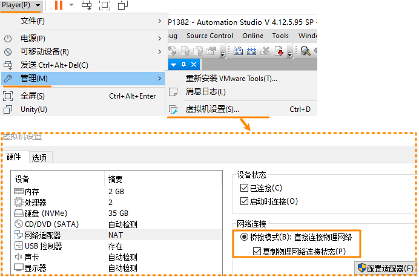
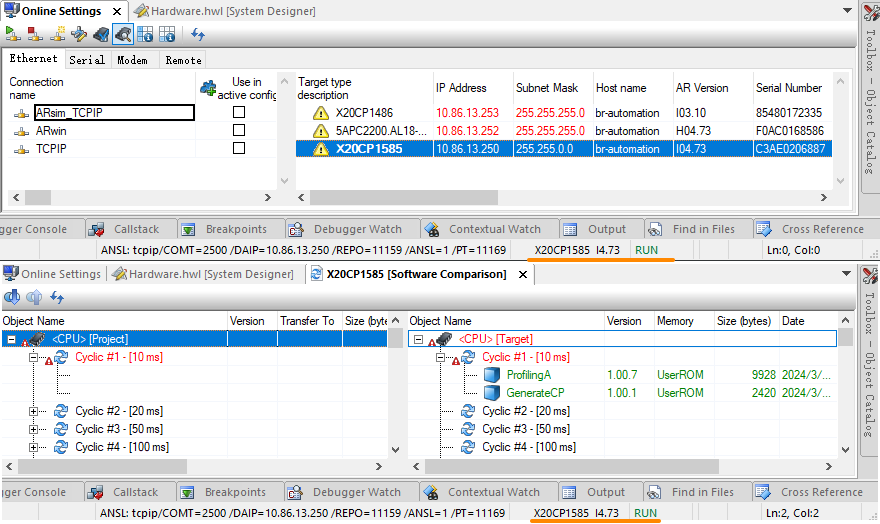

> Tags: #AS #AS安装 #虚拟机

- [1 085使用VMware虚拟机开箱即用贝加莱AS4.12软件](#1%20085%E4%BD%BF%E7%94%A8VMware%E8%99%9A%E6%8B%9F%E6%9C%BA%E5%BC%80%E7%AE%B1%E5%8D%B3%E7%94%A8%E8%B4%9D%E5%8A%A0%E8%8E%B1AS4.12%E8%BD%AF%E4%BB%B6)
- [2 下载链接](#2%20%E4%B8%8B%E8%BD%BD%E9%93%BE%E6%8E%A5)
- [3 使用方式](#3%20%E4%BD%BF%E7%94%A8%E6%96%B9%E5%BC%8F)
- [4 使用案例一：直接打开mappView Demo画面](#4%20%E4%BD%BF%E7%94%A8%E6%A1%88%E4%BE%8B%E4%B8%80%EF%BC%9A%E7%9B%B4%E6%8E%A5%E6%89%93%E5%BC%80mappView%20Demo%E7%94%BB%E9%9D%A2)
- [5 使用案例二：使用AS软件连接外部PLC设备](#5%20%E4%BD%BF%E7%94%A8%E6%A1%88%E4%BE%8B%E4%BA%8C%EF%BC%9A%E4%BD%BF%E7%94%A8AS%E8%BD%AF%E4%BB%B6%E8%BF%9E%E6%8E%A5%E5%A4%96%E9%83%A8PLC%E8%AE%BE%E5%A4%87)
- [6 更新日志](#6%20%E6%9B%B4%E6%96%B0%E6%97%A5%E5%BF%97)

# 1 B01.085-使用VMware虚拟机开箱即用贝加莱AS4.12软件

- 痛点
    - 希望使用贝加莱AS软件，但有时候因为电脑环境复杂，有杀毒软件与其他软件，装不上。
    - 希望提供完整的项目与环境给他人使用，方便他人能快速使用项目并编译更新。
    - 希望保持项目的一致性，不要有固件版本，软件版本的差异性，减少重复的安装动作。
- 解决方式
    - 现提供已安装完成AS4.12.5的Win 10 LTSC的VMware虚拟机镜像，方便开箱即用。
    - 下载文件大小12GB左右，解压完成后为35GB，亦可方便扩展空间。

# 2 下载链接

- [贝加莱社区-下载中心 (br-education.com)](https://br-education.com/downloadDis/67)
- 备选下载链接
    - 百度网盘
        - 链接： https://pan.baidu.com/s/1Wk-4iKYzjROrB-vUZjTa7A?pwd=g18h

# 3 使用方式

- 1___ 下载文件并解压，安装 VMware-player-17.5（后续更高版本亦可）
    - 
- 2____ 打开对应虚拟机文件
    - 
    - 
- 3___ 双击直接运行AS4.12.5
    - 
- 4___ 若提示需要激活码，则可以通过以下链接，在线申请90天免费测试激活码
    - [002如何获取Automation Studio的试用注册码](002如何获取Automation%20Studio的试用注册码.md)

# 4 使用案例一：直接打开mappView Demo画面

- 可根据需要，自行调整项目，进行mappView画面的测试与验证
- 

# 5 使用案例二：使用AS软件连接外部PLC设备

- 1___ 修改虚拟机的设置，将网络连接的模式从原来的NAT，改为桥接模式
    - 
    - 修改完成后，此时虚拟机的IP网口等同于实际硬件的IP网口
- 2___ 进行以太网的IP设置，确保能够与目标设备进行链接
- 3___ 打开AS软件，进行在线连接实际的PLC设备
    - 

# 6 更新日志

| 日期         | 修改人 | 修改内容 |
| :--------- | :-- | :--- |
| 2024-03-08 | YZY | 初次创建 |
