> Tags: #硬件版本 #固件安装 #固件版本

- [1 硬件的固件版本与硬件版本说明](#1%20%E7%A1%AC%E4%BB%B6%E7%9A%84%E5%9B%BA%E4%BB%B6%E7%89%88%E6%9C%AC%E4%B8%8E%E7%A1%AC%E4%BB%B6%E7%89%88%E6%9C%AC%E8%AF%B4%E6%98%8E)
	- [1.1 固件版本的相关关系](#1.1%20%E5%9B%BA%E4%BB%B6%E7%89%88%E6%9C%AC%E7%9A%84%E7%9B%B8%E5%85%B3%E5%85%B3%E7%B3%BB)
	- [1.2 历史信息](#1.2%20%E5%8E%86%E5%8F%B2%E4%BF%A1%E6%81%AF)
- [2 模块固件升降级](#2%20%E6%A8%A1%E5%9D%97%E5%9B%BA%E4%BB%B6%E5%8D%87%E9%99%8D%E7%BA%A7)
	- [2.1 标准IO模块 – 硬件版本](#2.1%20%E6%A0%87%E5%87%86IO%E6%A8%A1%E5%9D%97%20%E2%80%93%20%E7%A1%AC%E4%BB%B6%E7%89%88%E6%9C%AC)
		- [2.1.1 为什么需要不同的硬件版本?](#2.1.1%20%E4%B8%BA%E4%BB%80%E4%B9%88%E9%9C%80%E8%A6%81%E4%B8%8D%E5%90%8C%E7%9A%84%E7%A1%AC%E4%BB%B6%E7%89%88%E6%9C%AC?)
			- [2.1.1.1 “新硬件”100% 兼容模块功能](#2.1.1.1%20%E2%80%9C%E6%96%B0%E7%A1%AC%E4%BB%B6%E2%80%9D100%25%20%E5%85%BC%E5%AE%B9%E6%A8%A1%E5%9D%97%E5%8A%9F%E8%83%BD)
			- [2.1.1.2 固件中的错误修正或必要改进](#2.1.1.2%20%E5%9B%BA%E4%BB%B6%E4%B8%AD%E7%9A%84%E9%94%99%E8%AF%AF%E4%BF%AE%E6%AD%A3%E6%88%96%E5%BF%85%E8%A6%81%E6%94%B9%E8%BF%9B)
	- [2.2 安全IO模块](#2.2%20%E5%AE%89%E5%85%A8IO%E6%A8%A1%E5%9D%97)
		- [2.2.1 历史信息](#2.2.1%20%E5%8E%86%E5%8F%B2%E4%BF%A1%E6%81%AF)
		- [2.2.2 SafetyRelease和固件相关性](#2.2.2%20SafetyRelease%E5%92%8C%E5%9B%BA%E4%BB%B6%E7%9B%B8%E5%85%B3%E6%80%A7)
- [3 FAQ](#3%20FAQ)
	- [3.1 Q: 同一块模块，高版本固件版本是否完全向下兼容？](#3.1%20Q:%20%E5%90%8C%E4%B8%80%E5%9D%97%E6%A8%A1%E5%9D%97%EF%BC%8C%E9%AB%98%E7%89%88%E6%9C%AC%E5%9B%BA%E4%BB%B6%E7%89%88%E6%9C%AC%E6%98%AF%E5%90%A6%E5%AE%8C%E5%85%A8%E5%90%91%E4%B8%8B%E5%85%BC%E5%AE%B9%EF%BC%9F)
	- [3.2 Q: 是否可通过FTP的方式，任意切换某个硬件的固件版本？](#3.2%20Q:%20%E6%98%AF%E5%90%A6%E5%8F%AF%E9%80%9A%E8%BF%87FTP%E7%9A%84%E6%96%B9%E5%BC%8F%EF%BC%8C%E4%BB%BB%E6%84%8F%E5%88%87%E6%8D%A2%E6%9F%90%E4%B8%AA%E7%A1%AC%E4%BB%B6%E7%9A%84%E5%9B%BA%E4%BB%B6%E7%89%88%E6%9C%AC%EF%BC%9F)
	- [3.3 Q: AS3.0.90项目是否可以使用高版本硬件？](#3.3%20Q:%20AS3.0.90%E9%A1%B9%E7%9B%AE%E6%98%AF%E5%90%A6%E5%8F%AF%E4%BB%A5%E4%BD%BF%E7%94%A8%E9%AB%98%E7%89%88%E6%9C%AC%E7%A1%AC%E4%BB%B6%EF%BC%9F)
	- [3.4 Q: 从哪里可以了解到贝加莱模块的硬件版本变更？](#3.4%20Q:%20%E4%BB%8E%E5%93%AA%E9%87%8C%E5%8F%AF%E4%BB%A5%E4%BA%86%E8%A7%A3%E5%88%B0%E8%B4%9D%E5%8A%A0%E8%8E%B1%E6%A8%A1%E5%9D%97%E7%9A%84%E7%A1%AC%E4%BB%B6%E7%89%88%E6%9C%AC%E5%8F%98%E6%9B%B4%EF%BC%9F)
	- [3.5 Q: 从哪里可以了解到贝加莱模块的固件信息中的变更信息与对应的Firmware Number？](#3.5%20Q:%20%E4%BB%8E%E5%93%AA%E9%87%8C%E5%8F%AF%E4%BB%A5%E4%BA%86%E8%A7%A3%E5%88%B0%E8%B4%9D%E5%8A%A0%E8%8E%B1%E6%A8%A1%E5%9D%97%E7%9A%84%E5%9B%BA%E4%BB%B6%E4%BF%A1%E6%81%AF%E4%B8%AD%E7%9A%84%E5%8F%98%E6%9B%B4%E4%BF%A1%E6%81%AF%E4%B8%8E%E5%AF%B9%E5%BA%94%E7%9A%84Firmware%20Number%EF%BC%9F)
- [4 更新日志](#4%20%E6%9B%B4%E6%96%B0%E6%97%A5%E5%BF%97)

# 1 B01.086-硬件的固件版本与硬件版本说明

- 硬件升级包含在Automation Studio项目中。不同的硬件版本可以通过加载Tools-Upgrades对话框加载。
- 对于硬件升级，以X20BC0083具有 “2.10.0.0” 版本为例。固件版本多为三位数，比如‘428’。
- 模块的硬件升级包括模块的：
    - 固件
    - 硬件描述文件（`*.HWX`）
    - 帮助
- 硬件升级并不一定意味着模块固件的改变；
- 硬件升级信息/历史记录可在官网主页上找到。
- 相关说明
    - [005对于Automation Studio4.3及更早版本 如何降低硬件的固件版本](005对于Automation%20Studio4.3及更早版本%20如何降低硬件的固件版本.md)
    - [032AS版本降级与固件Firmware版本降级](032AS版本降级与固件Firmware版本降级.md)
    - [087不更新程序实现固件firmware升降级操作说明](087不更新程序实现固件firmware升降级操作说明.md)

## 1.1 固件版本的相关关系

- 可搜索相关的硬件，在此硬件的HW Upgrades中查看到相关的信息
- 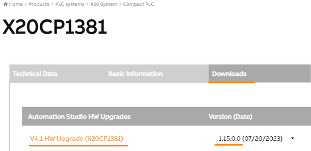
- [V4.1 HW Upgrade (X20CP1381) | B&R Industrial Automation (br-automation.com)](https://www.br-automation.com/en/downloads/software/automation-studio/hw-upgrades/v41-hw-upgrade-x20cp1381/)
- AS项目中Logical View中对应硬件的Version（固件版本），对应的信息可通过此硬件的I/O Mapping通道上看到（通过在线Monitor链接上PLC查看 / 通过此通道绑定了变量查看）
- 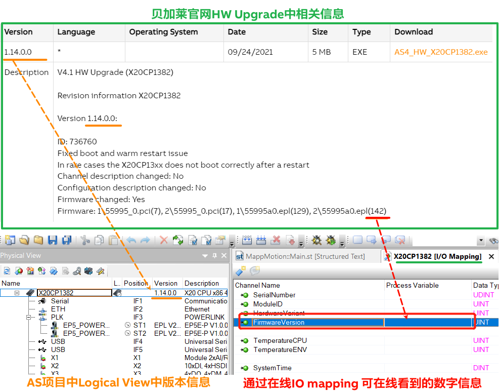

## 1.2 历史信息

- 历史信息中还提供了模块不同硬件版本相关的固件版本。
- 再次以X20BC0083为例。
- 固件：**1\7966_1.fw(428), 1\7966_3.fw(428), 1\7966_4.fw(428), 1\7966_5.fw(428), 1\7966_6.fw(428), 1\7966_7.fw(428)**
- 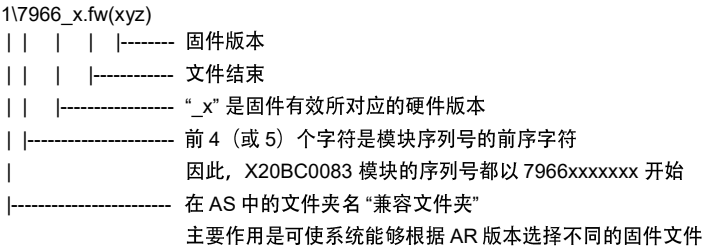
- 兼容文件夹说明
    - 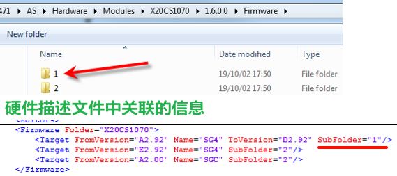

# 2 模块固件升降级

- Automation Studio项目中包含硬件升级，其中包含一个固件文件。
- 固件文件在下载过程中被传输到CPU中。
- 一旦CPU启动一次，可在CF卡中找到固件`*.fw.gz` 文件
- 固件文件可在以下系统分区文件夹路径找到：
    - `C:\System\ADDON\FW`
    - 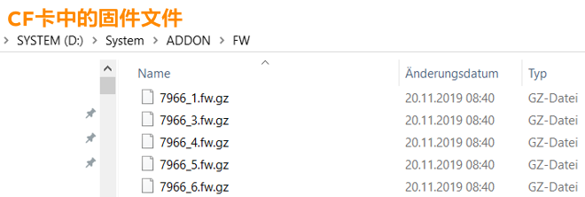
- 每个模块留存有板载固件。
- 在启动过程中，AR检查模块中的固件是否与CPU中固件相同。
- 若不同，模块上的固件将被替换。

## 2.1 标准IO模块 – 硬件版本

- 针对模块硬件版本，如果在CPU中没有相应固件，则不会进行固件升级。CPU会启动模块，模块会进入运行模式

### 2.1.1 为什么需要不同的硬件版本?

#### 2.1.1.1 “新硬件”100% 兼容模块功能

- 由于电子元器件(处理器、flash、FPGA等)的不断升级换代，我们需要重新开发现有的模块。为保证任何替换情况，这些模块的功能与旧版模块保持 100%兼容。

#### 2.1.1.2 固件中的错误修正或必要改进

- 当一个问题被发现且在新的固件中被修复，我们希望防止新交付的模块被降级到CPU中的旧固件。
- 因此，引入了一个新的硬件版本。
- 若CPU上使用的硬件升级不包含新的硬件版本所对应的固件文件，所以不会有固件降级。
- 要解决该问题，客户可以更换模块，但不会强制改变其应用程序中的硬件升级。所以没必要修改软件。
- 例如: X20BC0083 硬件升级 2.7.0.0
    - 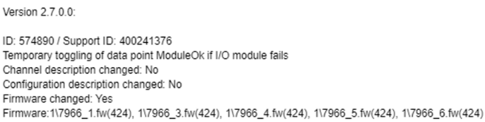
- 硬件升级包含硬件版本1 - 6 的固件版本424
- 如果插入具有硬件版本7的模块，模块固件不会降级到424，将会保持其板载固件428。

## 2.2 安全IO模块

- 安全模块的硬件版本始终为1。
- 使用的固件取决于AS程序中设定的SafetyRelease版本。

### 2.2.1 历史信息

- 同样地，官网主页中硬件升级描述信息中列出了对于某一硬件升级版本哪些固件是可用的。
- X20SI2100为例
- 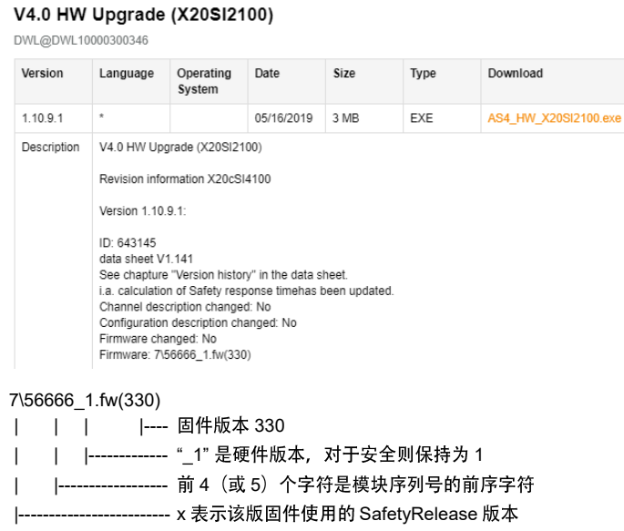

### 2.2.2 SafetyRelease和固件相关性

- 再次以X20SI2100为例，模块硬件升级历史如下
    - 固件: `4\56666_1.fw(290), 5\56666_1.fw(300)`
    - 固件: `6\56666_1.fw(301)`
    - 固件: `7\56666_1.fw(320)`
- 为明确所使用的固件（取决于SafetyRelease），需打开AS安装目录下的HWX文件。路径如下：
    - `…\BrAutomation\AS46\AS\Hardware\Modules\X20SI2100\1.10.9.1`
- 用Notepad打开X20SI2100.HWX，搜索“FromSafetyRelease”
    - 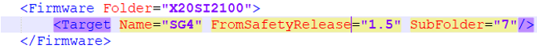
- 由此可见，对于SafetyRelease 1.5及以上，固件版本“`7\xxxxx_1`”会被使用。
    - `…\BrAutomation\AS46\AS\Hardware\Modules\X20SI2100\1.10.9.1\Firmware`
- 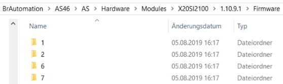
- 1，2，6，7这些文件夹含有固件文件。
- 文件夹7 包含 330版本
    - 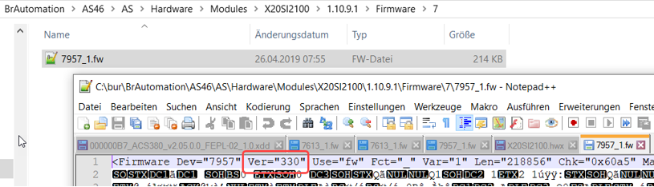

# 3 FAQ

## 3.1 Q: 同一块模块，高版本固件版本是否完全向下兼容？

- A: 兼容。

## 3.2 Q: 是否可通过FTP的方式，任意切换某个硬件的固件版本？

- A: 可以。通过FTP传递固件的.fw.gz文件，重启后PLC会自动检测并进行固件版本升降级。

## 3.3 Q: AS3.0.90项目是否可以使用高版本硬件？

- A: 目前经过测试，对于非安全类型模块（e.g. X20AT4222, X20BC1083），可以。

## 3.4 Q: 从哪里可以了解到贝加莱模块的硬件版本变更？

- A: 在贝加莱官网，**登录后**搜索需要了解信息的模块，可见Downloads右侧的REVISIONS条目，此条目即显示了硬件版本的变更情况。
- 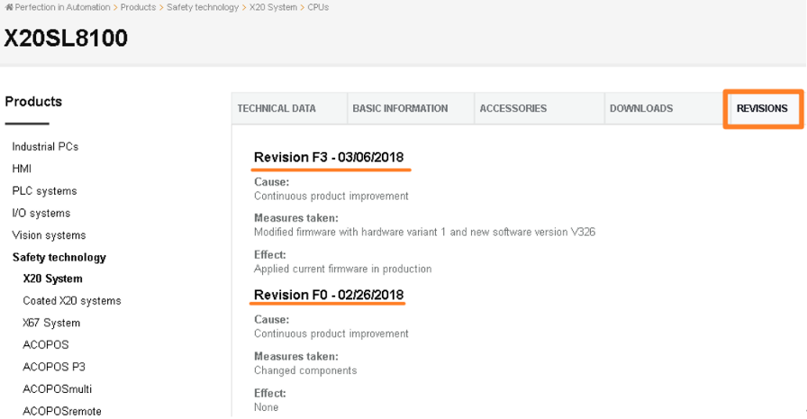

## 3.5 Q: 从哪里可以了解到贝加莱模块的固件信息中的变更信息与对应的Firmware Number？

- A: 在贝加莱官网，搜索需要了解信息的模块，在Dowloads处点击对应使用的固件版本，则显示对应的更新信息与对应的固件版本号（对应此模块在IO Mapping通道上的Firmware Number信息）

# 4 更新日志

| 日期         | 修改人 | 修改内容                                      |
| :--------- | :-- | :---------------------------------------- |
| 2020-02-17 | HQ  | 来自correlationHardwareVariantFirmware.docx |
| 2021-04-30 | CJP | 初步翻译                                      |
| 2021-07-31 | YZY | 补充信息，内容调整                                 |
| 2024-03-15 | YZY | 更新内容                                      |
