> Tags: #固件版本

- [1 不更新程序实现固件firmware升降级操作说明](#1%20%E4%B8%8D%E6%9B%B4%E6%96%B0%E7%A8%8B%E5%BA%8F%E5%AE%9E%E7%8E%B0%E5%9B%BA%E4%BB%B6firmware%E5%8D%87%E9%99%8D%E7%BA%A7%E6%93%8D%E4%BD%9C%E8%AF%B4%E6%98%8E)
- [2 文档说明基于的版本](#2%20%E6%96%87%E6%A1%A3%E8%AF%B4%E6%98%8E%E5%9F%BA%E4%BA%8E%E7%9A%84%E7%89%88%E6%9C%AC)
- [3 确认实际硬件运行固件](#3%20%E7%A1%AE%E8%AE%A4%E5%AE%9E%E9%99%85%E7%A1%AC%E4%BB%B6%E8%BF%90%E8%A1%8C%E5%9B%BA%E4%BB%B6)
	- [3.1 方法一：通过Automation Studio确认](#3.1%20%E6%96%B9%E6%B3%95%E4%B8%80%EF%BC%9A%E9%80%9A%E8%BF%87Automation%20Studio%E7%A1%AE%E8%AE%A4)
	- [3.2 方法二：通过SDM诊断网页确认](#3.2%20%E6%96%B9%E6%B3%95%E4%BA%8C%EF%BC%9A%E9%80%9A%E8%BF%87SDM%E8%AF%8A%E6%96%AD%E7%BD%91%E9%A1%B5%E7%A1%AE%E8%AE%A4)
- [4 升级降级固件](#4%20%E5%8D%87%E7%BA%A7%E9%99%8D%E7%BA%A7%E5%9B%BA%E4%BB%B6)
	- [4.1 固件文件获取](#4.1%20%E5%9B%BA%E4%BB%B6%E6%96%87%E4%BB%B6%E8%8E%B7%E5%8F%96)
		- [4.1.1 方式一：ARSIM生成.gz压缩包](#4.1.1%20%E6%96%B9%E5%BC%8F%E4%B8%80%EF%BC%9AARSIM%E7%94%9F%E6%88%90.gz%E5%8E%8B%E7%BC%A9%E5%8C%85)
		- [4.1.2 方式二：从AS安装路径下获取](#4.1.2%20%E6%96%B9%E5%BC%8F%E4%BA%8C%EF%BC%9A%E4%BB%8EAS%E5%AE%89%E8%A3%85%E8%B7%AF%E5%BE%84%E4%B8%8B%E8%8E%B7%E5%8F%96)
	- [4.2 更新固件方式](#4.2%20%E6%9B%B4%E6%96%B0%E5%9B%BA%E4%BB%B6%E6%96%B9%E5%BC%8F)
- [5 更新日志](#5%20%E6%9B%B4%E6%96%B0%E6%97%A5%E5%BF%97)

# 1 B01.087-不更新程序实现固件firmware升降级操作说明

# 2 文档说明基于的版本

- As版本：AS4.7.6
- 测试硬件与初始固件
    - 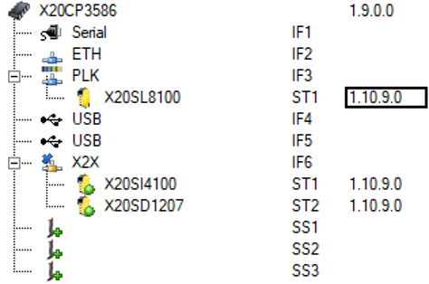
- 此方案适配AS3.0.90及以上版本，需注意固件版本的区别（AS3、AS4），以及AS项目中固件升级降级的方式的不同。

# 3 确认实际硬件运行固件

## 3.1 方法一：通过Automation Studio确认

- 查看模块IoMapping
    - 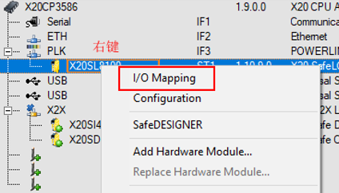
- 可通过IO mapping得知此当前运行模块的序列号，硬件版本，固件版本等信息
    - 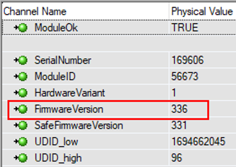

## 3.2 方法二：通过SDM诊断网页确认

- 通过网页，访问 `PLC的ip地址/sdm`
- 在初始页面点击Hardware部分，进入硬件相关页面。
    - 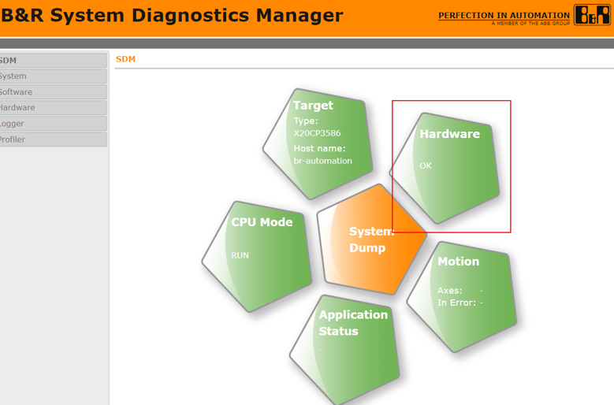
- 在左侧Hardware Tree上可见当前运行的所有硬件，选择所需了解的硬件，查看右侧Module Details部分，了解当前运行的固件版本（Firmware version）。
    - 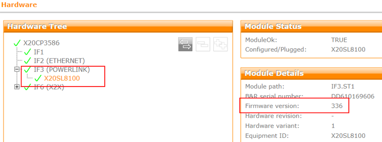

# 4 升级降级固件

- 将X20SL8100固件从1.10.9.0升级到1.10.10.2

## 4.1 固件文件获取

### 4.1.1 方式一：ARSIM生成.gz压缩包

- 确认需要使用的固件版本
    - 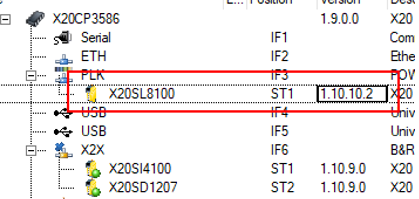
- 启动ARSIM，修改固件，点击Offline Installation
    - 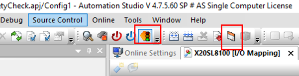
- 进行本地仿真烧卡操作
    - 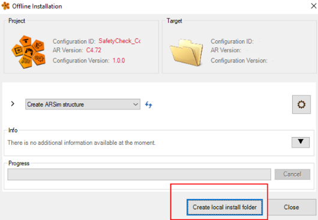
- 在程序仿真文件夹下：当前项目路径 `\Temp\Simulation\Config1\X20CP3586\System\ADDON\FW` 找到.gz包。
    - 上图中56673_1代表的含义为：
        - 56673：所使用的硬件类型，此数字代表此为X20SL8100模块，关联关系可从此模块的IO map-ping信息中获取。
        - 1：代表此固件所对应的硬件版本（Hardware Variant）。
        - 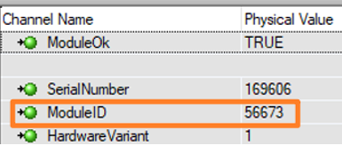

### 4.1.2 方式二：从AS安装路径下获取

- 在AS安装目录下找到相应固件：`C:\BrAutomation\AS47\AS\Hardware\Modules\X20SL8100`
    - 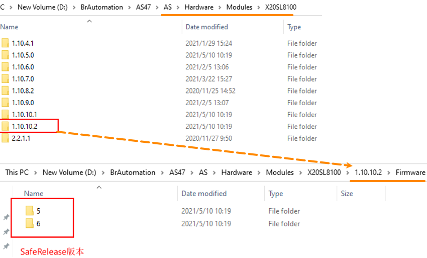
- 用Notepad打开.hwx，搜索FromSafetyRelease，可以看到SafetyRelease需要的文件，在此处确认所需版本信息。
    - 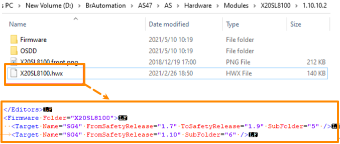
- 将.fw文件压缩成.gz的压缩包
    - 命名规则为 **ModuleID_HardwareVariant.fw.gz**
        - 
    - 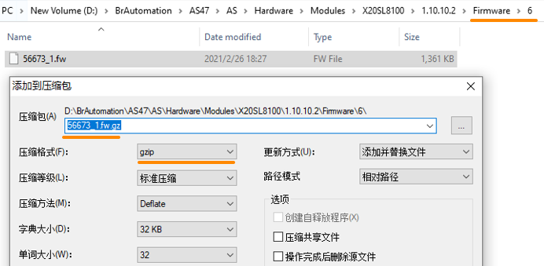

## 4.2 更新固件方式

- 方式一：通过FTP的方式（或者将运行过的CF卡拔出）将 `*.fw.gz` 文件放入 ftp://IP/SYSTEM/ADDON/FW/ 路径下，替换原文件，重启CPU。
    - 注意，此种方式，需要项目的 Module sysytem on target 为NORMAL模式，并且FTP参数中，Users → Shared Device 为 System Mass Storage，且对应的Shared Partition 为SYSTEM
- 方式二：将运行过的CF卡拔出，将 `*.fw.gz` 文件放入 `/SYSTEM/ADDON/FW/` 路径下，替换原文件，将卡插回，重启CPU。
- CPU启动后可以看到模块有升级提示，一般表现为模块的R灯绿色双闪，更新完成后为R灯绿色常亮。如果使用了安全模块，若出现安全链无法确认的现象，则需要将模块断电上电一次。
- IO Mapping下看到模块固件升级，Logger日志中也有相应记录。
    - 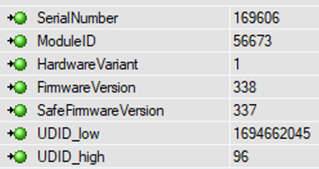
- 可从SDM中的Logger条目，或者AS连上去后通过Open → Logger查看到以下日志信息。
    - 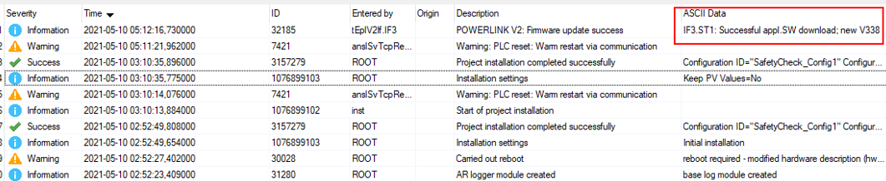

# 5 更新日志

| 日期         | 修改人 | 修改内容 |
| :--------- | :-- | :--- |
| 2021-05-10 | HYW | 初次创建 |
| 2021-05-18 | YZY | 文本补充 |
| 2024-03-15 | YZY | 文档迁移 |
