> Tags: #AS #备份 #源代码

- [1 B01.089.项目源码程序如何在下载程序时备份于CF卡中](#_1-b01089%E9%A1%B9%E7%9B%AE%E6%BA%90%E7%A0%81%E7%A8%8B%E5%BA%8F%E5%A6%82%E4%BD%95%E5%9C%A8%E4%B8%8B%E8%BD%BD%E7%A8%8B%E5%BA%8F%E6%97%B6%E5%A4%87%E4%BB%BD%E4%BA%8Ecf%E5%8D%A1%E4%B8%AD)
- [2 背景介绍](#_2-%E8%83%8C%E6%99%AF%E4%BB%8B%E7%BB%8D)
- [3 备份配置](#_3-%E5%A4%87%E4%BB%BD%E9%85%8D%E7%BD%AE)
- [4 恢复程序](#_4-%E6%81%A2%E5%A4%8D%E7%A8%8B%E5%BA%8F)
	- [4.1 1、方式一：使用AS上载程序](#_41-1%E6%96%B9%E5%BC%8F%E4%B8%80%EF%BC%9A%E4%BD%BF%E7%94%A8as%E4%B8%8A%E8%BD%BD%E7%A8%8B%E5%BA%8F)
	- [4.2 方式二：使用FTP复制程序](#_42-%E6%96%B9%E5%BC%8F%E4%BA%8C%EF%BC%9A%E4%BD%BF%E7%94%A8ftp%E5%A4%8D%E5%88%B6%E7%A8%8B%E5%BA%8F)
- [5 更新日志](#_5-%E6%9B%B4%E6%96%B0%E6%97%A5%E5%BF%97)

# 1 B01.089.项目源码程序如何在下载程序时备份于CF卡中

# 2 背景介绍

- 许多现场客户有类似于此需求：下载程序时，连同源码程序一起下载到现场CF卡中，方便现场人员进行维护。
- B&R 软件在Automation Runtime V3.08版本开始，已经可以实现此需求。

# 3 备份配置

- 1___具体在如下位置配置：Configuration View → 配置名 → Properties → Source Files → store project source files on target
    - 备份选项中，Archieve 和 Complete可任选一种（建议Archieve，占硬盘容量较少），如果使用过程中切换配置，在上载时可能会报错。
    - 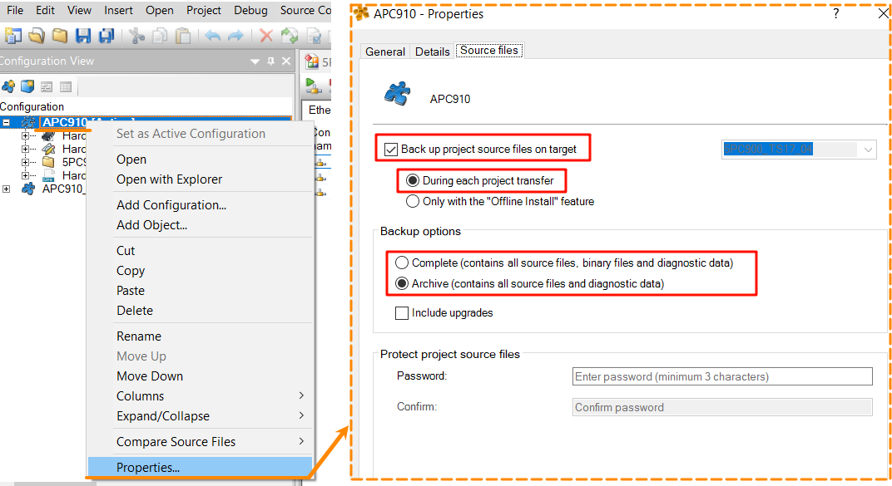
- 2___下载程序，开启每次Transfer备份源码到控制器，如果源程序容量太大，下载程序会花费较多时间，可尝试删除项目中的Binary，Temp，Diagnosis文件夹；
    - 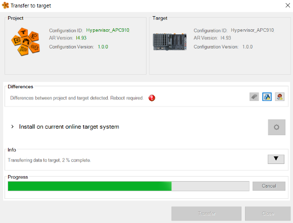
    - 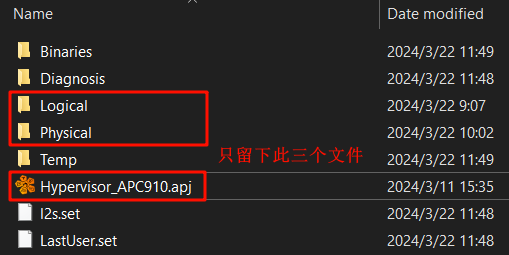

# 4 恢复程序

## 4.1 1、方式一：使用AS上载程序

- 1___打开空白AS，不需要新建工程，打开Online → Settings，然后点击Browse，找到PLC后，右击连接。
    - 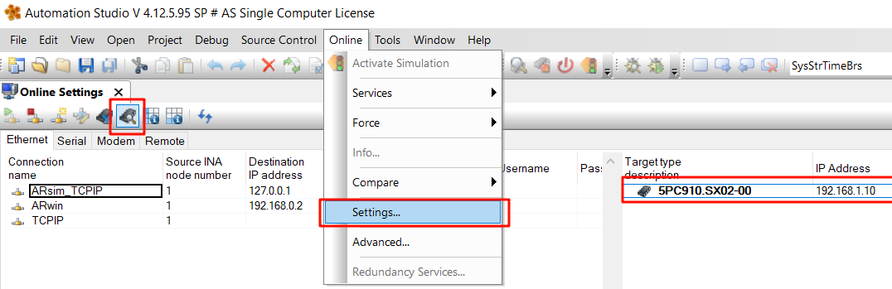
- 2___点击File → Open Project From Target，等待上载完成
    - 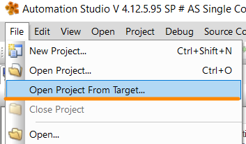
    - 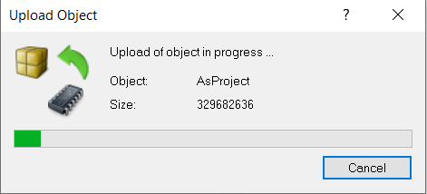
- 3___如果没有修改备份选项的情况下报错，请重启控制器并重复如上操作（就算是下载程序时重启了，也可能在上载程序时报错，请再次重启控制器）；
    - 如果使用过程中切换备份选项（Archieve 和 Complete），也会报此错误，重启没法解决，可尝试删除BDT（Binary、Diagnosis、Temp）文件夹，再全编译下载解决。
    - 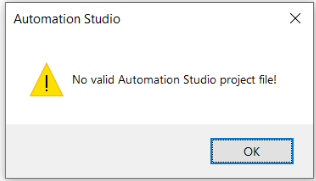
- 4___上载完成，选择需要恢复到的文件夹。
    - 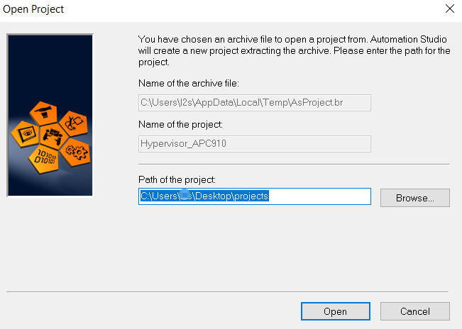

## 4.2 方式二：使用FTP复制程序

- 1___使用FTP需配置使能CPU的FTP功能，如下图配置（密码配置好后会显示乱码，最好在注释处写上密码内容，防止忘记）
    - 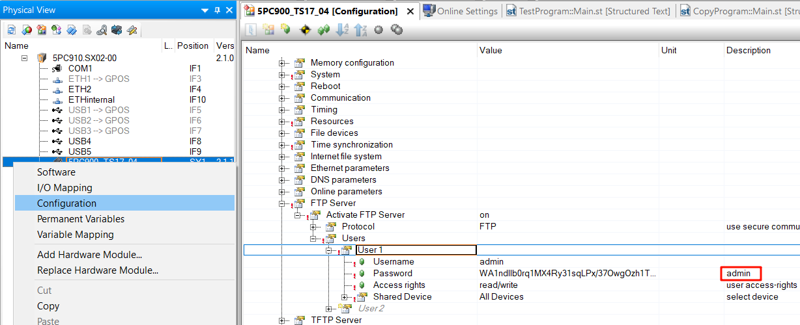
- 2___使用FTP客户端连接PLC，如下两个软件都可；
    - 
    - 输入PLC ETH IP地址，以及用户名和密码，端口号（FTP默认21，SFTP默认22）；
    - 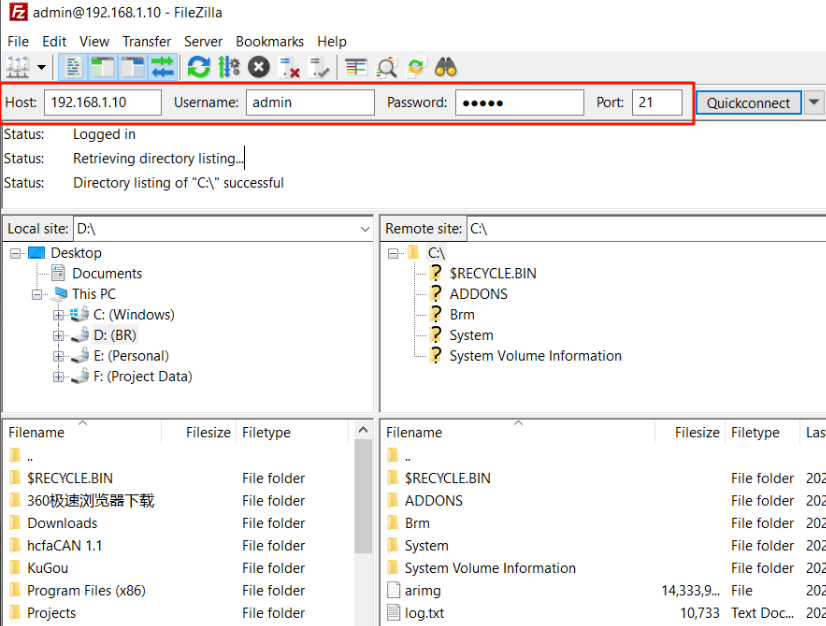
- 3___如下图所示，通过FTP可以看到备份与CF卡中的源码程序；
    - 直接通过CF卡读卡器访问不到；CF卡读卡器查看无法查看到DATA文件。
    - 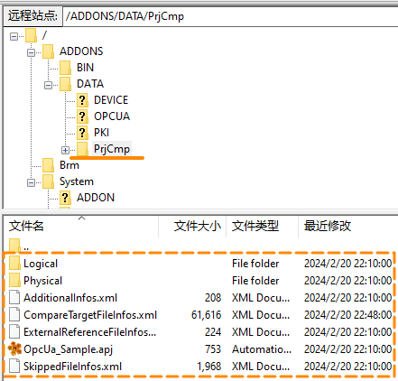
    - 将其下载到本地，即可在源码程序上进行修改。

# 5 更新日志

| 日期         | 修改人 | 修改内容      |
| :--------- | :-- | :-------- |
| 2024-02-21 | CZP | 创建文档      |
| 2024-03-21 | LSZ | 优化文档      |
| 2024-03-27 | YZY | 更新至brhelp |
