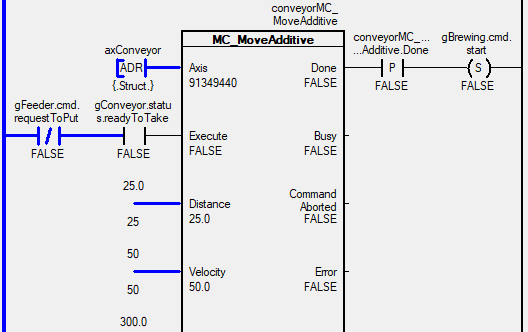

> Tags: #AS #watch

- [1 B01.091.如何通过Watch方式查看运行中PLC变量数值](#_1-b01091%E5%A6%82%E4%BD%95%E9%80%9A%E8%BF%87watch%E6%96%B9%E5%BC%8F%E6%9F%A5%E7%9C%8B%E8%BF%90%E8%A1%8C%E4%B8%ADplc%E5%8F%98%E9%87%8F%E6%95%B0%E5%80%BC)
- [2 A_Monitor模式下，直接查看变量数值](#_2-a_monitor%E6%A8%A1%E5%BC%8F%E4%B8%8B%EF%BC%8C%E7%9B%B4%E6%8E%A5%E6%9F%A5%E7%9C%8B%E5%8F%98%E9%87%8F%E6%95%B0%E5%80%BC)
- [3 B_任务右键Watch，添加变量](#_3-b_%E4%BB%BB%E5%8A%A1%E5%8F%B3%E9%94%AEwatch%EF%BC%8C%E6%B7%BB%E5%8A%A0%E5%8F%98%E9%87%8F)
- [4 C_Monitor模式下，在右侧Watch窗口边看代码边看变量](#_4-c_monitor%E6%A8%A1%E5%BC%8F%E4%B8%8B%EF%BC%8C%E5%9C%A8%E5%8F%B3%E4%BE%A7watch%E7%AA%97%E5%8F%A3%E8%BE%B9%E7%9C%8B%E4%BB%A3%E7%A0%81%E8%BE%B9%E7%9C%8B%E5%8F%98%E9%87%8F)
- [5 更新日志](#_5-%E6%9B%B4%E6%96%B0%E6%97%A5%E5%BF%97)

# 1 B01.091.如何通过Watch方式查看运行中PLC变量数值

- 贝加莱项目支持多种方式Watch变量，根据不同的使用场景，主要有如下两种方式
    - A___ Monitor模式下，直接查看变量数值
        - 适用场景：变量数量少，可以直接浏览所有的变量情况
    - B___ 任务右键Watch，添加变量
        - 适用场景：变量多，复杂的代码，需要挑选出几个关键变量进行查看
    - C___ Monitor模式下，在右侧Watch窗口边看代码边看变量
    - [013在线控制PLC与采集变量软件brwatch](/C07_工具/013在线控制PLC与采集变量软件brwatch.md)

# 2 A_Monitor模式下，直接查看变量数值

- 在确认AS软件已连接上PLC
- 点击Monitor按钮
    - 
- 双击打开所需查看的项目代码
- LD梯形图效果
    - 
- CFC代码效果
    - 
- ST代码效果
    - 需鼠标悬浮在变量上，可见变量数值
    - 
- C语言代码效果
    - 一般使用C语言的项目，变量数量较多，故需鼠标悬浮在变量上，可见变量数值。
    - 

# 3 B_任务右键Watch，添加变量

- 在Logical View下右键任务，点击 Open → Watch
- 此方式便于查看一些复杂多层的结构体变量，以及挑出部分需要查看的变量
    - 
- 在弹出的空白窗口下，右键 Insert Variable → 选择需要查看的变量
    - 
- 在变量窗口边查看变量信息
    - 

# 4 C_Monitor模式下，在右侧Watch窗口边看代码边看变量

- 

# 5 更新日志

| 日期                             | 修改人 | 修改内容 |
| :----------------------------- | :-- | :--- |
| 2024-07-06 | YZY | 初次创建 |
