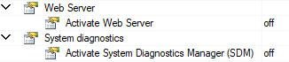

> Tags: #AS

- [1 B01.095.贝加莱AS6使用注意事项](#_1-b01095%E8%B4%9D%E5%8A%A0%E8%8E%B1as6%E4%BD%BF%E7%94%A8%E6%B3%A8%E6%84%8F%E4%BA%8B%E9%A1%B9)
- [2 mappCockpit无法访问](#_2-mappcockpit%E6%97%A0%E6%B3%95%E8%AE%BF%E9%97%AE)
- [3 OPC UA开启选项变更位置](#_3-opc-ua%E5%BC%80%E5%90%AF%E9%80%89%E9%A1%B9%E5%8F%98%E6%9B%B4%E4%BD%8D%E7%BD%AE)
- [4 OPC UA信息模型默认2.0，第三方Client连接，使用Namespace需变更](#_4-opc-ua%E4%BF%A1%E6%81%AF%E6%A8%A1%E5%9E%8B%E9%BB%98%E8%AE%A420%EF%BC%8C%E7%AC%AC%E4%B8%89%E6%96%B9client%E8%BF%9E%E6%8E%A5%EF%BC%8C%E4%BD%BF%E7%94%A8namespace%E9%9C%80%E5%8F%98%E6%9B%B4)
- [5 添加配置与对象，需要通过Toolbox添加](#_5-%E6%B7%BB%E5%8A%A0%E9%85%8D%E7%BD%AE%E4%B8%8E%E5%AF%B9%E8%B1%A1%EF%BC%8C%E9%9C%80%E8%A6%81%E9%80%9A%E8%BF%87toolbox%E6%B7%BB%E5%8A%A0)
- [6 默认情况下SDM关闭，WebServer关闭](#_6-%E9%BB%98%E8%AE%A4%E6%83%85%E5%86%B5%E4%B8%8Bsdm%E5%85%B3%E9%97%AD%EF%BC%8Cwebserver%E5%85%B3%E9%97%AD)
- [7 Linux 上的 MappView 在 AS6 中不正常显示 → 需要Chromium 90以上版本](#_7-linux-%E4%B8%8A%E7%9A%84-mappview-%E5%9C%A8-as6-%E4%B8%AD%E4%B8%8D%E6%AD%A3%E5%B8%B8%E6%98%BE%E7%A4%BA-%E2%86%92-%E9%9C%80%E8%A6%81chromium-90%E4%BB%A5%E4%B8%8A%E7%89%88%E6%9C%AC)
- [8 更新日志](#_8-%E6%9B%B4%E6%96%B0%E6%97%A5%E5%BF%97)

# 1 B01.095.贝加莱AS6使用注意事项

- 文档主要汇总AS4.12与AS6.0之间的差异与注意事项

# 2 mappCockpit无法访问

- **现象**
    - 原项目在AS4.12可通过网页正常访问mappCockpit内容，但项目升级到AS6.0后，无法显示mappCockpit内内容，网页仍能访问。
- **原因与解决方式**
    - AS6.0需要配置权限，否则无法查看mappCockpit画面。新建空项目若没有分配权限，则无法查看有效信息。
    - 需要选择例如BR_Engineer这类角色权限，才能正常访问。
    - 
- 🔴从AS4.12升级至AS6.0，会带来错误的 **Administrators** 与 **Everyone** 角色，请不要选择。
    - 若没有手动调整权限分配，则会出现异常，建议删除 .user 文件重新添加。
    - 

# 3 OPC UA开启选项变更位置

- AS4
    - 
- AS6
    - 

# 4 OPC UA信息模型默认2.0，第三方Client连接，使用Namespace需变更

 - 
 - ❌信息模型 1.0：`urn:B&R/pv/`
 - ✔️信息模型 2.0: `http://br-automation.com/OpcUa/PLC/PV/`

# 5 添加配置与对象，需要通过Toolbox添加

- AS4可通过右键Add Object / 按钮图标添加内容，在AS6.0版本，只能通过Toolbox添加。
- 

# 6 默认情况下SDM关闭，WebServer关闭

- 
- 需要手动开启，且需要注意，默认使用HTTPS，若有必要可改回HTTP。

# 7 Linux 上的 MappView 在 AS6 中不正常显示 → 需要Chromium 90以上版本

- **现象**
    - 客户在 Linux 10 中使用了 PPC，使用Hypervisor并使用带有 mappView 的 AS6 项目。
    - 在笔记本电脑上的可视化效果很好，但在 Linux 上的 Chromium 中，它只显示介绍Logo
        - 
- **解决方案**
    - 检查 Chromium 版本。然后执行更新。
    - 在帮助中，需要的最低版本：Chromium（版本 90 或更高版本）。
        - [贝加莱在线英文帮助 AS 6](https://help.br-automation.com/#/en/6/visualization%2Fmappview%2Fguides%2Fcomissioning%2Fbrowserrequirements.html)
    - 在若使用Debian 10，Chromium 版本为 83.0.4103.116
    - 更新方式
        - 将PPC连接到Internet并在终端中输入以下命令：
            - sudo apt update
            - sudo apt --only-upgrade install chromium

# 8 更新日志

| 日期         | 修改人        | 修改内容 |
| :--------- | :--------- | :--- |
| 2024-11-12 | ZJ         | 初次创建 |
| 2024-11-14 | ZSY YZY | 补充   |
