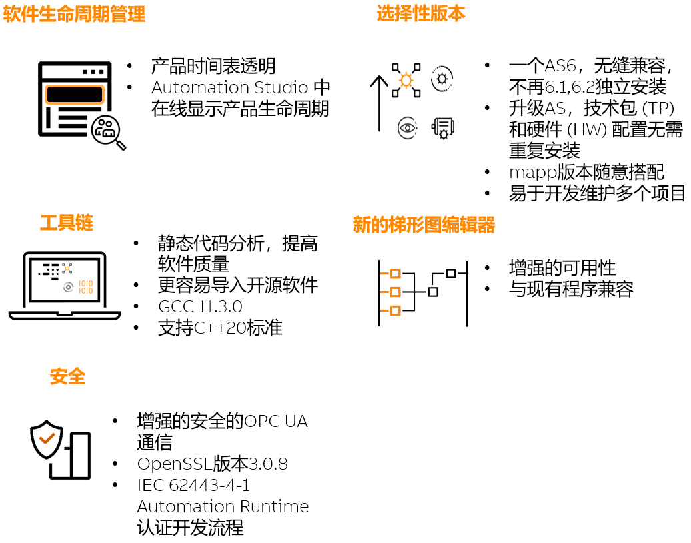
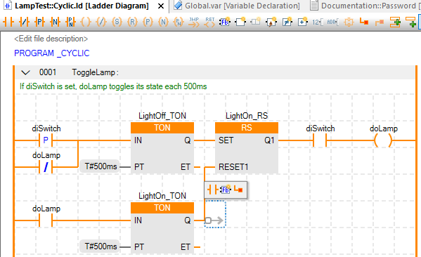

> Tags: #AS

- [1 096贝加莱AS6特点介绍](#_1-096%E8%B4%9D%E5%8A%A0%E8%8E%B1as6%E7%89%B9%E7%82%B9%E4%BB%8B%E7%BB%8D)
- [2 AS6 主要特点介绍](#_2-as6-%E4%B8%BB%E8%A6%81%E7%89%B9%E7%82%B9%E4%BB%8B%E7%BB%8D)
- [3 软件许可](#_3-%E8%BD%AF%E4%BB%B6%E8%AE%B8%E5%8F%AF)
- [4 时间线](#_4-%E6%97%B6%E9%97%B4%E7%BA%BF)
- [5 支持硬件](#_5-%E6%94%AF%E6%8C%81%E7%A1%AC%E4%BB%B6)
- [6 取消的常用功能](#_6-%E5%8F%96%E6%B6%88%E7%9A%84%E5%B8%B8%E7%94%A8%E5%8A%9F%E8%83%BD)
- [7 更新日志](#_7-%E6%9B%B4%E6%96%B0%E6%97%A5%E5%BF%97)

# 1 096贝加莱AS6特点介绍

- [贝加莱官网介绍 → Automation Software](https://www.br-automation.com/en/technologies/automation-software/#slide-2028236)
- [软件下载链接 → Automation Studio V6.0 | B&R Industrial Automation](https://www.br-automation.com/en/downloads/software/automation-studio/automation-studio-6/automation-studio-v60/)
- 

# 2 AS6 主要特点介绍

- 
- 实现更短的上市时间
    - 增强的软件生命周期
        - Automation Software 6 提供透明的产品时间表，确保对解决方案交付的期望得到明确设置，并以更高的准确性满足要求。通过提供一个统一的平台，使产品用户、研发、合作伙伴、供应商和订单处理之间的活动同步，我们弥合了团队之间的差距。这种集成方法提高了供应链和利益相关者协作的效率。
        - 
    - 编程效率改进
        - 将项目迁移到Automation Studio 6 后，我们的选择性版本可确保项目可以更新到最新的Automation Studio版本，而无需进行转换，从而保持不同未来版本的兼容性。此增强功能简化了多个项目的开发和维护，提高了效率并减少了出错的可能性。Automation Studio 6.0，项目版本与软件版本可以不同，便于持续的项目维护。即使发布了新版本的Automation Studio，此功能也可以不间断地处理项目，从而确保保持兼容性。
        - 
    - 灵活的升级路径
        - 在一台机器中使用多种mapp技术时，自定义是关键。我们正在消除Automation Studio，Automation Runtime和单个mapp技术包之间的互锁绑定关系，因此用户现在可以自行决定选择满足其项目要求的特定版本。这种单点升级方法允许有针对性的更新，提供对最新功能和错误修复的更新，而不需要全面的软件升级。
        - 
- 更快的开发
    - 编译器和操作系统增强
        - 新版本升级到GNU编译器集合 GCC 11，提供增强的性能和可靠性。除此之外，我们还升级了基础实时操作系统，以增强稳定性和安全性。这些升级对于提高软件质量和简化开源软件的移植至关重要，符合最新的C/C++语言标准。
    - 梯形图编程的创新
        - Automation Studio 6.0 中的梯形图编辑器已通过更新的用户界面和修订的编辑规则进行了重新设计，从而保持了与现有程序的兼容性。该编辑器通过可变宽度的触点/线圈、功能块和连接提高了可用性。这些更改旨在简化编程对齐，优化各种设备的编程接口，并增强程序的可读性。
        - 
- 面向未来的软件开发
    - 高级安全措施
        - Automation Studio 6.0 的设计重点是安全性，结合了增强的安全OPC UA通信，并符合IEC 62443-4-1认证的Automation Runtime 6.0开发流程。这种严格的方法可确保客户端系统免受当前和未来安全漏洞的影响。
        - 所有网络服务默认关闭，开启后默认使用TLS
            - 

# 3 软件许可

- 与当前使用的Automation Studio 4.x，mapp5.x授权方式一致。
- 未来，mapp、AS或AR等单个产品领域将根据需要继续推出具有新许可证的新产品和功能。

# 4 时间线

- Automation Studio 6.0 于 2024年7月发布
    - [软件下载链接 → Automation Studio V6.0 | B&R Industrial Automation](https://www.br-automation.com/en/downloads/software/automation-studio/automation-studio-6/automation-studio-v60/)
- Automation Studio 4.12用户可以放心，根据产品生命周期策略，AS4.12版本将再支持十年。
    - 其中约1.5年的活动阶段、约2年的经典阶段和约5~7年的有限阶段支持。这种对长期支持的承诺意味着所有用户都不需要立即将现有的4. x项目迁移到Automation Studio 6.0。
    - 虽然Automation Studio 4.12仍然是我们继续维护的强大可靠的平台，但我们建议在特定场景下迁移到Automation Studio 6.0.
    - 从头开始开发新机器时，Automation Studio 6.0是利用最新技术进步的能够发挥全部潜力的推荐平台。
- 在机器的重大更新或重新设计期间，为了利用新发布的硬件（例如APC4100）或软件功能（例如全新的梯形图），将需要过渡到Automation Studio 6.0。

# 5 支持硬件

- APC9xxS
- APCRTH
- X20CPx68x
- X20EMx6xx
- xPC22xx
- xPC31xx
- xPC31xx
- PPC3x
- PPC5x
- PPC8x
- X20CP04xx
- X90CP
- XEPIMC200
- APC4100
- 🔴 注意！X20CP1585，X20CP1382等类型停产硬件，无法在AS6软件中使用。

# 6 取消的内容

- 取消的功能
    - SG3/SGC
    - Safety Release
    - INA2000/IMA
    - OPC UA信息模型1.0
    - 集成的SVN版本控制
    - IO Switchboard
    - CF/HD Utility
    - POWERLINK V1
    - B&R Hypervisor不再支持Legacy启动
- 取消的库
    - AsHydCon
    - AsPROFIBUS
    - LoopCont
    - AsSafety
    - INAclnt
    - Commserv
- 取消的mapp功能
    - mapp User → 替代为mapp UserX
    - mapp WebXs → 替代为mapp Cockpit
    - mapp Alarm → 替代为mappAlarmX
    - mapp Energy：暂时删除
    - mapp Tweet：暂时删除
    - mapp OEE & mapp AssetInt：暂时删除
    - mapp Com：由于过时或被其他功能替换
    - mapp Audit中的PDF功能：随着mappReport的引入以及Audit和AlarmX等组件的集成，mappAduit中的PDF功能已被删除

# 7 更新日志

| 日期                             | 修改人 | 修改内容 |
| :----------------------------- | :-- | :--- |
| 2024-11-14 | YZY | 初次创建 |
