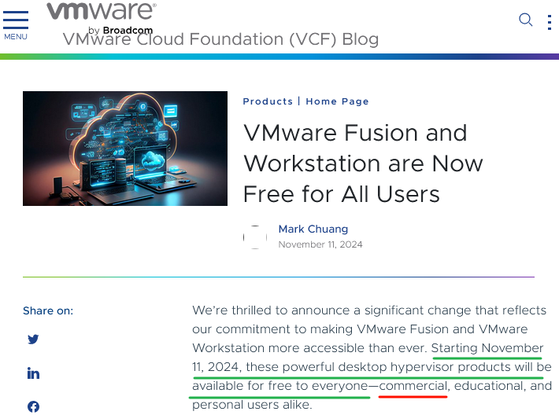

> Tags: #AS

- [1 B01.097.开箱即用VMware虚拟机AS6.0](#_1-b01097%E5%BC%80%E7%AE%B1%E5%8D%B3%E7%94%A8vmware%E8%99%9A%E6%8B%9F%E6%9C%BAas60)
- [2 下载链接](#_2-%E4%B8%8B%E8%BD%BD%E9%93%BE%E6%8E%A5)
- [3 使用步骤](#_3-%E4%BD%BF%E7%94%A8%E6%AD%A5%E9%AA%A4)
- [4 更新日志](#_4-%E6%9B%B4%E6%96%B0%E6%97%A5%E5%BF%97)

# 1 B01.097.开箱即用VMware虚拟机AS6.0

- 贝加莱已于2024.07发布全新一代Automaiton Studio 6.0，为方便测试使用，先提供已安装完成的VMware虚拟机镜像，打开后注册即可直接使用。
- Automation Studio 6.0 特点以及使用事项如下
    - [096贝加莱AS6特点介绍](096贝加莱AS6特点介绍.md)
    - [095贝加莱AS6使用注意事项](095贝加莱AS6使用注意事项.md)
    - [098项目从AS4.12迁移至AS6.0指南](098项目从AS4.12迁移至AS6.0指南.md)
- ⭐ VMware Workstation 已被宣布可免费商用，[说明链接地址](https://blogs.vmware.com/cloud-foundation/2024/11/11/vmware-fusion-and-workstation-are-now-free-for-all-users/)
    - 故可以方便使用VMware进行AS6.0测试使用，相关使用技巧可参考 [085使用VMware虚拟机开箱即用贝加莱AS4.12软件](085使用VMware虚拟机开箱即用贝加莱AS4.12软件.md)
    - 

# 2 下载链接

- [点击前往 → 下载中心进行下载 大小：22GB ](https://br-community.com/downloadDis/303)

# 3 使用步骤

- 1___ 安装本文件夹中VMware Workstation 17.6.1 版本软件 ( 老版本可能加载不了镜像 )
- 2___ 打开虚拟机软件
- 3___ 在虚拟机中激活AS软件 [002如何获取Automation Studio的试用注册码](002如何获取Automation%20Studio的试用注册码.md)
- 4___ AS6中操作演示

<video muted autoplay="autoplay" loop="loop" width="640" height="360" controls>
  <source src="/B01_技术_AutomationStudio/FILES/097开箱即用VMware虚拟机AS6.0/2024-11-15-As6操作演示视频-V1.mp4" type="video/mp4">
  Your browser does not support the video tag.
</video>

# 4 更新日志

| 日期                             | 修改人 | 修改内容 |
| :----------------------------- | :-- | :--- |
| 2024-11-15 | YZY | 初次创建 |
