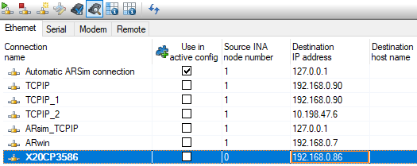
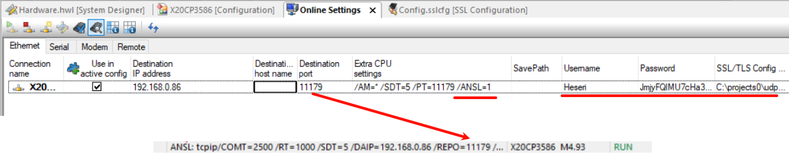
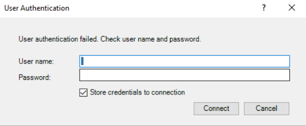

> Tags: #PVI #网络安全

- [1 100如何在AS软件中强制与PLC进行ANSL通信](#_1-100%E5%A6%82%E4%BD%95%E5%9C%A8as%E8%BD%AF%E4%BB%B6%E4%B8%AD%E5%BC%BA%E5%88%B6%E4%B8%8Eplc%E8%BF%9B%E8%A1%8Cansl%E9%80%9A%E4%BF%A1)
- [2 解决方式](#_2-%E8%A7%A3%E5%86%B3%E6%96%B9%E5%BC%8F)
- [3 更新日志](#_3-%E6%9B%B4%E6%96%B0%E6%97%A5%E5%BF%97)

# 1 100如何在AS软件中强制与PLC进行ANSL通信

- 连接PLC这里，现在只要是点 connect 就是 INA，希望可以强制走ANSL 通信
    - 
- 在使用过程中开启了TLS/SSL，并开启了通信用户权限认证功能。

# 2 解决方式

- 在CPU extra settings里面，尾部加 “ /ANSL=1 ”，并增加Username与Password等相关参数
- 
- 

# 3 更新日志

| 日期         | 修改人               | 修改内容 |
| :--------- | :---------------- | :--- |
| 2025-01-14 | CZP LPQ KJN | 初次创建 |
