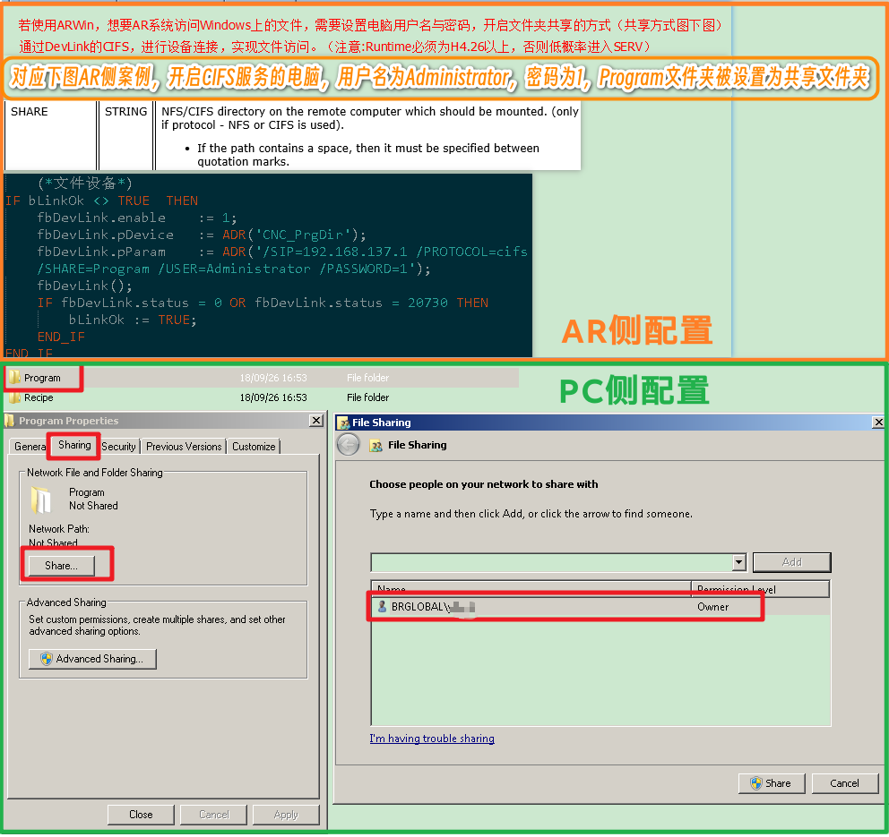
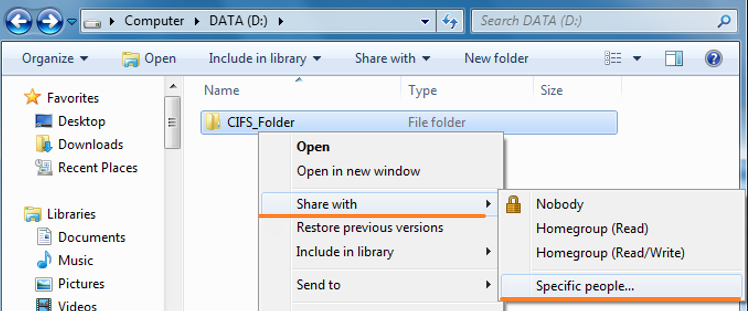

- [问题描述](#%E9%97%AE%E9%A2%98%E6%8F%8F%E8%BF%B0)
- [建议解决方式](#%E5%BB%BA%E8%AE%AE%E8%A7%A3%E5%86%B3%E6%96%B9%E5%BC%8F)
- [使用配置流程](#%E4%BD%BF%E7%94%A8%E9%85%8D%E7%BD%AE%E6%B5%81%E7%A8%8B)
	- [简单步骤](#%E7%AE%80%E5%8D%95%E6%AD%A5%E9%AA%A4)
	- [详细步骤](#%E8%AF%A6%E7%BB%86%E6%AD%A5%E9%AA%A4)
		- [Windows 侧](#Windows%20%E4%BE%A7)
		- [AR 侧](#AR%20%E4%BE%A7)
		- [故障排查](#%E6%95%85%E9%9A%9C%E6%8E%92%E6%9F%A5)
- [CIFS 是什么](#CIFS%20%E6%98%AF%E4%BB%80%E4%B9%88)
	- [贝加莱操作系统对 CIFS 的支持特性](#%E8%B4%9D%E5%8A%A0%E8%8E%B1%E6%93%8D%E4%BD%9C%E7%B3%BB%E7%BB%9F%E5%AF%B9%20CIFS%20%E7%9A%84%E6%94%AF%E6%8C%81%E7%89%B9%E6%80%A7)

# 问题描述

- 客户需要在AR的环境中，定时把生产数据文件发送到Windows服务器的共享文件夹中。
- 即 AR 环境需要能够直接访问 Windows 的共享目录。

# 建议解决方式

- 使用 Windows 的 CIFS 服务，贝加莱操作系统通过 FileIO 库的 Devlink 函数，直接映射一个远程的 CIFS 服务器作为自己的 FileDevice，直接进行文件夹的访问与读写。
- 
- Automation Help 4.12.4 对应的 GUID：`6bc04f87-a564-42fe-be38-060045eb83d6`
- Automation Help 4.12.4 对应路径：Programming - Libraries - Data access and data storage - FileIO - Function blocks and functions - DevLink

# 使用配置流程

## 简单步骤

- 

## 详细步骤

### Windows 侧

- 1） 右键单击要共享的文件夹，然后从快捷菜单中选择 `Share with" / "Specific people`
- 
- 这将打开一个窗口，可授予现有用户对文件夹的共享访问权限
- 🔴 要使用 ARwin，必须选择一个带有密码的用户！
- 2） 点击 " Add "后，用户（用户：test，密码：1234）就可以访问共享文件夹。
- 3） 然后为用户定义访问权限，"Share "确认操作。
    - 
- 4） 现在，文件夹已共享，并可通过 DevLink 进行链接。
    - 

### AR 侧

- 可以使用以下字符串和 FileIO 库中的 DevLink 功能块将文件设备链接到共享文件夹

```c
    DevLink_0.pParam = (UDINT)"/SIP=10.43.49.126 /PROTOCOL=cifs /SHARE=CIFS_Folder /USER=test /PASSWORD=1234";
```

- 需注意参数
    - /SHARE ：为连接的共享文件夹名
    - 这既适用于本地文件夹，也适用于共享的网络文件夹。
    - 根据网络拓扑结构，可能需要使用"/DOMAIN "参数指定域。如果未指定用户名、密码或域，则将使用默认设置。
    - 如果提供的是主机名而不是 IP 地址，则主机名必须通过 DNS 解析（启用 DNS）。

### 故障排查

- 若还连接不上，建议在 Windows 侧排查以下信息
- 1） 打开共享文件夹的网络文件共享权限
- 
- 2） 关闭防火墙
- 
- 3） 添加了合适的用户
- 
- 4） 分配权限
    - 

# CIFS 是什么

- Common Internet File System - CIFS，即通用因特网文件系统。
- ⭐CIFS 是 SMB 协议的衍生品，即 CIFS 是 SMB 协议的一种特殊实现，由美国微软公司开发，在 Windows 系统上使用。
- ⭐SMB：Server Message Block - SMB，即服务 (器)消息块，是 IBM 公司在 80 年代中期发明的一种文件共享协议。它只是系统之间通信的一种方式（协议），并不是一款特殊的软件。
- SMB 协议被设计成为允许计算机通过本地局域网（LAN）在远程主机上读写文件。远程主机上通过 SMB 协议开放访问的目录称为共享文件夹。
- ⭐Samba 是 SMB 协议在 Linux/Unix 操作系统上的实现，与 CIFS 类似，它允许 Windows 客户访问 Linux 系统上的目录、打印机和文件

## 贝加莱操作系统对 CIFS 的支持特性

- AR 版本低于 A 4.71：支持 SMB 2 标准
- AR 版本高于 A 4.71：支持 SMB 3.1.1 标准
- 支持访问的 CIFS 对应 WIndows 分区的文件系统
    - FAT12
    - FAT16
    - FAT32
