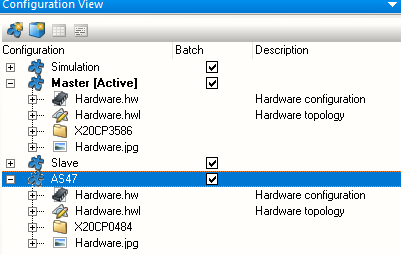
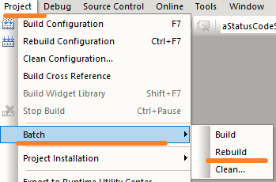
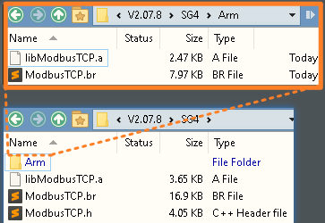
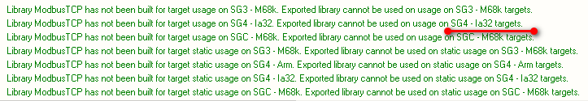
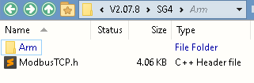
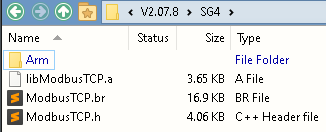

> 012二进制库无法在ARM类型PLC上导入使用

- [1 现象](#1%20%E7%8E%B0%E8%B1%A1)
- [2 原因](#2%20%E5%8E%9F%E5%9B%A0)
	- [2.1 二进制库兼容性矩阵](#2.1%20%E4%BA%8C%E8%BF%9B%E5%88%B6%E5%BA%93%E5%85%BC%E5%AE%B9%E6%80%A7%E7%9F%A9%E9%98%B5)
- [3 解决方式](#3%20%E8%A7%A3%E5%86%B3%E6%96%B9%E5%BC%8F)
- [4 测试下发现，不同的PLC型号，编译生成内容均有不同](#4%20%E6%B5%8B%E8%AF%95%E4%B8%8B%E5%8F%91%E7%8E%B0%EF%BC%8C%E4%B8%8D%E5%90%8C%E7%9A%84PLC%E5%9E%8B%E5%8F%B7%EF%BC%8C%E7%BC%96%E8%AF%91%E7%94%9F%E6%88%90%E5%86%85%E5%AE%B9%E5%9D%87%E6%9C%89%E4%B8%8D%E5%90%8C)
	- [4.1 配置项目仅仅在X20CP3586配置中进行编译](#4.1%20%E9%85%8D%E7%BD%AE%E9%A1%B9%E7%9B%AE%E4%BB%85%E4%BB%85%E5%9C%A8X20CP3586%E9%85%8D%E7%BD%AE%E4%B8%AD%E8%BF%9B%E8%A1%8C%E7%BC%96%E8%AF%91)
	- [4.2 配置项目仅仅在X20CP0484配置中进行编译](#4.2%20%E9%85%8D%E7%BD%AE%E9%A1%B9%E7%9B%AE%E4%BB%85%E4%BB%85%E5%9C%A8X20CP0484%E9%85%8D%E7%BD%AE%E4%B8%AD%E8%BF%9B%E8%A1%8C%E7%BC%96%E8%AF%91)
	- [4.3 通过Batch编译，勾选多种配置](#4.3%20%E9%80%9A%E8%BF%87Batch%E7%BC%96%E8%AF%91%EF%BC%8C%E5%8B%BE%E9%80%89%E5%A4%9A%E7%A7%8D%E9%85%8D%E7%BD%AE)

# 1 现象

- 在AS4.3开始之后，可以使用例如X20CP0484等ARM芯片的PLC
- 在对例如X20CP0484PLC项目进行其他项目的二进制库导入并使用时，发现编译报错。
- 提示如下：
    - Binary file xxxxx.a of library xxxxxx could not be found.
    - 
    - undefined reference to 'xxxxx'
    - 

# 2 原因

- 使用的二进制库在编译创建时，仅在INTEL芯片模式下编译，没有对ARM芯片兼容处理。在进行二进制导出时，编译弹框会提示如下信息。
- 
- 编译出的内容缺少了ARM文件中的相关信息
- 

## 2.1 二进制库兼容性矩阵

- 导出的库只能在使用相同 GCC 版本构建的配置中使用。
- 👍例外情况：英特尔平台允许所有项目和库组合。
- ⭐重要：不允许使用不同平台的程序库。

|   |Project for ARM with GCC 4.1.2|Project for ARM with GCC 6.3.0|Project for Intel with GCC 4.1.2|Project for Intel with GCC 6.3.0|
|---|---|---|---|---|
|Library created with GCC 4.1.2 for ARM|OK|OK|Error: Undefined reference to "fbFoo"|Error: Undefined reference to "fbFoo"|
|Library created with GCC 6.3.0 for ARM|File not recognized: File format not recognized |OK|Error: Undefined reference to "fbFoo"|Error: Undefined reference to "fbFoo"|
|Library created with GCC 4.1.2 for Intel|Error: Undefined reference to "fbFoo"|Error: Undefined reference to "fbFoo"|OK |OK|
|Library created with GCC 6.3.0 for Intel|Error: Undefined reference to "fbFoo"|Error: Undefined reference to "fbFoo"|OK|OK|

# 3 解决方式

- 1. 创建多个配置，需要包含INTEL芯片的PLC以及ARM芯片的PLC，例如X20CP3586与X20CP0484。需注意，X20CP0484的实际硬件配置项目，不要开启仿真。
- 2. 每个配置均把需要编译的库拖拽至项目配置中
- 在Configuration View中，Batch按钮打钩勾选
    - 
- 3. 点击Project - Batch - Rebuild，进行全局编译
    - 
- 4. 选择需要导出的库，进行导出操作
    - 
- 5.导出成功后，可见文件夹中有两个libXXXX.a文件，且大小不同
    - 

# 4 测试下发现，不同的PLC型号，编译生成内容均有不同

## 4.1 配置项目仅仅在X20CP3586配置中进行编译

- 
- 

## 4.2 配置项目仅仅在X20CP0484配置中进行编译

- 
- 

## 4.3 通过Batch编译，勾选多种配置

- 
- 
