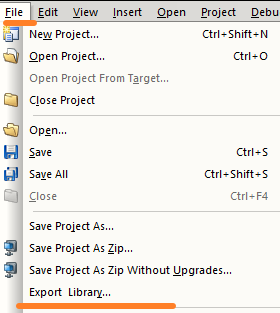

# 012二进制库无法在ARM类型PLC上导入使用
## 现象
- 在AS4.3开始之后，可以使用例如X20CP0484等ARM芯片的PLC
- 在对例如X20CP0484PLC项目进行其他项目的二进制库导入并使用时，发现编译报错。
- 提示如下：
    - 

## 原因
- 使用的二进制库在编译创建时，仅在INTEL芯片模式下编译，没有对ARM芯片兼容处理。在进行二进制导出时，编译弹框会提示如下信息。
- 
- 编译出的内容缺少了ARM文件中的相关信息
- 

## 解决方式
- 1. 创建多个配置，需要包含INTEL芯片的PLC以及ARM芯片的PLC，例如X20CP3586与X20CP0484。需注意，X20CP0484的实际硬件配置项目，不要开启仿真。
- 2. 每个配置均把需要编译的库拖拽至项目配置中
- 在Configuration View中，Batch按钮打钩勾选
    - 
- 3. 点击Project - Batch - Rebuild，进行全局编译
    - 
- 4. 选择需要导出的库，进行导出操作
    - 
- 5.导出成功后，可见文件夹中有两个libXXXX.a文件，且大小不同
    - 

## 测试下发现，不同的PLC型号，编译生成内容均有不同
### 配置项目仅仅在X20CP3586配置中进行编译
- 
- 
### 配置项目仅仅在X20CP0484配置中进行编译
- 
- 
### 通过Batch编译，勾选多种配置
- 
- 

