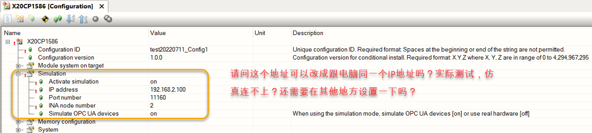
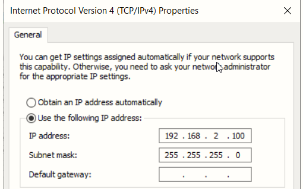

# 014仿真情况下的IP地址是否可以设置为自定义IP？
## 问题
- 笔记本的ARSim在仿真模式下默认的IP地址是127.0.0.1，想知道是否可以修改这个IP地址，以便笔记本开的ARSim能够被别的电脑访问到。
- 

## 实现方式
- 可以实现，需要网口插上网线，激活网口
- 

[详情可参考以下页面](../B01_技术_AutomationStudio/045仿真状态下如何更改IP.md)
