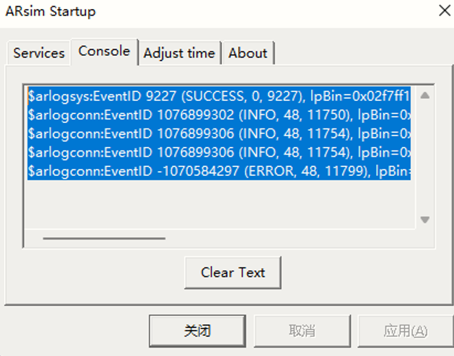
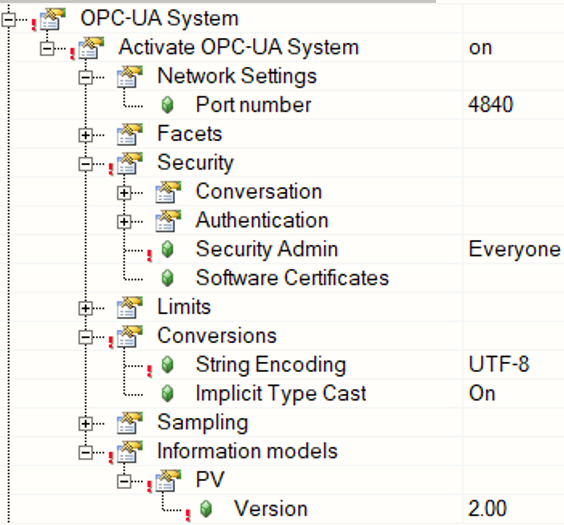
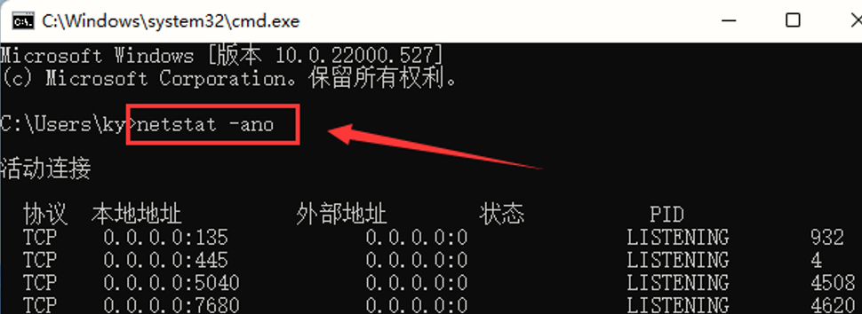
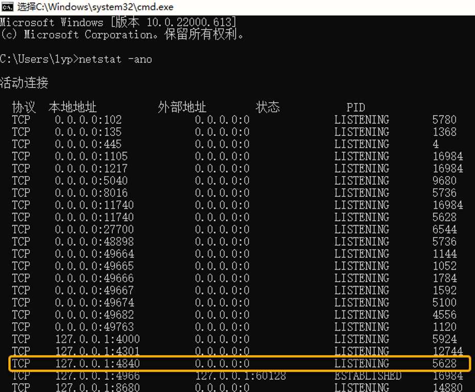

# 015程序下载后，重启时仿真不能重启
## 问题描述：
- 新建程序，仿真能够正常使用，带有OPCUA功能的程序，下载之前仿真能启动，下载后，重启时仿真不能启动：
- 
## 问题原因：是端口4840冲突，被占用
- 
## 解决方法：
- 打开CMD窗口，输入netstat-ano查找端口占用情况，获得对应的PID：5628,打开任务管理器查看PID：5628被哪个软件占用。
- 
- 
- 