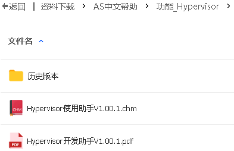
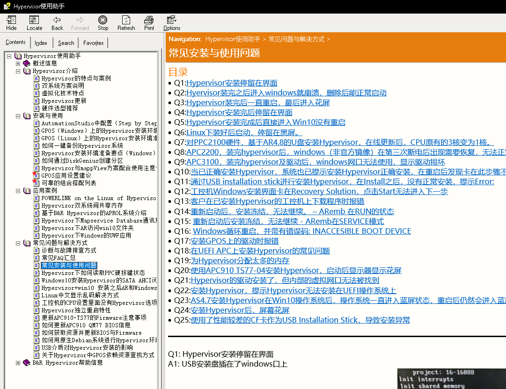

> 017Hypervisor安装与使用问题

> #Hypervisor

- [1 常见问题列表](#1%20%E5%B8%B8%E8%A7%81%E9%97%AE%E9%A2%98%E5%88%97%E8%A1%A8)
- [2 🌐在线帮助访问地址](#2%20%F0%9F%8C%90%E5%9C%A8%E7%BA%BF%E5%B8%AE%E5%8A%A9%E8%AE%BF%E9%97%AE%E5%9C%B0%E5%9D%80)
- [3 离线帮助下载地址](#3%20%E7%A6%BB%E7%BA%BF%E5%B8%AE%E5%8A%A9%E4%B8%8B%E8%BD%BD%E5%9C%B0%E5%9D%80)
- [4 CHM文件显示](#4%20CHM%E6%96%87%E4%BB%B6%E6%98%BE%E7%A4%BA)
- [5 常见使用案例问题](#5%20%E5%B8%B8%E8%A7%81%E4%BD%BF%E7%94%A8%E6%A1%88%E4%BE%8B%E9%97%AE%E9%A2%98)

# 1 常见问题列表

- [⭐026Hypervisor常见问题一览](026Hypervisor常见问题一览.md)

# 2 🌐在线帮助访问地址

```
hypervisor.brhelp.cn
```

- [Hypervisor使用助手 (brhelp.cn)](https://hypervisor.brhelp.cn/index.html?general.html)

# 3 离线帮助下载地址

[贝加莱知识库 (huashengyun.online)](https://brtechs.huashengyun.online/index.php?mod=bjl&do=file&gid=19#group&do=file&gid=19&fid=2855)

> 登录后再次点击链接即可自动

- 

# 4 CHM文件显示

- 

# 5 常见使用案例问题

- 1.我无法从ArEmb/Windows访问SSD。可能是什么问题？
- 2.带有管理程序和Linux Debian 9的系统，PPC无法启动Linux 系统
- 3.如何避免外部网络线缆短接并使用VNC Viewer？
- 4.我们正面临着Visual Basic应用程序--在Windows（APC-GPOS）和ArEmb之间通过内部桥接进行PVI通信的问题。
- 5.需要从mapp View，关闭Linux Debien 9系统。
- 6.有可能只关闭 Linux吗？
- 7.在Hypervisor中是否有任何设置可用于Windows系统和ArEmb 系统之间的时间同步？
- 8.在将OrangeBox升级到Nestle OrangeBox时，产生了数据库错误。有什么可能的解决方案？
- 9.我们正试图通过VCWT在PPC2100的Hypervisor+Windows 10中操作VC4，但我们无法做到这一点。 有什么可能的解决方法？
- 10.我们正面临着Hypervisor和Zenon SCADA的PVI通信问题
- 11.我们在windows上用Hypervisor创建的分区数量有什么限制吗？
- 12.我们正在使用带有ArWin的APC3100和（5E9030.29）RFID转发器。我们想在该RFID上读取和写入数据。是否有可能用ArWin来做这件事？
- 13.Hypervisor是否需要PVI许可证？
- 14.如果ArEmb处于服务模式，在VNC浏览器/Linux中没有关于服务模式的信息。有什么方法可以获得ArEmb的状态（不需要额外的编程）并在Linux Debian中显示出来？
- 15.我们正在使用带有Hypervisor的PPC2200，我们能够在ArEmb中记录数据并创建MpReport，但不能通过 CIFS将这些文件保存到WindowC盘。
- 16.我们正在使用APC3100，但现在想用windows系统安装Hypervisor，但根据帮助，Hypervisor环境必须被启用，而它被禁用了（它被锁定，不能编辑）
- 17.在没有hypervisor许可证的情况下，Hypervisor工作正常，是否真的需要在机器上使用Hypervisor许可证？
- 18.Hypervisor下两个系统(GPOS与ARemb)之间实现通讯交互
