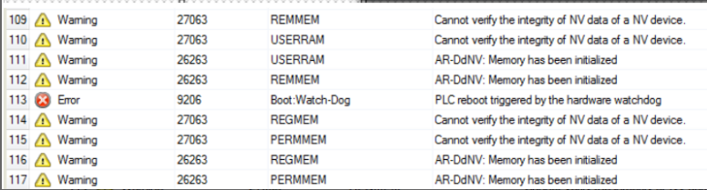

# 一、Watchdog错误描述 （9206）
- 该错误表示 PLC 已“冻结”。
- PLC运行一个名为IOScheduler任务。此托盘每System Tick触发 2 次。
- 他的任务是管理任务并确保它们不会持续太久。它还会重置系统Watchdog计时器。
- 如果系统检测到此Watchdog计时器尚未重置，则会报告错误 9206。
  
- 在Watchdog错误期间，DRAM 中的剩余（掉电保持和永久）变量无法备份到 UserRAM，并且它们会丢失。

> 在开始了解Watchdog之前，建议了解贝加莱操作系统Automation Runtime机制，详情见基础培训内容 TM213

# 二、什么是Automation Runtime中的Watchdog？  
- 系统任务 IO Scheduler始终以一定的周期时间运行。  
- 此周期时间取决于 CPU 配置中设置的系统计时器，即System Timer  
- 在下面的示例中，使用默认设置 -> CPU Timer，System Tick为 1000μs
- 
- 由于此设置，IO Scheduler 在 500μs（System Timer 的一半）后循环调用  

- 如果设置一个接口（Interface）用作System Timer，则在“接口的周期时间”的一半过去后调用IO Scheduler。  
- 
- IO Scheduler管理任务并检测任务的执行是否花费太长时间。  
- 这就是为什么当发生周期时间冲突时，始终在记录器Logger中报告此任务的原因。  
- IO Scheduler一直执行的另一个操作是重置Watchdog计数器。  
- 如果未及时完成此操作，Automation Runtime预计IO Scheduler未正常运行。由于这会导致意外行为，因此 CPU 会停止并显示Watch dog错误 9206。  
- 

# 三、为什么发生Watchdog错误后内存丢失？  
- Automation Runtime并不总是直接访问每个物理内存。  
- 访问 DRAM 要快得多，因此非易失性变量会这里被Automation Runtime处理。  
- 在 CPU 启动期间，这些变量的值被复制到 DRAM，在关机期间，它们被复制回内存区域，重新启动后不会清除该区域。  
- 
- 如果出现看门狗Watchdog错误，通常在关机期间发生的程序不再工作。甚至IO Scheduler也被视为阻塞，因此较低的先前任务也预计会失败。  
- 因此，Automation Runtime无法再保证正确的值存储在非易失性变量上。  
- 因此，这些内存区域被清除为具有一定的值，并提供检查应用程序中合理性的机会。
- 这取决于Automation Runtime版本，哪些内存区域被直接访问，哪些被复制到DRAM中。

# 四、Watchdog错误的可能原因是什么？
## 1.系统错误
- Automation Runtime中的软件错误，例如IRQ 中断处理程序（来自总线,...）阻塞了系统

## 2.应用程序错误
- 访问Automation Runtime基本函数使用的内存区域。  
- 通常这些是非常低的地址。

## 3.输入错误
- 如果Automation Runtime检测到错误，则会将此错误写入记录器Logger。但是，应该输入的信息也可能受到错误的影响，并且输入错误。  
- 所以原因 1 和原因 2 通常一起发生。  
- 错误案例的分析将显示错误的真正原因。

## 4.硬件故障
- 硬件故障（通常在 CPU 本身上，CPU 过热、触点或组件故障）也可能导致Watchdog。

## 5.异常任务（Exception Tasks）
- 异常任务类以与 IOScheduler  相同的优先级（253）运行。因此，此任务中的任务会延迟 IO调度器，并阻止它重置Watchdog计数器。  
- 错误案例的Profiling将显示这一点。

## 6.堆Stack
- 如果Automation Runtime的堆栈用完。  
- 可以使用性能分析器Profiler测量可用堆。

## 7.内存不足
- 在 DRAM 不足的情况下，例如由于内存泄漏，也可能发生Watchdog。可用内存可以使用AS，SDM或MEMxinfo（）（BRSystem库）进行测量。


# 五、发生Watchdog后下可能的操作
## 1.Profiling分析
- 第一个目标应该是获取错误案例的Profiling。  
- 这不适用于默认设置，因为Profiler数据存储在 DRAM 中。  
- 此外，默认Profiler的缓冲区大小太小。  
- 如果可能，“Buffer for created tasks”的设置应设置为 100，以避免在Profiling中出现未知任务。  
- 因此，Profiling配置应如下所示：  
- 
  
- 根据 CPU 的不同，可用的 USER RAM 存在限制。  
- 因此，并非总是可以使用这样的配置。  
  
- 另一个潜在的问题是，某些Automation Rutime版本不直接访问 USERRAM。因此，USERRAM 受到与 DRAM 相同的问题的影响。  
- 对于这一点，存在一种解决方法，在使用之前应与总部支持人员讨论。  
- 在这种情况下，记录器Logger如下所示：  
- 
- 警告 27063 和 26263 可能在Watchdog之前输入，但时间戳几乎相同。然而，这些都是相应的警告。  
- 如果有足够的 USRRAM 可用，则还建议将使用的库函数包含在分析中。它提供了更好的概述在错误情况下会发生什么。  
- 选择 USRROM 作为探查器数据的目标内存不是一个选项，因为访问 USRROM 的速度太慢，无法将Profiler数据存储在那里。
## 2.更新程序
- 将所有软件（AS，AR，Firmware，mapp）更新到最新版本
- 将 AS 项目更新到版本 >= AS/AR 4.8。在此版本中，添加了循环备份剩余数据的选项。这不会修复Watchdog错误，但可以防止剩余数据丢失：
- 
## 3.交换硬件
如果Watchdog错误只发生在一个CPU上，则可能是单个硬件问题。  
在这种情况下，应更换 CPU。

## 4.代码审查 Code review
- 应检查应用程序代码是否存在编程错误
- 实施IECCheck功能
- 检查地址和函数的长度，如memcpy，strcpy,...
- 检查指针处理
- 如果IECCheck功能不可用，则检查数组的范围溢出
- 检查可用 DRAM 内存是否不随时间推移而减少

## 5.复现和信息
- 如果问题可复现，则总是更容易找到问题。  
- 用例中导致Watchdog错误的任何提示都可能有助于复现。  
- 机器的历史信息也是一个重要的点。例如，如果机器运行多年而没有问题，然后Watchdog错误开始频繁发生。在这种情况下，建议更换 CPU。

## 6.检查可用内存
- 可用内存可以使用AS，SDM或MEMxinfo（）（BRSystem库）进行测量。

# 五、如何通过代码的方式触发Watchdog

- 通过编程方式调用禁用处理器中断。以下 ANSI C程序可用于此目的
- 如果以这种方式调用监视器，则不会创建Profiler

```C
#include <bur/plctypes.h>
 
#ifdef _DEFAULT_INCLUDES
    #include <AsDefault.h>
#endif
 
void _CYCLIC ProgramCyclic(void)
{
    if (triggerWatchdog)
    {
        nbWatchdogs++;
         
        //disable interrupts
        #ifdef __i386__
        __asm("cli");
        #endif
         
        #ifdef __arm__
        __asm("cpsid i");
        #endif
         
        for(;;); /* endless loop */
    }
}
```

# 六、参考链接
- [Watchdog (9206) - Global Application Platform - Confluence (br-automation.com)](https://confluence.br-automation.com/pages/viewpage.action?pageId=71199246)
- [GEC 2021 - Automation Runtime - Page fault and watchdog analysis - #KNRZL | B&R Industrial Automation (br-automation.com)](https://www.br-automation.com/en/academy/knowledge-resource-search/gec-2021-automation-runtime-page-fault-and-watchdog-analysis-knrzl-1614619517970/)
- [Watchdog - CZ - INT - Support_Level1 - Confluence (br-automation.com)](https://confluence.br-automation.com/display/GISC/Watchdog)