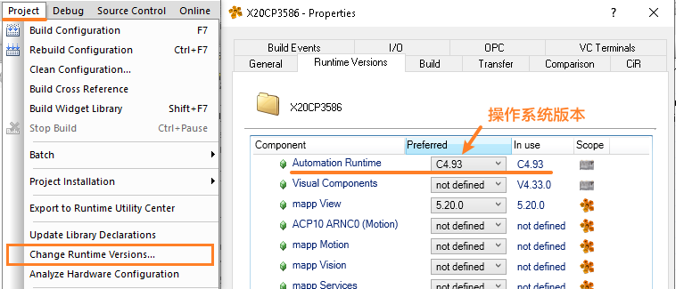
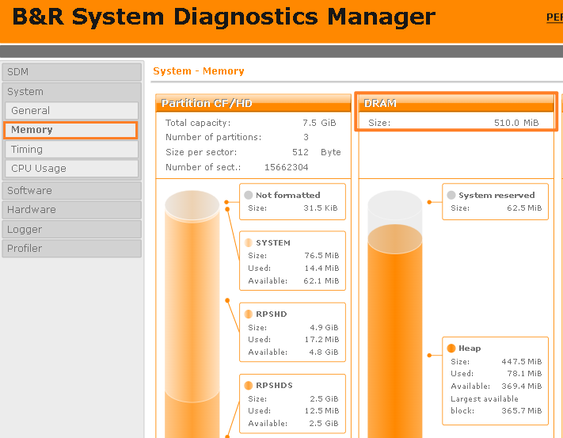

# 操作系统资源池说明
文件描述符（File descriptors）和套接字（sockets）是抽象的管理构造，它们表示内核中的文件或套接字等对象。  
它们是有限的资源，在操作系统的编译时定义。

例如在使用贝加莱程序的FileIO库中的FileOpen函数，调用成功一次，则占用了一个文件描述符，使用AsTCP库调用一次TcpOpen函数成功，则占用了一个socket套接字资源。

这些资源是有限的，且根据Automation Runtime的版本以及内存剩余大小变化

当特定资源耗尽时，您将收到相关的错误消息，指出没有更多的资源可用。
- 例如，我们会受到以下报警号：
    - 32650
    - 20728

这时我们就有一个疑问，到底AR系统有多少资源可供使用？

# 数量说明

- **AsTCP**与**AsUDP**在系统内部可以请求的ident数量被限制在了 128 ，与Socket数量无关。

|   AR   | 内存 | MAX_FILE | MAX_INT | MAX_SOCKET | MAX_FDS | 可能的Socket数 | 每个分区可能打开的文件数 | 整个系统最大能打开的文件数 |
|:-----|:-----|:-----|:-----|:-----|:-----|:-----|:-----|------|
| < 4.61 |  | 100 | 200 | 200 | 307 =100+200+7 | 197 =200-3 | 106 =100+6 | 304 =307-3 |
| >= C4.61 | < 1GB RAM | 100 | 200 | 1024 | 307 =100+200+7 | 304 =307-3 | 106 =100+6 | 304 =307-3 |
| >= C4.61 | > 1GB RAM | 256 | 1024 | 1024 | 1287 =256+1024+7 | 1021 =1024-3 | 262 =256+6 | 1048 =(256 + 6)* 4个分区 |
| \>= B4.93 |      | 256 |  | 1024 | 1280 =256+1024 | 1021 =1024-3 | 262 =256+6 | 1048 =(256+6)* 4个分区 |

## 含义解释
### Socket 套接字
在每个目标上，最多定义 1024 个套接字，但在内部始终使用 3 个套接字。  
每个套接字还需要一个描述符，因此也受到系统可用描述符总数的限制。  
如果打开的文件越多，可以打开的套接字就越少，反之亦然。

### MAX_FILE 文件描述符
每个 DOS 文件系统的最大文件句柄数 （C：， D：， E：， F：）并限制每个分区的最大打开文件数。  
此数字在内部增加 +6，但也受到句柄总数的限制。

### MAX_INT 内部文件描述符
内部文件描述符仅用于对于一个系统整体进行实际计算统计，避免理解困难。  
对总文件描述符有影响，如下所示，但不限制特定资源，如文件或套接字本身。

### 句柄总数 MAX_FDS
要计算可用句柄总数，请使用以下公式。
#### AR >= C4.61
MAXFDS = MAX_FILE + MAX_INT + 7
#### AR >= B4.93
MAX_FDS = MAX_FILE + MAX_SOCKET

## 相关资料说明
- Automation Help GUID: 712a2d40-ee3c-4da3-8476-b9ce4a2dd0f7
- [File Descriptors and sockets - Global Application Platform - Confluence (br-automation.com)](https://confluence.br-automation.com/display/RDGO/File+Descriptors+and+sockets)
- Support ID 400396980 

## 获取当前可用的文件描述符与Socket套接字数量方式
SG4 中没有读取当前可用文件描述符数量的函数，但您可以通过尝试打开现有文件/套接字直到失败来获取该数字。

