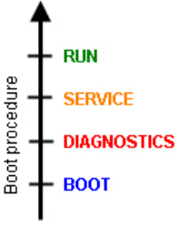
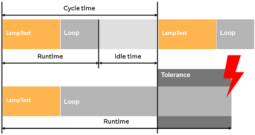

> Tags: #AR

> 此章节信息主要来自贝加莱基础培训 TM213 Automation Runtime

- [1 B02.020.什么是贝加莱PLC的SERV模式](#_1-b02020%E4%BB%80%E4%B9%88%E6%98%AF%E8%B4%9D%E5%8A%A0%E8%8E%B1plc%E7%9A%84serv%E6%A8%A1%E5%BC%8F)
- [2 Automation Runtim操作状态](#_2-automation-runtim%E6%93%8D%E4%BD%9C%E7%8A%B6%E6%80%81)
	- [2.1 BOOT](#_21-boot)
	- [2.2 DIAGNOSTICS](#_22-diagnostics)
	- [2.3 SERVICE](#_23-service)
	- [2.4 RUN](#_24-run)

# 1 B02.020.什么是贝加莱PLC的SERV模式

# 2 Automation Runtim操作状态

- Automation Runtime具有四个操作状态，分别是BOOT，DIAGNOSTICS，SERVICE，RUN
- 在PLC启动过程中也是按照四个阶段依次启动执行，一旦一个阶段顺利完成那么就开始启动下个阶段。
- 在“RUN”阶段下，Automation Runtime开始循环执行由Automation Studio开发的应用程序。
- 
- 有些事件会引起目标系统在某一阶段停止，然后系统会停留在这一状态方便诊断。具体描述见下：

## 2.1 BOOT

- 启动状态描述
    - 加载Boot AR
    - 可能在下载操作系统
- 导致进入该系统状态的条件
    - 未插入CompactFlash卡
    - CF卡/CFast卡中没有可用的操作系统
    - 节点号切换为“00”，模式选择开关切换为“BOOT”，复位按钮RESET BUTTON按键导致
- PLC上r灯颜色
    - 红灯常亮
- Automation Studio 连接上PLC后可见状态栏信息
    - 

## 2.2 DIAGNOSTICS

- 启动状态描述
    - 加载来自SystemROM的模块，例如ashwd，sysconf，asfw，arconfig，TCData
- 导致进入该系统状态的条件
    - 清空内存
    - 致命的系统错误
    - 节点号切换为“FF”，模式选择开关切换为“DIAG”，复位按钮
- Automation Studio 连接上PLC后可见状态栏信息
    - 
- PLC上r灯颜色
    - 红灯常亮

## 2.3 SERVICE

> 关联信息 → [006PLC进入Service Mode，该如何解决？](../B03_技术_诊断/006PLC进入Service%20Mode，该如何解决？.md)

- 启动状态描述
    - 加载system modules
- 导致进入该系统状态的条件
    - 除零操作
        - 与Intel目标系统(例如X20CP3687X)不同的是，除0不会导致ARM目标系统（例如X20CP04系列PLC）上的处理器异常，而是导致0。
    - 页面出错 Page Fault
        - 现象
            - 一般为内存溢出
            - 如果使用AS4.7及以上，在线连接PLC后，通过logger中的Backtrace信息，可直接跳转到导致Page Fault的代码段
        - 解决方式
            - 检查代码中是否数据越界
            - 检查代码中是否误用了strcat，strcpy，memcpy等内存操作
    - 循环时间时间超时
        - 现象
            - 任务的执行时间过长
            - 
        - 解决方式
            - 优化代码质量，减少循环调用次数，实现负载均衡
            - 增加任务所在循环周期的时间
            - 增加循环周期的容忍时间
    - 丢失硬件模块
        - 在模块配置处将module supervised 设置为OFF
        - 
    - 通过Automation Studio操作，使Automation Runtime设置为SERV模式
        - 
- Automation Studio 连接上PLC后可见状态栏信息
    - 
- PLC上r灯颜色
    - 红灯常亮

## 2.4 RUN

- 没有错误
- 启动状态描述
    - 加载任务
    - 启动任务周期系统
- Automation Studio 连接上PLC后可见状态栏信息
    - 
- PLC上r灯颜色
    - 绿灯常亮
