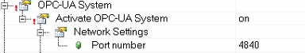
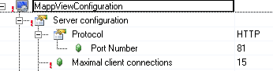
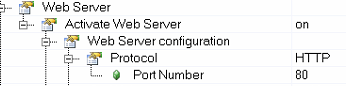
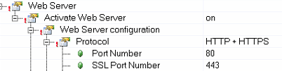
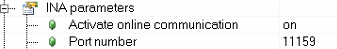
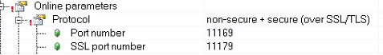
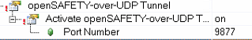
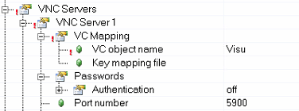

|服务 |端口号|备注|
|:-----|:-----|:-----|
|FTP| 21 | |
|TFTP| 69 |      |
|FTPS| 990 |      |
|ModbusTCP Slave| 502 |      |
|ModbusTCP Master| 自行分配 |      |
|OPC UA| 4840 | 可自行调整  |
|rpcbind| 111 |RPC(Remote Procedure Call，远程过程调用)服务所开放的端口，主要用于分布式系统中不同计算机的内部进程通信|
|IEC 61850| 102 | |
|IEC 104| 2404 | |
|mappView| 81 |可自行调整 |
|Webserver (HTTP)| 80 |例如SDM服务即基于此端口   可自行调整 |
|Webserver (HTTPS)| 443 | 可自行调整  |
|INA| 11159 | 可自行调整  |
|ANSL (non-secure)| 11169 | 可自行调整  |
|ANSL (secure)| 11179 | 可自行调整  |
|openSafety OverUDP| 9877 | 可自行调整  |
|SNTP/NTP| 123 | 对时服务 |
|VNC| 5900 | 可自行调整  |
|AR Simulation| 11160 | Automation Studio仿真时连接ARSim的端口 可自行调整  |

