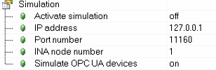

| 服务               | 端口号   | 备注                                                                                                                       |
|:------------------ |:-------- |:-------------------------------------------------------------------------------------------------------------------------- |
| TFTP               | 69       |                                                                                                                            |
| Webserver (HTTP)   | 80       | 例如SDM服务即基于此端口   可自行调整                  |
| rpcbind            | 111      |RPC(Remote Procedure Call，远程过程调用)服务所开放的端口，主要用于分布式系统中不同计算机的内部进程通信   RPC服务被其他例如NFS Client的服务需要 如果实际项目中不需要，可以通过贝加莱防火墙关闭|
| INA                | 11159    | 可自行调整                                                |
| ANSL (non-secure)  | 11169    |可自行调整 |
| ANSL (secure)      | 11179    | 可自行调整                                              |

## 默认关闭端口

| 服务               | 端口号   | 备注                                                                                                                       |
|:------------------ |:-------- |:-------------------------------------------------------------------------------------------------------------------------- |
| FTP | 20 - 21       |                                                                                                                            |
|DHCP server |67|修改选项 Ethernet - Configuration: DHCP server |
|OPC server |135|修改选项 Configuration: OPC server |
|SNTP server|123|对时服务  修改选项 Configuration: Time synchronization|
|Modbus TCP slave |502 |修改选项 Ethernet - Configuration: Modbus parameter|
| ModbusTCP Master| 自行分配 |  |
|DCOM and OPC server |1026 与 1029|修改选项：Configuration: OPC server|
|GDB server |2323|如果在 Automation Studio 中进行 Debugger 即会占用此端口|
|ARWin 内部通信|4000|修改选项：Configuration: Automation Runtime type |
|ARWin 内部通信的 License 管理|4001|修改选项：Configuration: Automation Runtime type|
|ARWin 内部通信（ARwin service 与 ARwin loader） |4002|修改选项：Configuration: Automation Runtime type|
| OPC UA| 4840     | 可自行调整                                                   |
|VNC server |5900 - 5931|修改选项：Ethernet - Configuration: VNC server |
|ARSim 上的 I/O simulation|7353|修改选项：Sim device|
|VC manager web interface for debugging purposes|8000|只有当 VC4使用时才激活 |
|VISAPI server data port|8001|只有当VISAPI使用时才激活|
|Site manager / Remote maintenance |8888|SiteManager模块配置时可修改端口|
|PVI remote communication|20000|修改方式：PVI monitor configuration: TCP/IP communication|
|SPROXY port for SafeDESIGNER-to-SafeLOGIC communication|50000|修改方式：Module - Configuration: SafeDESIGNER-to-SafeLOGIC communication|
|DTM server|50200|修改方式：Target system - Configuration: DTM server|
|Remote Control connection in SafeDESIGNER - Legacy Safety|51000+|修改方式：Project engineering of a SafeLOGIC module   SafeLogicID-1 for LegacySafety|
|Remote Control connection in SafeDESIGNER - mappSafety|52000+|SafeDomainID-1 for mapp Safety |
|NetX diagnostic|51111 - 51112|修改方式：Configuring a NetX module|
| IEC 61850| 102      |                                                                                                                            |
| IEC 104            | 2404     |                                                                                                                            |
| mappView           | 81       | 可自行调整                                                               |
| Webserver (HTTPS)  | 443      | 可自行调整                                               |
| openSafety OverUDP | 9877     | 可自行调整                                              |
| SNTP/NTP           | 123      |对时服务|
| VNC                | 5900     |可自行调整 |
| AR Simulation      | 11160    | Automation Studio仿真时连接ARSim的端口 可自行调整  |

## Client 端口

| 服务               | 端口号   | 备注                                                                                                                       |
|:------------------ |:-------- |:-------------------------------------------------------------------------------------------------------------------------- |
|邮件发送AsSmtp|25|Email dispatch via library "AsSmtp"|
|DNS client|53 |修改选项：Ethernet - Configuration: DNS parameters|
|DHCP client |68|修改方式：Ethernet - Configuration: Get IP address from DHCP server## 默认开启端口|
|AsSnmp|161|SNMP communication via library "AsSnmp"|
|SMB/CIFS communication|445|SMB/CIFS communication via library "FileIO"|