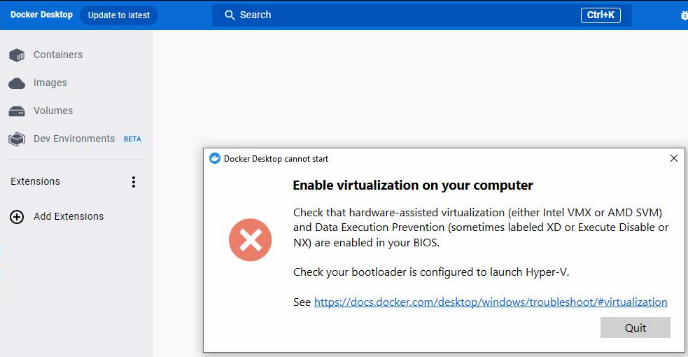

## 现象
- 在安装了 Hypervisor 系统上，安装 Docker 后，运行会报出如下报错
- 

## 原因
- Hypervisor 占用了虚拟化技术端口，因此使用此项技术的功能都无法使用，例如 VMWare，VirtualBox，Docker。
## Automation Help 4.12 说明不支持
GUID: 9cab0273-63dc-448f-ba19-8d69720f1960
路径：Real-time operating system - Target systems - Target systems SG 4 - B&R Hypervisor - Features - Virtualization
>   Virtualization in the GPOS
>   It is not possible to use virtualization that uses hardware virtualization functions (e.g. Hyper-V) since B&R Hypervisor exclusively requires these hardware functions.