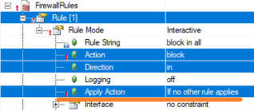
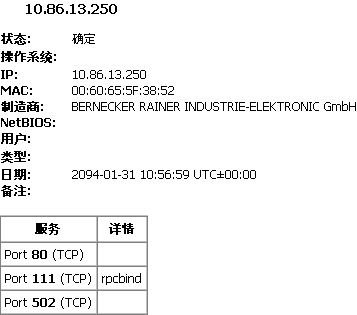
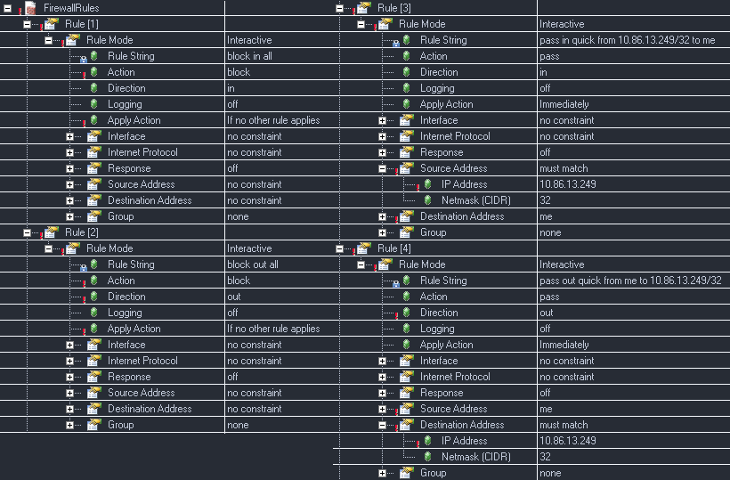
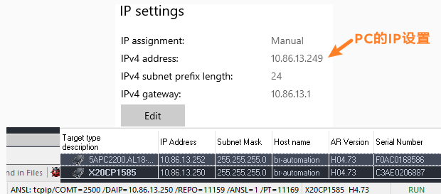
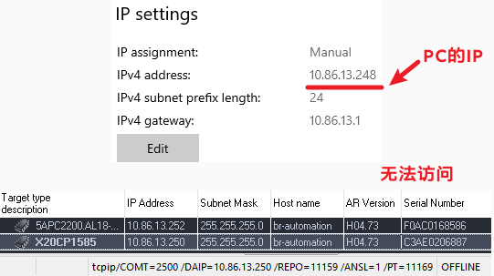
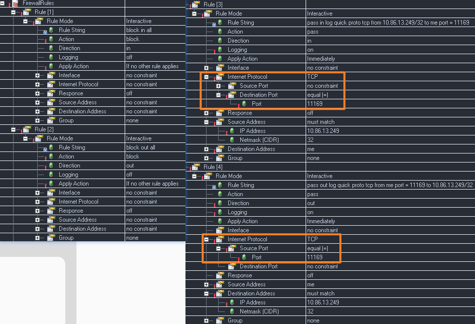
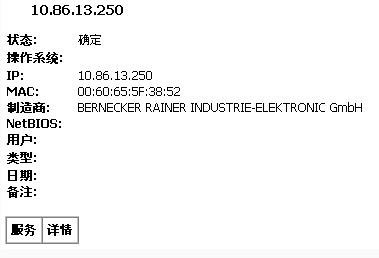
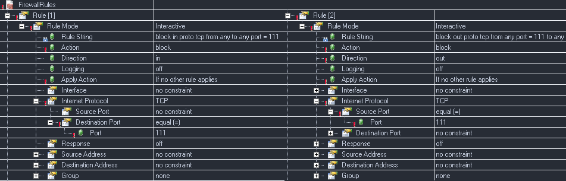
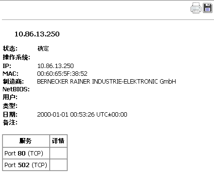

> Tags: #防火墙Firewall

- [1 B02.025.贝加莱防火墙Firewall配置案例](#_1-b02025%E8%B4%9D%E5%8A%A0%E8%8E%B1%E9%98%B2%E7%81%AB%E5%A2%99firewall%E9%85%8D%E7%BD%AE%E6%A1%88%E4%BE%8B)
- [2 背景知识](#_2-%E8%83%8C%E6%99%AF%E7%9F%A5%E8%AF%86)
- [3 配置基本规则](#_3-%E9%85%8D%E7%BD%AE%E5%9F%BA%E6%9C%AC%E8%A7%84%E5%88%99)
- [4 检查 PLC 上开放端口方式](#_4-%E6%A3%80%E6%9F%A5-plc-%E4%B8%8A%E5%BC%80%E6%94%BE%E7%AB%AF%E5%8F%A3%E6%96%B9%E5%BC%8F)
- [5 案例一：只允许指定 IP 访问 PLC](#_5-%E6%A1%88%E4%BE%8B%E4%B8%80%EF%BC%9A%E5%8F%AA%E5%85%81%E8%AE%B8%E6%8C%87%E5%AE%9A-ip-%E8%AE%BF%E9%97%AE-plc)
	- [5.1 配置方式](#_51-%E9%85%8D%E7%BD%AE%E6%96%B9%E5%BC%8F)
	- [5.2 实现效果](#_52-%E5%AE%9E%E7%8E%B0%E6%95%88%E6%9E%9C)
- [6 案例二: PLC 只开放指定 IP 与指定端口号提供访问](#_6-%E6%A1%88%E4%BE%8B%E4%BA%8C-plc-%E5%8F%AA%E5%BC%80%E6%94%BE%E6%8C%87%E5%AE%9A-ip-%E4%B8%8E%E6%8C%87%E5%AE%9A%E7%AB%AF%E5%8F%A3%E5%8F%B7%E6%8F%90%E4%BE%9B%E8%AE%BF%E9%97%AE)
	- [6.1 配置方式](#_61-%E9%85%8D%E7%BD%AE%E6%96%B9%E5%BC%8F)
	- [6.2 实现效果](#_62-%E5%AE%9E%E7%8E%B0%E6%95%88%E6%9E%9C)
- [7 案例三：关闭指定端口](#_7-%E6%A1%88%E4%BE%8B%E4%B8%89%EF%BC%9A%E5%85%B3%E9%97%AD%E6%8C%87%E5%AE%9A%E7%AB%AF%E5%8F%A3)
	- [7.1 配置方式](#_71-%E9%85%8D%E7%BD%AE%E6%96%B9%E5%BC%8F)
	- [7.2 实现效果](#_72-%E5%AE%9E%E7%8E%B0%E6%95%88%E6%9E%9C)

# 1 B02.025.贝加莱防火墙Firewall配置案例

# 2 背景知识

- [023贝加莱操作系统支持防火墙功能吗](023贝加莱操作系统支持防火墙功能吗.md)
- [024如何在Automation Studio中配置防火墙](024如何在Automation%20Studio中配置防火墙.md)

# 3 配置基本规则

- 添加 Firewall rule 时需要注意:
    - 对于同一规则
        - 如果先放行，那么后续再添加的阻挡策略就不会生效；
        - 反之，如果先阻挡，那么后续的放行就不会生效。
    - 如果希望对同一规则下增加例外
        - Apply Action 设置为 If no other rule applies
        - 
- 防火墙功能在仿真模式下，相关功能会存在异常，因此建议在硬件 PLC 上测试。

# 4 检查 PLC 上开放端口方式

- 端口扫描工具
    - [https://www.advanced-port-scanner.com/cn/](https://www.advanced-port-scanner.com/cn/)
- 默认情况下开启 ModbusTCP Slave 功能的 PLC 开放的端口
    - 

# 5 案例一：只允许指定 IP 访问 PLC

## 5.1 配置方式

- 只允许 IP 为 10.86.13.249 的设备访问
- 

## 5.2 实现效果

- PC 的 IP 地址为 10.86.13.249 可以访问
- 
- PC 的 IP 地址为 10.86.13.248 不可以访问
- 

# 6 案例二: PLC 只开放指定 IP 与指定端口号提供访问

## 6.1 配置方式

- 只允许 IP 为 10.86.13.249 的 PC 设备访问
- 

## 6.2 实现效果

- 端口扫描工具无法扫到其他端口
    - 
- 通过 AS 软件能够连接此 PLC
    - 
- PLC 的 ModbusTCP Slave 与 Web 服务例如 SDM 均无法访问

# 7 案例三：关闭指定端口

## 7.1 配置方式

- 关闭 PLC 上开启的 111 端口
- 

## 7.2 实现效果

- 可见原先默认开放的 111 端口已被关闭
- 
