> 026Hypervisor常见问题一览

> #Hypervisor #问题处理

> 最后更新时间：2023.12.28

- Q0: Hypervisor安装启动中出现 /OS/1 I/O access blocked. 影响安装吗？
- Q1: Hypervisor安装停留在界面
- Q2:Hyervisor装完之后进入windows就崩溃，删除后能正常启动
- Q3:Hypervisor装完后一直重启，最后进入花屏
- Q4:Hypervisor安装完后停留在界面
- Q5:Hypervisor安装完成后直接进入Win10没有重启。
- Q6:Linux下装好后启动，停留在黑屏。
- Q7:对PPC2100硬件，基于AR4.8的U盘安装Hypervisor，在线更新后，CPU原有的3核变为1核。
- Q8:APC2200，装完hypervisor后，windows（非官方镜像）在第三次断电后出现需要恢复，无法正常启动
- Q9:APC3100，装完hypervisor及驱动后，windows网口无法使用，显示驱动损坏
- Q10:当已正确安装Hypervisor，系统也已提示安装Hypervisor正确安装，在重启后发现卡在此步骤不动，应该如何处理。
- Q11:通过USB installation stick进行安装Hypervisor，在Install之后，没有正常安装，提示Error:
- Q12:工控机Windows安装界面卡在Recovery Solution，点击Start无法进入下一步
- Q13:客户在已安装Hypervisor的工控机上下载程序时报错
- Q14:重新启动后，安装冻结，无法继续 – ARemb 在RUN的状态
- Q15: 重新启动后安装冻结，无法继续 - ARemb在SERVICE模式
- Q16: Windows循环重启，并带有错误码: INACCESIBLE BOOT DEVICE
- Q17:安装GPOS上的驱动时报错
- Q18:在UEFI APC上安装Hypervisor的常见问题
- Q19:为Hypervisor分配太多的内存
- Q20:使用APC910 TS77-04安装Hypervisor，启动后显示器显示花屏
- Q21:Hypervisor的驱动安装了，但内部的虚拟网口无法被找到
- Q22:安装Hypervisor，提示Hypervisor无法安装在UEFI操作系统上
- Q23:AS4.7安装Hypervisor在Win10操作系统后，操作系统一直进入蓝屏状态，重启后仍然会进入蓝屏
- Q24:安装Hypervisor后，屏幕花屏
- Q25:使用了性能较差的CF卡作为USB Installation Stick，导致安装异常
- Q26:PPC2200之类的设备，使用Debian系统，在镜像到不同屏幕上，触摸功能失效
- Q27:安装好Hypervisor后的Windows系统如何再次分区？
- Q28:安装Hypervisor后提示安装成功，但实际Hypervisor没有启动，ETH口无法连上。
- Q29:在APC910-QM77上安装Hypervisor报错提示Virtualization is disabled by the firmware
- Q30:5ACPCE.ETH4-00卡能否支持Hypervisor？
- Q31:在操作系统为Debian 10上的APC910 TS17-04设备上安装Hypervisor，提示如下报错
- Q32:安装Hypervisor驱动时，提示A backup of the original boot loader already exists.
- Q33:原先安装正常使用的Hypervisor，卸载安装其他版本的Hypervisor，出现 The original boot loader could not be backuped
- Q34:Hypervisor在USB更新程序后无法启动显示License is not valid
- Q35:给一台全新的硬件安装Hypervisor提示Uninstall
- Q36:安装过程中 Hypervisor 重启几次后，卡在/OS/1 Booting runtime 0 状态
- Q37:U盘安装Hypervisor，在系统选择从U盘启动时提示BOOTMGR is missing
- Q38:安装Hypervisor提示Hypervisor boot failed.
- Q39:安装卡在30%，出现欢迎访问Buildroot的信息
- Q40:在APC3100上安装Hypervisor提示You cannot install B&R Hypervisor on a UEFI system when you have booted the USB install stick with legacy.
- Q41: 使用AS4.10，Hypervisor安装提示 No EFI system partition (ESP) found

# Q0: Hypervisor安装启动中出现 /OS/1 I/O access blocked. 影响安装吗？

- A0:
- 在安装过程中，系统试图检测一个串行接口。如果所使用的硬件上没有这个接口，就会输出以下警告。
- 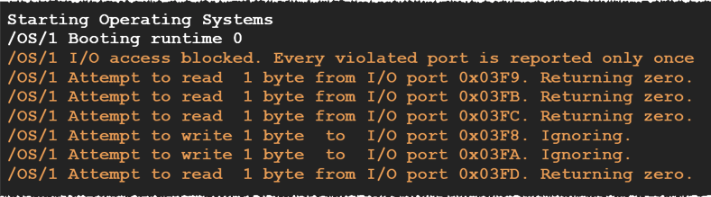
- 这些警告并不影响安装程序。

# Q1: Hypervisor安装停留在界面

- A1: USB安装盘插在了windows口上
- 

# Q2:Hyervisor装完之后进入windows就崩溃，删除后能正常启动

- A2:重装ADI驱动

# Q3:Hypervisor装完后一直重启，最后进入花屏

- A3:更新AS版本补丁包

# Q4:Hypervisor安装完后停留在界面

- A4:CPU型号选错
- 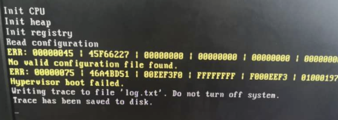

# Q5:Hypervisor安装完成后直接进入Win10没有重启。

- A5:BIOS中BOOT启动项要选择B&R Hypervisor（最近采购的工控机才有的选项）

# Q6:Linux下装好后启动，停留在黑屏。

- A6:一开始使用的AR版本是B4.82，换成B4.62，成功
- 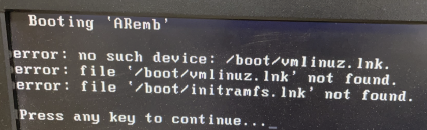
- 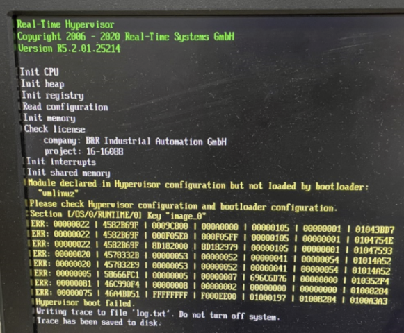

# Q7:对PPC2100硬件，基于AR4.8的U盘安装Hypervisor，在线更新后，CPU原有的3核变为1核。

- A7:换用AR4.7及以下，通过U盘安装Hypervisor。之后通过AS4.8进行在线更新，则没有问题

# Q8:APC2200，装完hypervisor后，windows（非官方镜像）在第三次断电后出现需要恢复，无法正常启动

- A8:
- **操作步骤**
    - 在 Win 10 系统下按 Win+R 按键，启动 【命令行 (管理员模式)】。注意：一定要是管理员模式。
    - 依次输入如下命令（注意空格和符号）：

```
bcdedit /set bootstatuspolicy ignoreallfailures
bcdedit /set recoveryenabled No
bcdedit /set {current} bootstatuspolicy ignoreallfailures
bcdedit /set {current} recoveryenabled No
bcdedit /set {globalsettings} advancedoptions false
```

- 正常重启计算机一次。然后就可以测试效果了，这时再出现三次不正常启动也就不会出现恢复选项了。
- 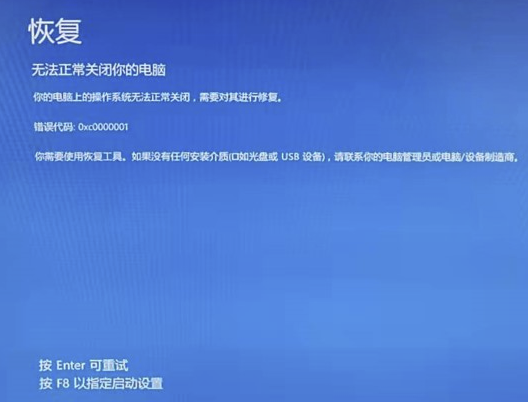

# Q9:APC3100，装完hypervisor及驱动后，windows网口无法使用，显示驱动损坏

- A9:
- 操作步骤：
    - 原AS版本4.10，AR版本B4.91。将AR版本升级至D4.91。
    - 在Windows管理器内卸载BR Hypervisor。
    - 将升级AR后的程序下载至工控机内。
    - 重新安装Windows的BR Hypervisor。

# Q10:当已正确安装Hypervisor，系统也已提示安装Hypervisor正确安装，在重启后发现卡在此步骤不动，应该如何处理。

- 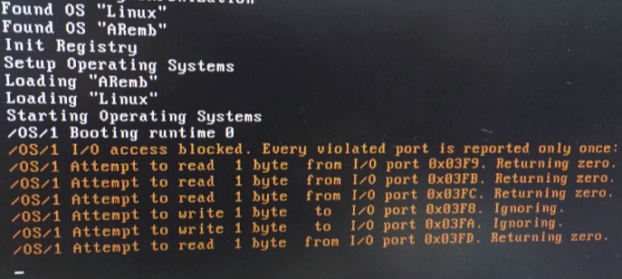
- A10:
    - 1.确认BIOS版本、Firmware版本、在Linux系统上的驱动是否正确安装了。可能BIOS与Firmware使用了旧的版本或者不正确不匹配的版本。（64Bit、32Bit，不同的GPOS对应的固件版本以及BIOS）
    - 2.更新顺序必须为更新BIOS，再更新Firmware，再更新GPOS上安装的驱动。否则无效。
    - **尝试看看ARemb是否已经起来了，使用Automation Studio软件连接上，更新ARemb程序看是否能够解决。**

# Q11:通过USB installation stick进行安装Hypervisor，在Install之后，没有正常安装，提示Error:

- 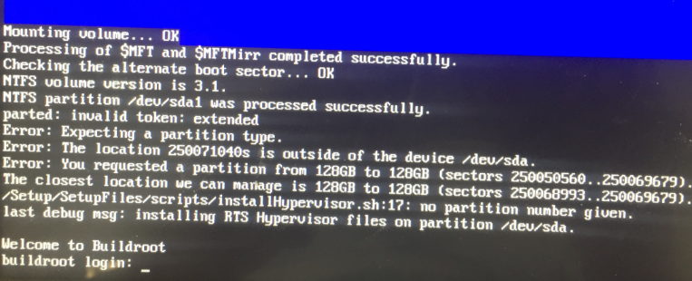
- A11:
- 此问题即是分区资源分配的不合理导致。需检查并确认：
    - 硬盘最后的区域属于 unallocated 状态且不小于1GB，
    - 划分出来的区域不是Windows下的扩展分区
    - 通过DiskGenius软件检查并确认了系统的分区情况合理
- 当系统进入Welcome to Buildroot这类Makefiles和patches的命令集，则可按Ctrl+Alt+Delete让系统自动重启。

# Q12:工控机Windows安装界面卡在Recovery Solution，点击Start无法进入下一步

- 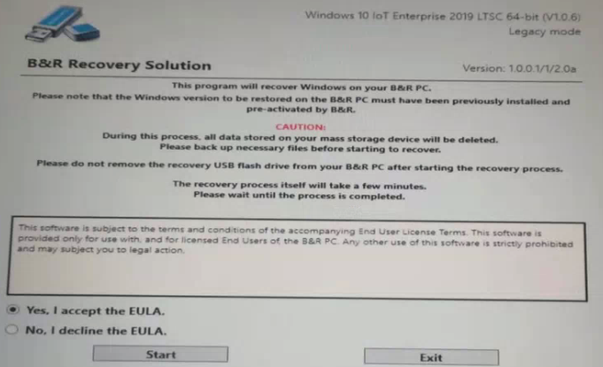
- **问题原因**：
    - 工控机无法识别到硬盘（CFast）
- **A12**：
    - 将Cfast卡插拔下，能在BIOS中识别到就可以进入下一步

# Q13:客户在已安装Hypervisor的工控机上下载程序时报错

- （客户程序中使用SAFE分区并分配了500MB User空间，安装的Hypervisor镜像中也使用了SAFE分区但是未分配User空间）
- 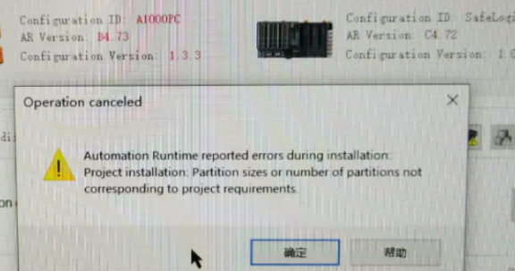
- A13: 使用SAFE分区并分配500MB User空间的Hypervisor镜像重新安装后客户可以正常下载程序

# Q14:重新启动后，安装冻结，无法继续 – ARemb 在RUN的状态

- **典型的终端信息情况**:
    - 黑屏终端提示，末尾信息为 /OS/1 Booting runtime 0 information
    - 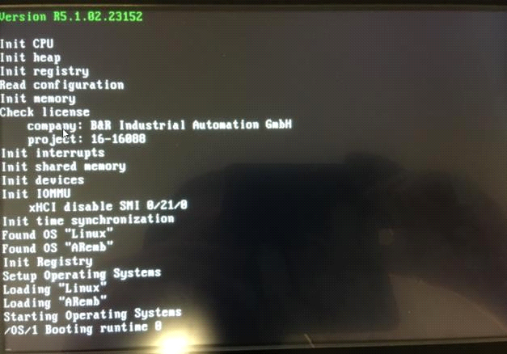
    - 有可能通过AS中分配给ARemb的ETH端口连接到ARemd，并且ARemb处于RUN模式。
    - 
    - AS → Online → Compare → Software中的差异如下
    - 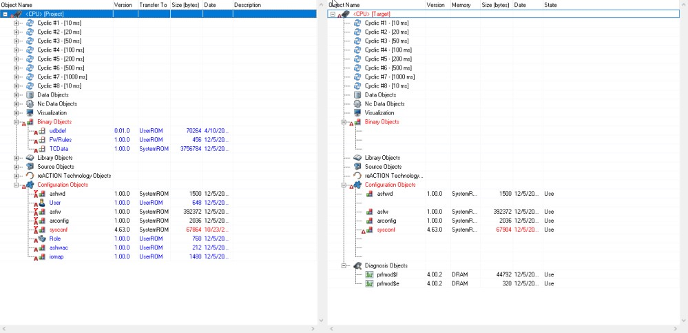
    - GPOS不启动
    - 无法从U盘中继续安装
    - 当你直接通过ETH端口从AS下载应用程序到ARemb时，GPOS将启动。
- **A14**:
    - U盘被插在APC上错误的USB端口上。有必要将U盘插入APC上的USB端口，该端口在AS中分配给ARemb。
    - 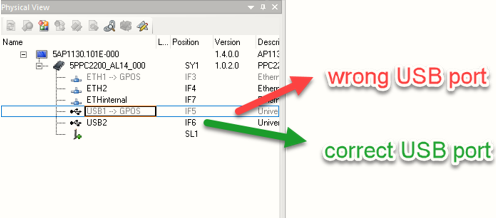

# Q15: 重新启动后安装冻结，无法继续 - ARemb在SERVICE模式

- **典型的终端信息情况**:
    - 黑屏终端提示，末尾信息为 /OS/1 Booting runtime 0 information
    - 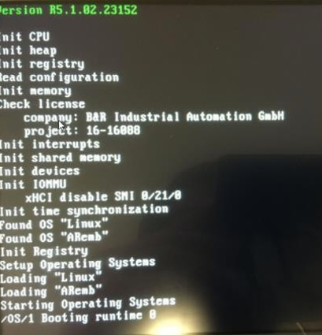
    - 有可能通过AS中分配给ARemb的ETH端口连接到ARemd，并且ARemb处于SERV模式。
        - 
    - AS → Online → Compare → Software中显示的差异如下
        - 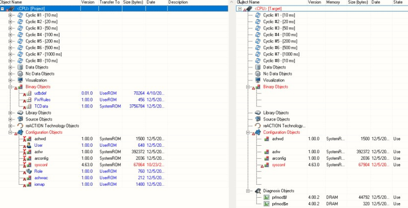
    - GPOS不启动
    - 从U盘中无法继续安装
- **A15**:
    - 当你打开Online → Compare → Hardware，检查AS中使用的HW和目标上真正使用的HW，你会发现有差别。
    - 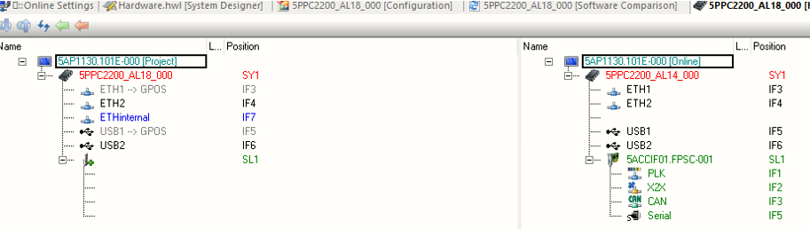
    - 如果你将HW配置改为正确的配置，一切都应该运行。

# Q16: Windows循环重启，并带有错误码: INACCESIBLE BOOT DEVICE

- **现象**
    - Windows循环重启
    - 蓝色窗口并带有如下Stop Code: INACESSIBLE BOOT DEVICE
    - 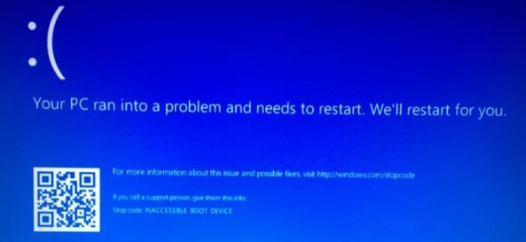
    - ARemb 在 RUN 状态
        - 
- **A16**:
    - 原因是IDE ATA/ATAPI控制器没有设置为标准AHCI 1.0。
    - 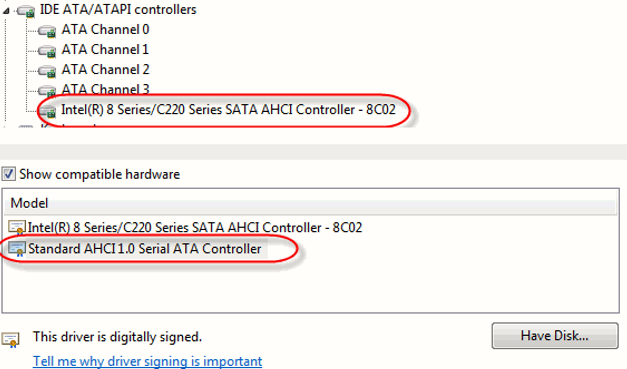
    - 这也意味着在这种情况下，GPOS驱动程序没有安装到Windows中。

# Q17:安装GPOS上的驱动时报错

- **现象**
    - 当你从AS中为管理程序生成安装USB时，也有一个GPOS的驱动程序，它创建了虚拟的ETH端口，以便于从ARemb到GPOS的通信。这个驱动程序在USB的BRHypervisor/GPOSDrivers/Windows中。
    - 在APC上安装Hypervisor之前，有必要在Windows上安装这个驱动程序。
    - 安装时会返回错误，提示必须先卸载AHCI驱动程序。
    - 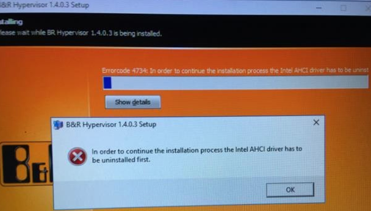
- **A17**：
    - 检查IDE ATA/ATAPI控制器
    - 这取决于APC的类型，但有些APC不使用de-fail的标准AHCI 1.0串行控制器，而是使用例如英特尔的。为了正确安装Hypervisor，有必要改变这个控制器。
    - 具体操作方式请参考此章节。
    - 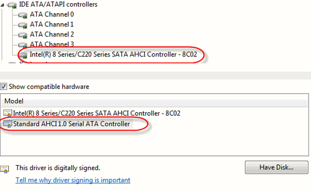

# Q18:在UEFI APC上安装Hypervisor的常见问题

- 原本可以在APC上安装的Hypervisor, Boot Type选择 Legacy boot type only，由于更换了CFast卡，或者选择重新安装镜像，发现提示UEFI，不能正常安装
- 如遇到以下中列出的问题，建议使用AS4.7及以上的软件进行安装
- 案例说明
    - 如果你试图在这样的APC上安装hypervisor，你会在安装过程中收到信息，即不可能在UEFI系统上安装hypervisor。
        - 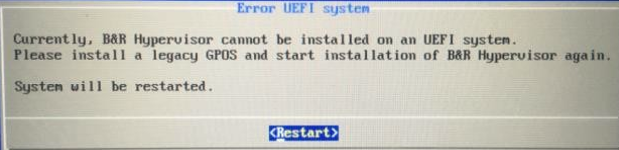
    - 在旧版本的AR中，你可以在安装过程中收到一个窗口，说没有可用的磁盘来安装Hypervisor，即使出现了未分配的分区。
        - 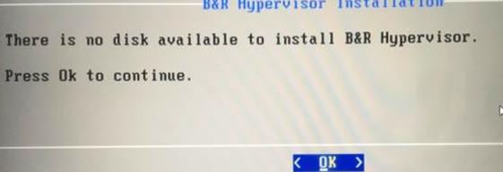
    - 也有可能你能在APC上以UEFI启动模式安装hypervisor，但在第一次重启hypervisor安装后，你会再次进入安装屏幕，hypervisor会想要卸载。
        - 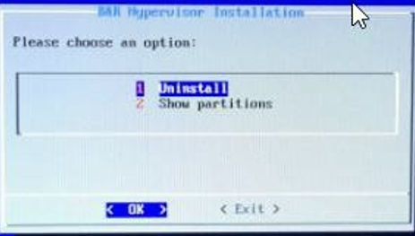

# Q19:为Hypervisor分配太多的内存

- **现象**
    - 可以在AS中配置hypervisor的内存大小。
    - 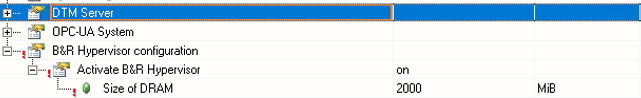
    - 我们有不同的APC，有不同大小的DRAM内存。可能发生的情况是，为管理程序配置了太多的内存。当这种情况发生时，你会收到这个错误窗口
    - 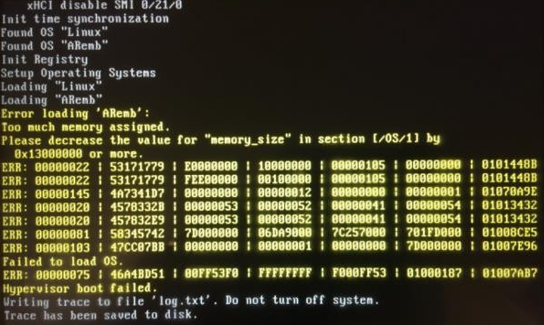
    - Hypervisor将不会更多的启动，GPOS也不会启动。
- **A19**:
    - 在这种情况下，有必要减少配置在 AS 中的 DRAM 内存的大小。如果需要使用更多的内存，有必要订购内部有更多DRAM内存的APC。

# Q20:使用APC910 TS77-04安装Hypervisor，启动后显示器显示花屏

- **现象**
    - 用的BIOS为Q1.30 MTCX为1.25
    - 使用AS 4.6.2，AR为B4.62
    - hypervisor的ARemb在更新硬件配置后启动正常，程序正常加载。但切换到Linux系统后显示花屏。
    - 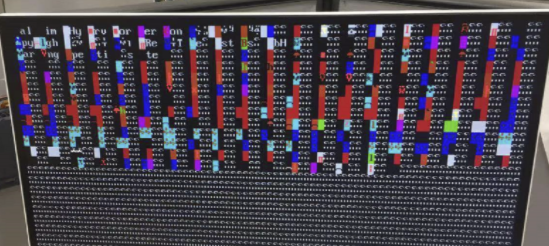
- **A20**:
    - 后将项目升级到AS4.7.2，在线更新程序，Hypervisor下AR更新成功，Linux原本的花屏现象消失

# Q21:Hypervisor的驱动安装了，但内部的虚拟网口无法被找到

- A21:AS项目中的ETHinternal没有正确配置，合理配置如下：
    - 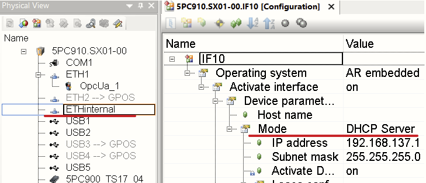

# Q22:安装Hypervisor，提示Hypervisor无法安装在UEFI操作系统上

- 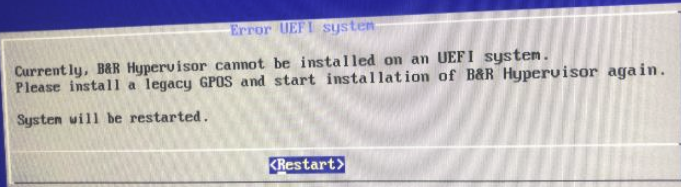
- A22:
    - 使用AS4.7，并使用Automation Runtime B4.73及以上版本进行安装。

# Q23:AS4.7安装Hypervisor在Win10操作系统后，操作系统一直进入蓝屏状态，重启后仍然会进入蓝屏

- 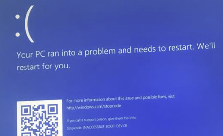
- A23:在WIndows系统上安装ADI驱动

# Q24:安装Hypervisor后，屏幕花屏

- A24:
    - 有如下几种可能会导致此现象
        - 测试PPC2200时，因为BIOS的参数设置错误，导致屏幕花屏
            - BIOS的realtime environment没开
            - BIOS的Hypervisor没开
        - PPC910时，因为下载了低的Runtime，导致屏幕花屏。
        - 使用B4.62的AR

# Q25:使用了性能较差的CF卡作为USB Installation Stick，导致安装异常

- 
- 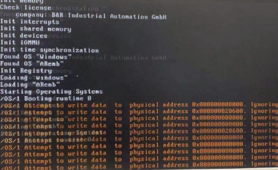
- A25:
    - 使用USB3.0接口的U盘作为USB Installation Stick

# Q26:PPC2200之类的设备，使用Debian系统，在镜像到不同屏幕上，触摸功能失效

- A26:
    - 如果使用的屏幕类型在多点触控到单点触控之间切换，使用同一个镜像，需要重新校准，否则触摸功能失效。
    - 以下简单介绍如何找到对应的驱动资源，并进行设置安装。
    - 确认Debian系统上安装了Touch Screen驱动，如果没有安装，可去贝加莱官网进行下载获取
    - 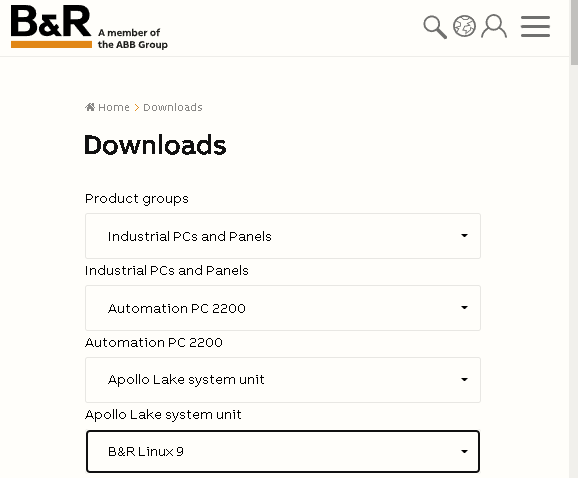
    - 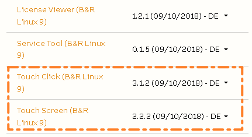
- 使用Root权限安装完成后，在启动项列表中找到Touch Screen。
    - 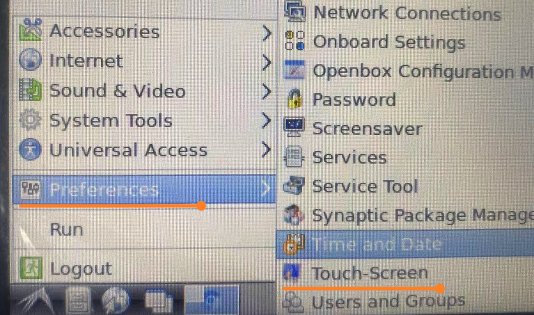
- 先点击Test all，再Apply，即解决屏幕的触摸不起作用的问题。
    - 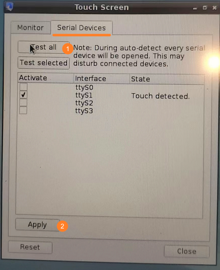
- 若发现屏幕上点击有偏移，可在此页面，先Assign屏幕，再Calibrate校准屏幕。
    - 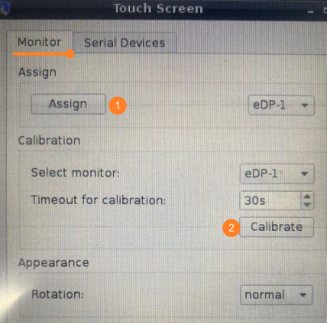
- 关于Linux上驱动的具体使用方式，可下载对应的文档，了解更多。
    - 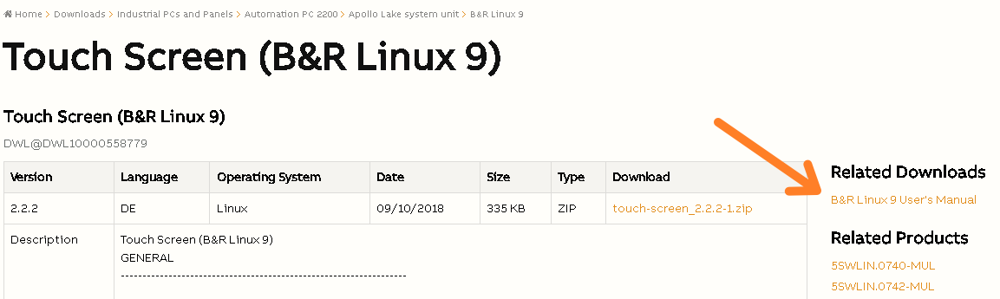

# Q27:安装好Hypervisor后的Windows系统如何再次分区？

- A27:
    - 需要先卸载Hypervisor，再通过Windows磁盘管理或DiskGenius软件进行分区，否则会提出如下报错。
    - 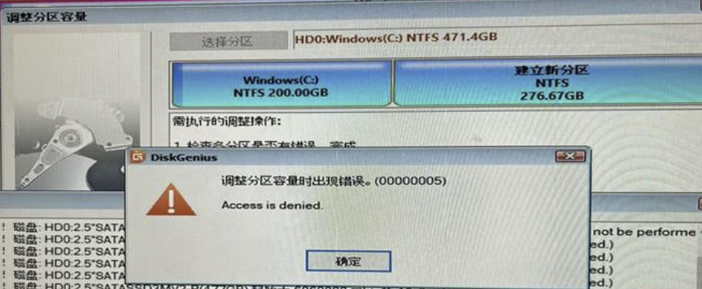

# Q28:安装Hypervisor后提示安装成功，但实际Hypervisor没有启动，ETH口无法连上。

- A28:
- BIOS启动项设置错误，1st Boot Device需要调整为BR Hypervisor，（选择设置后能够看到此选项）
    - 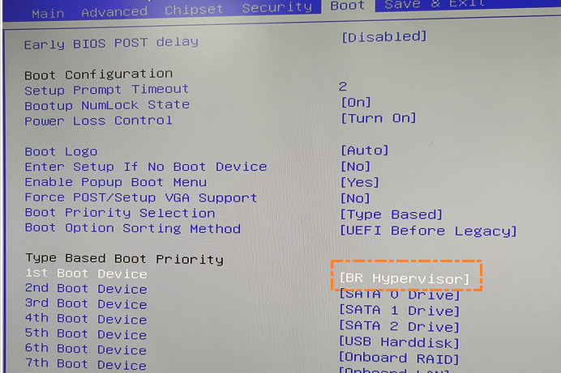

# Q29:在APC910-QM77上安装Hypervisor报错提示Virtualization is disabled by the firmware

- 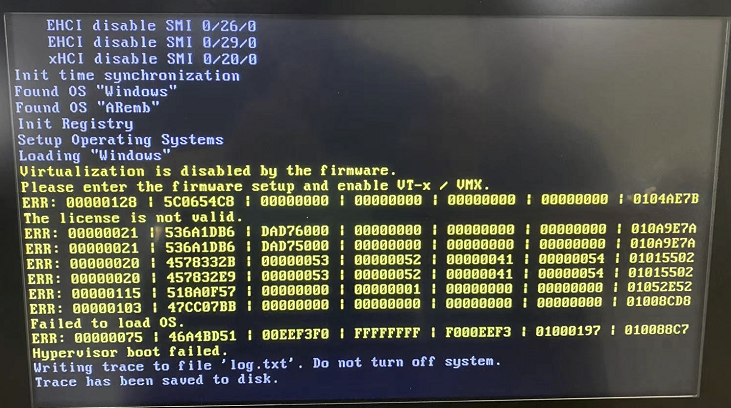
- A29:
    - BIOS与Firmware版本过低，需要更新至最新。操作参考[此处](#FAQ11)。

# Q30:5ACPCE.ETH4-00卡能否支持Hypervisor？

- A30:
    - 支持在Windows/Linux上使用
    - ARemb上无须配置
    - 使用贝加莱BR Linux(debian 10)，无须额外装驱动，卡插上即可直接使用。

# Q31:在操作系统为Debian 10上的APC910 TS17-04设备上安装Hypervisor，提示如下报错

- 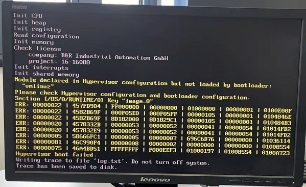
- A31:
    - 原因为Linux下的驱动没有安装好。
    - 使用最新的Automation Runtime，创建Hypervisor的USB Installation Stick，可从中获得最新的Linux驱动，将驱动完全安装后，再安装Hypervisor。
    - 详情参考[此处](#Setup10)。

# Q32:安装Hypervisor驱动时，提示A backup of the original boot loader already exists.

- **现象**
    - 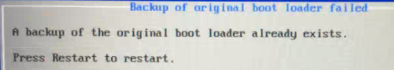
- **原因**:
    - 原因是未分配的分区不在磁盘上最末尾，或者boot loader信息错了。
    - 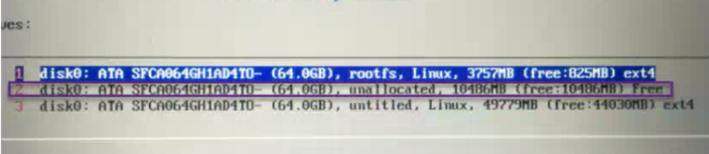
- **解决方式**
    - 重装Windows/Linux，重新安装后，有必要正确地分割磁盘，使未分配的分区成为列表中的最后一个分区。

# Q33:原先安装正常使用的Hypervisor，卸载安装其他版本的Hypervisor，出现 The original boot loader could not be backuped

- 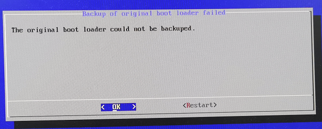
- A33: 更换高版本AR解决。
- 具体情况如下：
    - 在Win 10 2016上安装Hypervisor （AS4.7 AR:H4.73 )正常使用，但偶发出现网口丢失问题
    - 升级高版本Hypervisor (AS4.12 AR:B4.93)，无法安装，提示The original boot loader could not be backuped
    - 重新安装旧版本 (AS4.7 AR:H4.73)，能够正常安装
    - 使用更新的版本(AS4.12 AR:E4.93)，能够正常安装

# Q34:Hypervisor在USB更新程序后无法启动显示License is not valid

- 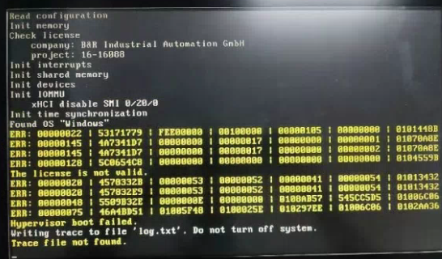
- A34: 更换更新用的U盘后解决。

# Q35:给一台全新的硬件安装Hypervisor提示Uninstall

- 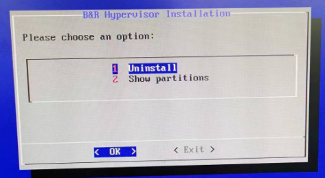
- A35:
    - 使用DiskGenius软件检查磁盘分区情况，信息如下，可见分了一个D盘，并且信息为扩展分区，Hypervisor安装的区域为硬盘的末尾，且前面分区不能为扩展分区
        - 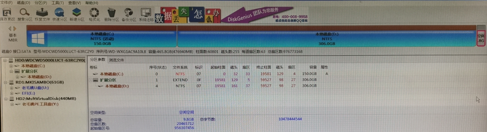
    - 解决方式为调整分区
        - 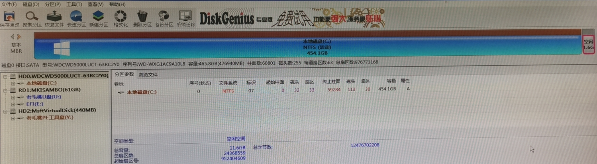
- 重新安装Hypervisor即显示正常
    - 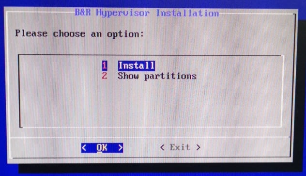

# Q36:安装过程中 Hypervisor 重启几次后，卡在/OS/1 Booting runtime 0 状态

- 现象
    - 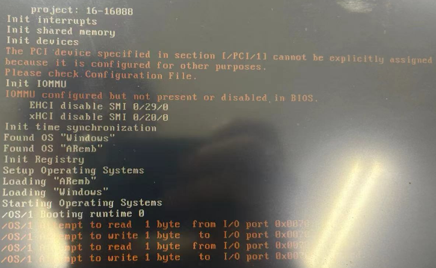
    - 或者如下界面
    - 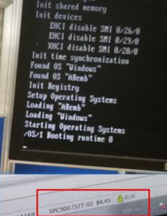
- A36:
    - 需要在线通过Automation Studio连上Hyperviosr的ARemb端，进行更新程序后解决。

# Q37:U盘安装Hypervisor，在系统选择从U盘启动时提示BOOTMGR is missing

- 现象
    - 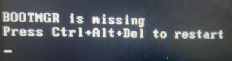
- A37:
    - U 盘坏了，换个 U 盘（建议使用 USB 3.0 及以上的接口的 U 盘，使用 2.0 接口的 U 盘，可能会导致安装失败 )

# Q38:安装Hypervisor提示Hypervisor boot failed.

- **现象**
    - 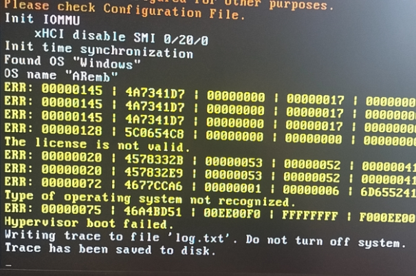
- **A38**:
    - Hypervisor的分区有问题，windows里面shink没用，Hypervisor安装时仍会提示uninstall，无法安装
    - 重新用DiskGenius软件删除重建选主分区，确保磁盘最后一个分区是主分区，就可以install了。

# Q39:安装卡在30%，出现欢迎访问Buildroot的信息

- **现象**
    - 在安装过程中，安装程序冻结在30%，并出现“Welcome to Buildroot"和“Buildroot login:”。重启后再开始安装，你会看到 boot loader已经存在的信息
    - 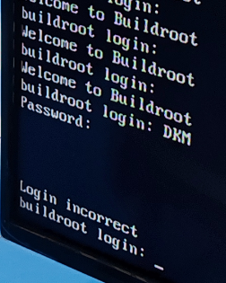
- **可能的原因和补救措施**
    - 未分配的分区不是列表中的最后一个，有可能是用"Free space preceding"而不是"New size"创建的自由空间。
    - Linux可能需要重新安装。

# Q40:在APC3100上安装Hypervisor提示You cannot install B&R Hypervisor on a UEFI system when you have booted the USB install stick with legacy.

- **现象**
    - 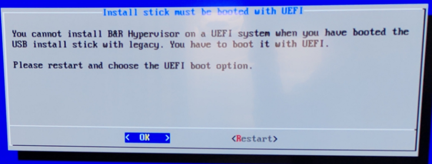
- 硬件：
    - 5APC3100_KBU2_000
- 操作系统：
    - Windows 10 IoT Enterprise 2019 LTSC
- 开发环境
    - AS4.10 E4.93
- 磁盘信息
    - 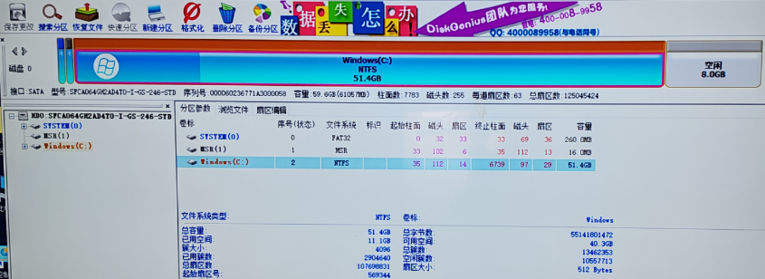
- **解决方式**
    - 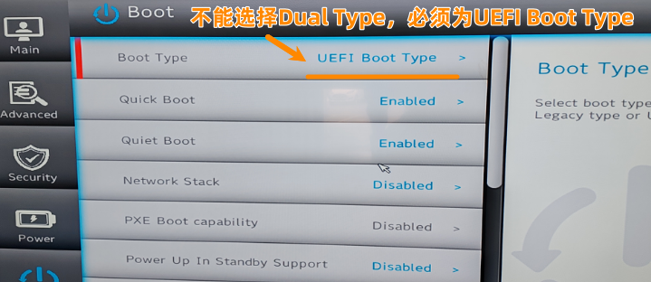

# Q41: 使用AS4.10，Hypervisor安装提示 No EFI system partition (ESP) found

- **基本参数**
    - 硬件：APC3100
    - AR版本：G4.91
    - AS版本：AS4.10
    - BIOS - Boot Type为UEFI Boot Type
- **现象**
    - 安装Linux系统（Ubuntu 16.04）后，再安装Hypervisor后，提示No EFI system partition （ESP) found
    - 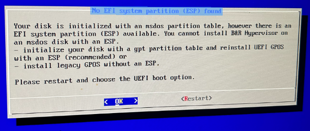
- **可能的原因**
    - CFast卡内的文件系统异常，需要使用Disk Genius软件调整
- **解决方式**
    - 1) 格式化卡：使用Diskgenius软件，将卡删除所有分区，并格式化（默认NTFS格式）
    - 2) 将格式化后的卡，进行磁盘分区操作，分为以下三个部分：
        - ESP：EFI格式(300MB)
        - 本地磁盘E：228GB
        - 剩余磁盘：闲置空区域
    - 3) 重新安装Linux系统，再使用同样的版本安装Hypervisor正常
