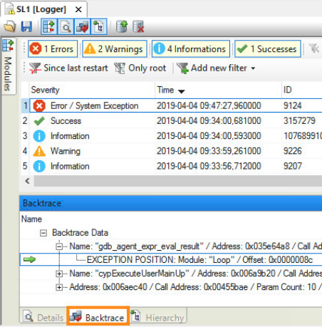
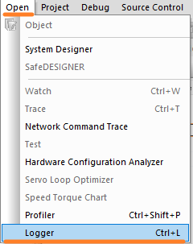
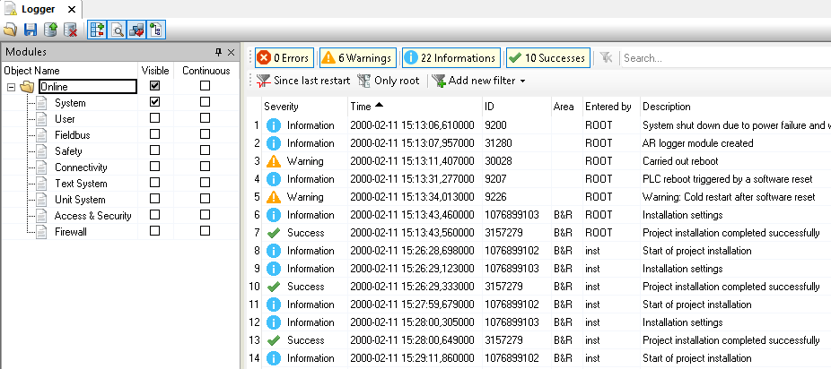
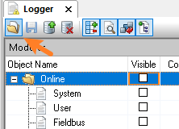
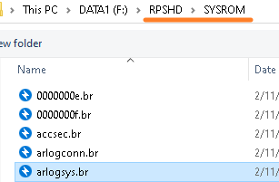
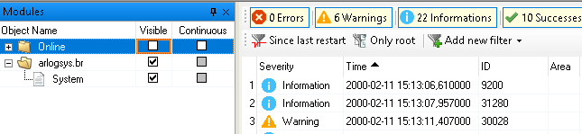
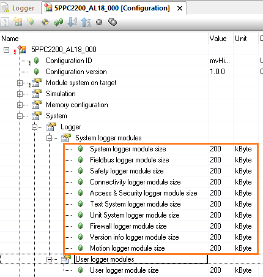

> Tags: #日志Logger #诊断
- [1 B02.027.贝加莱系统日志Logger](#_1-b02027%E8%B4%9D%E5%8A%A0%E8%8E%B1%E7%B3%BB%E7%BB%9F%E6%97%A5%E5%BF%97logger)
- [2 Logger 日志是什么？](#_2-logger-%E6%97%A5%E5%BF%97%E6%98%AF%E4%BB%80%E4%B9%88%EF%BC%9F)
- [3 Logger 如何打开](#_3-logger-%E5%A6%82%E4%BD%95%E6%89%93%E5%BC%80)
	- [3.1 Automation Studio 软件与 PLC 已建立了连接](#_31-automation-studio-%E8%BD%AF%E4%BB%B6%E4%B8%8E-plc-%E5%B7%B2%E5%BB%BA%E7%AB%8B%E4%BA%86%E8%BF%9E%E6%8E%A5)
	- [3.2 直接读取 PLC 卡内的 Logger 日志](#_32-%E7%9B%B4%E6%8E%A5%E8%AF%BB%E5%8F%96-plc-%E5%8D%A1%E5%86%85%E7%9A%84-logger-%E6%97%A5%E5%BF%97)
- [4 Logger 文件存储规则与设置](#_4-logger-%E6%96%87%E4%BB%B6%E5%AD%98%E5%82%A8%E8%A7%84%E5%88%99%E4%B8%8E%E8%AE%BE%E7%BD%AE)
	- [4.1 存储方式与规则](#_41-%E5%AD%98%E5%82%A8%E6%96%B9%E5%BC%8F%E4%B8%8E%E8%A7%84%E5%88%99)
	- [4.2 存储配置修改](#_42-%E5%AD%98%E5%82%A8%E9%85%8D%E7%BD%AE%E4%BF%AE%E6%94%B9)
- [5 用户可以自行创建 Logger 日志吗](#_5-%E7%94%A8%E6%88%B7%E5%8F%AF%E4%BB%A5%E8%87%AA%E8%A1%8C%E5%88%9B%E5%BB%BA-logger-%E6%97%A5%E5%BF%97%E5%90%97)

# 1 B02.027.贝加莱系统日志Logger

# 2 Logger 日志是什么？

- 选择正确的诊断工具可以快速高效的定位问题之所在，Logger 日志是贝加莱 PLC 的系统日志，设备上重要的信息均会记录在 Logger 日志中。
    - PLC 上电、任务循环超时、系统时间变化，意外断电、功能块执行错误信息，用户日志等
- 我们可以通过 Logger 了解一个 PLC 从第一次烧卡以来的所有日志信息。
- 若 PLC 在运行过程中进入异常状态，Logger 会记录从 BOOT 开始到 SERVICE 模式开始的全部信息。引发问题的原因可以通过 backtrace 很快被找到，点击 backtrace 中对应条目可以跳转到导致出问题的具体的那一行代码。
    - 

# 3 Logger 如何打开

- 通过点击主菜单"Open" \ "Logger" 或者使用键盘 `CTRL+ L` 打开 logger 信息。
- 

## 3.1 Automation Studio 软件与 PLC 已建立了连接

- 如果 AS 与 PLC 建立了连接，可在状态栏中看到已连接的 PLC 型号
    - 
- 即可看到如下信息
- 

## 3.2 直接读取 PLC 卡内的 Logger 日志

- Logger 界面中点击打开按钮
    - 
- 找到 CF 卡里的 Logger 存储的实体文件
    - 
- 在侧边栏可见当前读取的 Logger 日志来源
    - 

# 4 Logger 文件存储规则与设置

## 4.1 存储方式与规则

- 以文件的方式存储在 **RPSHD/SYSROM** 与 **RPSHDS/SYSROM** 文件夹中
- Logger 容量在创建后是固定的，如果记录条目满了，则以**先进先出**规则把老的记录条目删除。
- 默认的系统级 Logger 容量为 200 KB，基本能记录 120 条左右的系统日志，若有需要记录更多的 Logger 日志，可以通过配置修改

## 4.2 存储配置修改

- 

# 5 用户可以自行创建 Logger 日志吗

- 可以
- 通过库函数 ArEventLog 来实现
