- [1. 介绍](#1.%20%E4%BB%8B%E7%BB%8D)
	- [注意](#%E6%B3%A8%E6%84%8F)
	- [所需软件](#%E6%89%80%E9%9C%80%E8%BD%AF%E4%BB%B6)
	- [获取方式](#%E8%8E%B7%E5%8F%96%E6%96%B9%E5%BC%8F)
	- [RUC软件主要使用选项](#RUC%E8%BD%AF%E4%BB%B6%E4%B8%BB%E8%A6%81%E4%BD%BF%E7%94%A8%E9%80%89%E9%A1%B9)
- [2. 仅使用 PVI 传输工具备份](#2.%20%E4%BB%85%E4%BD%BF%E7%94%A8%20PVI%20%E4%BC%A0%E8%BE%93%E5%B7%A5%E5%85%B7%E5%A4%87%E4%BB%BD)
	- [2.1 准备](#2.1%20%E5%87%86%E5%A4%87)
		- [2.1.1 使用 PVI 传输工具建立在线连接](#2.1.1%20%E4%BD%BF%E7%94%A8%20PVI%20%E4%BC%A0%E8%BE%93%E5%B7%A5%E5%85%B7%E5%BB%BA%E7%AB%8B%E5%9C%A8%E7%BA%BF%E8%BF%9E%E6%8E%A5)
	- [2.2 上传变量（PV)](#2.2%20%E4%B8%8A%E4%BC%A0%E5%8F%98%E9%87%8F%EF%BC%88PV))
		- [2.2.1 加载变量列表（PV List）](#2.2.1%20%E5%8A%A0%E8%BD%BD%E5%8F%98%E9%87%8F%E5%88%97%E8%A1%A8%EF%BC%88PV%20List%EF%BC%89)
	- [2.3 上传模块](#2.3%20%E4%B8%8A%E4%BC%A0%E6%A8%A1%E5%9D%97)
		- [2.3.1 导出任务模块列表](#2.3.1%20%E5%AF%BC%E5%87%BA%E4%BB%BB%E5%8A%A1%E6%A8%A1%E5%9D%97%E5%88%97%E8%A1%A8)
		- [2.3.2 上传模块](#2.3.2%20%E4%B8%8A%E4%BC%A0%E6%A8%A1%E5%9D%97)
	- [2.4 新PLC，准备下载](#2.4%20%E6%96%B0PLC%EF%BC%8C%E5%87%86%E5%A4%87%E4%B8%8B%E8%BD%BD)
		- [2.4.1 获取AR版本](#2.4.1%20%E8%8E%B7%E5%8F%96AR%E7%89%88%E6%9C%AC)
		- [2.4.2 下载操作系统（Automation Runtime）](#2.4.2%20%E4%B8%8B%E8%BD%BD%E6%93%8D%E4%BD%9C%E7%B3%BB%E7%BB%9F%EF%BC%88Automation%20Runtime%EF%BC%89)
		- [2.4.3 获取系统模块](#2.4.3%20%E8%8E%B7%E5%8F%96%E7%B3%BB%E7%BB%9F%E6%A8%A1%E5%9D%97)
	- [2.5 下载模块](#2.5%20%E4%B8%8B%E8%BD%BD%E6%A8%A1%E5%9D%97)
	- [2.6 下载变量列表（PV List)](#2.6%20%E4%B8%8B%E8%BD%BD%E5%8F%98%E9%87%8F%E5%88%97%E8%A1%A8%EF%BC%88PV%20List))
- [3.附加 - 使用Automation Studio 2.x 和 PVI 传输工具进行备份](#3.%E9%99%84%E5%8A%A0%20-%20%E4%BD%BF%E7%94%A8Automation%20Studio%202.x%20%E5%92%8C%20PVI%20%E4%BC%A0%E8%BE%93%E5%B7%A5%E5%85%B7%E8%BF%9B%E8%A1%8C%E5%A4%87%E4%BB%BD)
- [3.1 准备项目](#3.1%20%E5%87%86%E5%A4%87%E9%A1%B9%E7%9B%AE)
	- [3.2 上传系统和数据对象](#3.2%20%E4%B8%8A%E4%BC%A0%E7%B3%BB%E7%BB%9F%E5%92%8C%E6%95%B0%E6%8D%AE%E5%AF%B9%E8%B1%A1)
	- [3.3 获取任务和 PV 列表](#3.3%20%E8%8E%B7%E5%8F%96%E4%BB%BB%E5%8A%A1%E5%92%8C%20PV%20%E5%88%97%E8%A1%A8)

# 1. 介绍

SG3 Target（2003、2005 和 2010 系列PLC，无 CF 卡的PLC）的任务不能像 PG2000 中那样通过 "同步 "与 AS 上传。但仍可通过PVI软件的Runtime Utility Center软件备份 SG3 系统。

本文档介绍如何备份 SG3 系统下的程序，此方法亦可适用于SGC，SG4系统。

没有CF卡的PLC例如X20CP0201，X20CP1381，X20CP0484，均可尝试使用Runtime Utility Center软件备份项目

## 注意

- 无法上传任务源程序
- 如果 CPU 处于 DIAG 模式，则无法上传任务
- 由于任务和数据模块可以存储在 FIXRAM 中，而 FIXRAM 由 CPU akku 或电池缓冲，因此无法保证成功上传。如果电池电量过低，FIXRAM 可能会损坏，导致任务或数据对象丢失。

  如果 CPU 已发货或已不在机器中工作（SERV 或 DIAG），无法保证备份后的项目可以正常运行。

## 所需软件

## 获取方式

- 方式一：
  - 在电脑上安装Automation Studio后自动附带安装
- 方式二：
  - 前往贝加莱官网 www.br-automation.com 在下载 - Software - Automation NET/PVI 中找到对应版本安装
  - 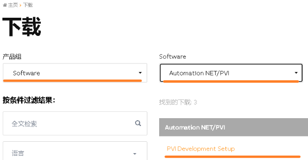

## RUC软件主要使用选项

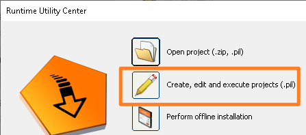

# 2. 仅使用 PVI 传输工具备份

## 2.1 准备

### 2.1.1 使用 PVI 传输工具建立在线连接

- 创建新列表
- 建立连接
- 例如

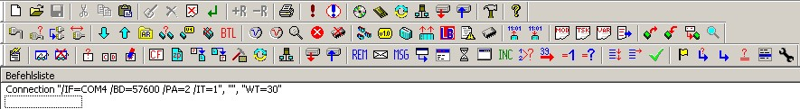

## 2.2 上传变量（PV)

### 2.2.1 加载变量列表（PV List）

- 导出所有变量（PV）
- 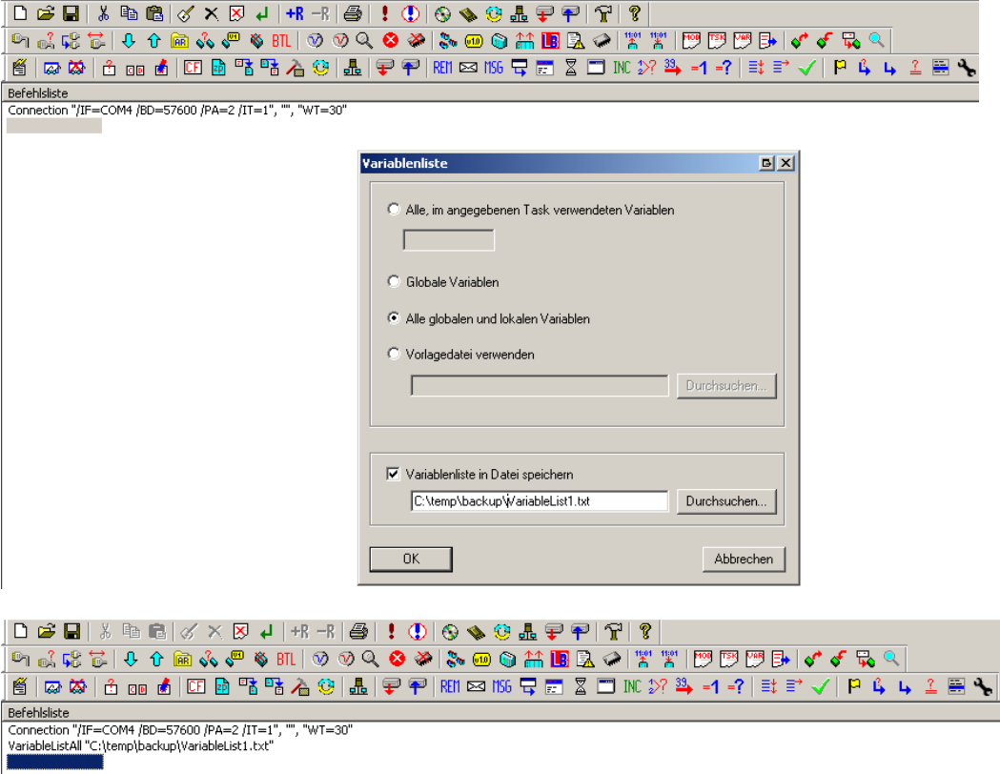
- 执行列表
- 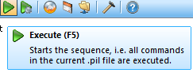
- 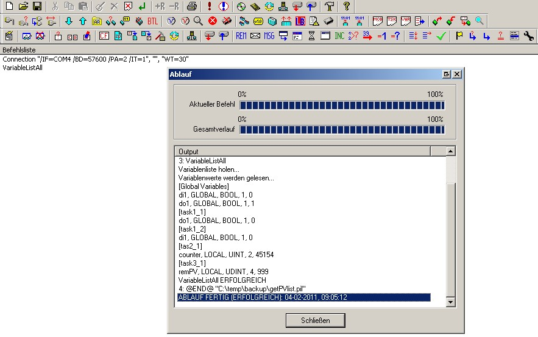
- 检查列表是否显示变量。如果列表为空，则可能出了问题
- 可能 CPU 处于 DIAG 模式，或者 CPU 上没有任务
- 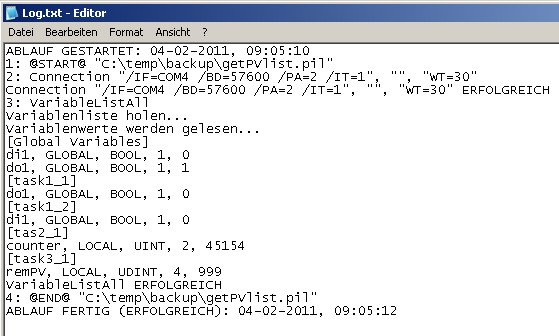

## 2.3 上传模块

### 2.3.1 导出任务模块列表

- 导出所有模块
- 如果选择的是 TaskList 而不是 ModuleList，则不会列出数据对象。
- 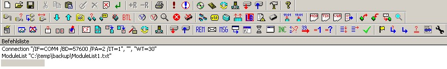
- 执行列表
- 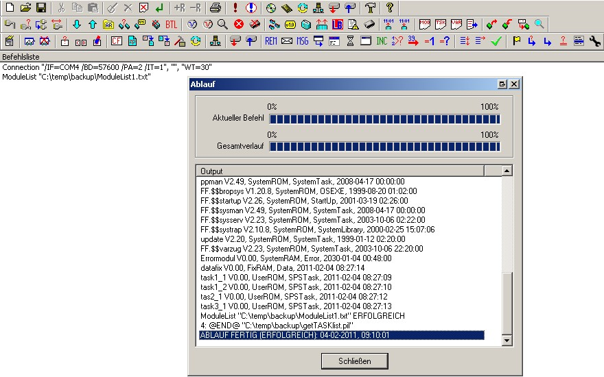
- 列出了任务、数据模块和系统模块。某些系统模块不能传输到 CPU。哪些模块将在接下来的步骤中说明
- 检查列表
- 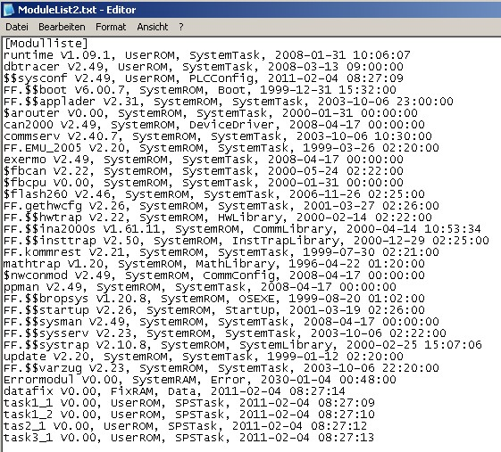

### 2.3.2 上传模块

- 创建一个上传列表，其中包含之前列表功能中显示的所有模块。
- 排除名称中包含 $ 和 FF.$$ 的所有模块。
  - 除了 $$sysconf，必须上传此模块。
- 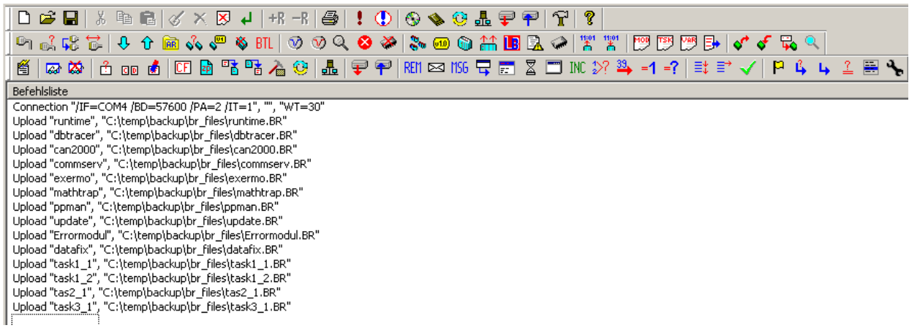
- 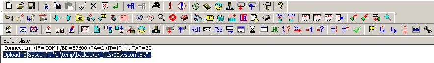
- 执行列表
- 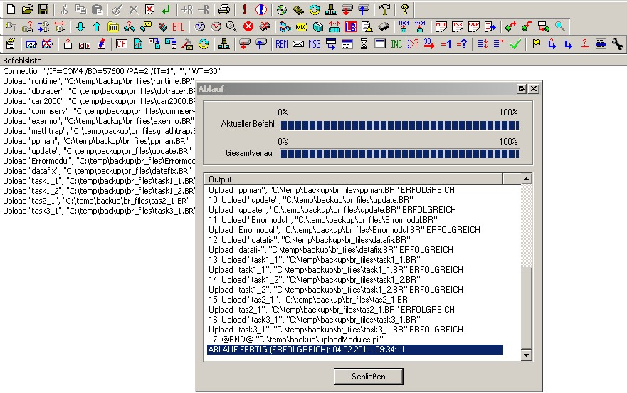
- 在 Windows 资源管理器中检查*.br 文件是否已从PLC中上传上来

## 2.4 新PLC，准备下载

- 如果可能，绝对不能碰原始 CPU。下载程序应使用备用 CPU。

### 2.4.1 获取AR版本

- 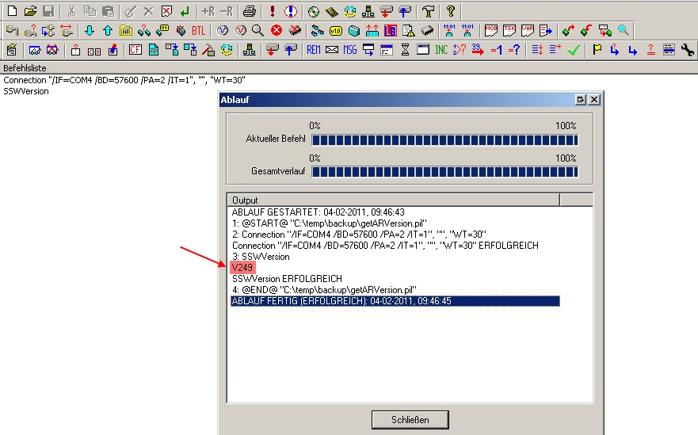

### 2.4.2 下载操作系统（Automation Runtime）

- 选择正确的 AR 版本并以 BOOTSTRAPLOADER 模式下载 AR
- 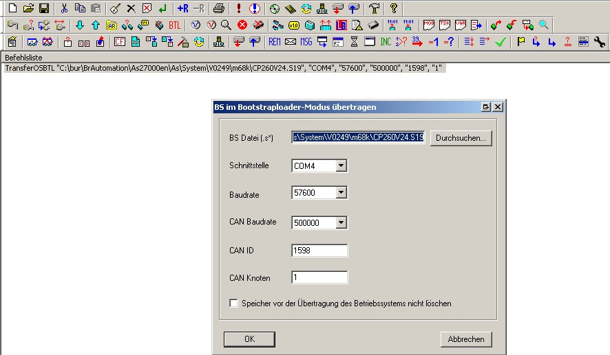
- 执行列表

### 2.4.3 获取系统模块

- 重命名原始模块列表文件（ModuleListOrig.txt）
- 再次执行步骤 2.3.1 加载模块
- 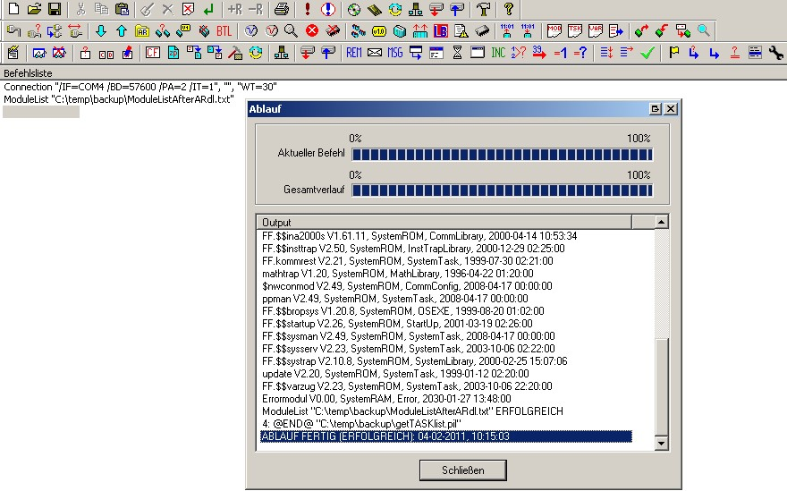
- 将新列表与原列表进行比较
- 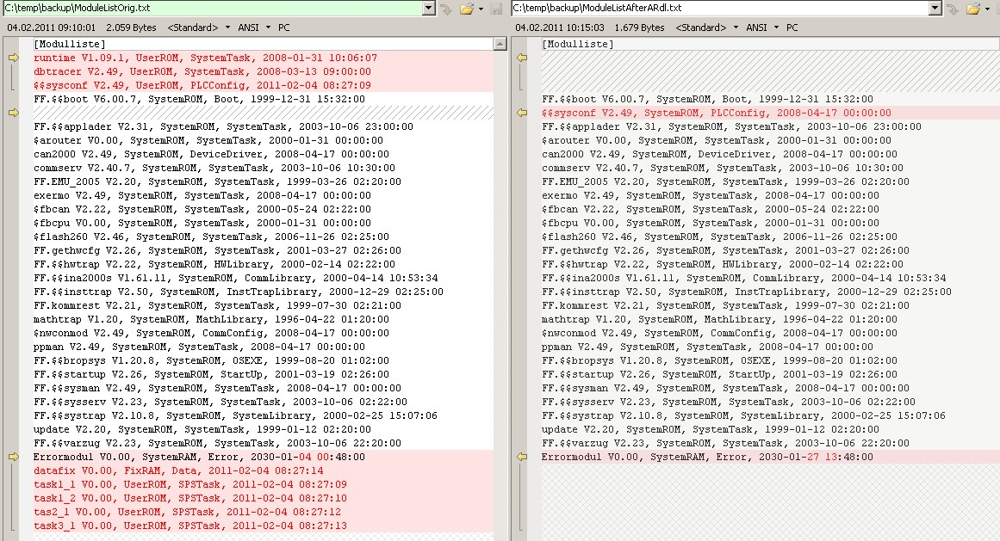

## 2.5 下载模块

- 只下载原始文件中未在 ModuleListAfterARdl 中显示的任务
- 还需要下载 $$sysconf。必须先重命名为 sysconf。
- 将模块下载到原来的内存中
- 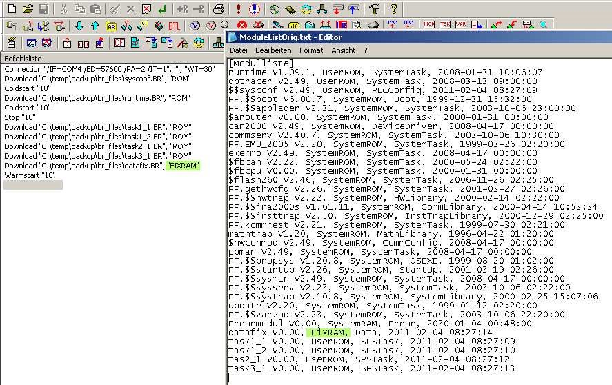
- 下载系统模块（sysconf、CANIO、burtrap...）
- 执行冷重启
- 下载任务和数据模块前停止 PLC
- 传输任务后执行热重启
- 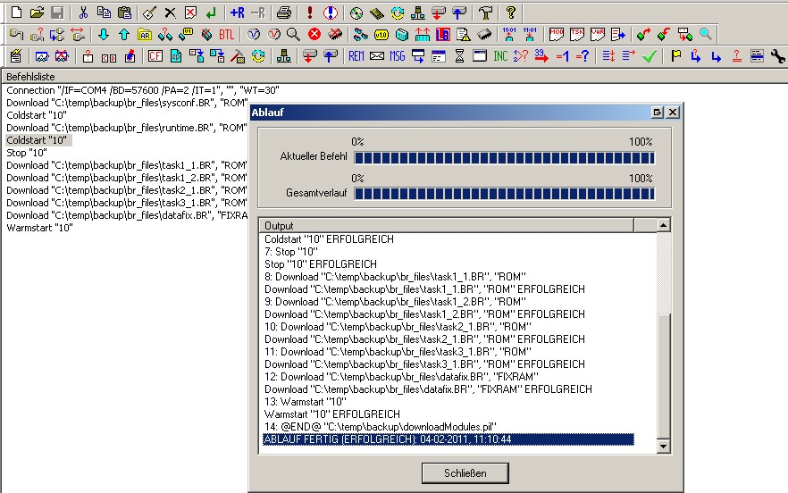

## 2.6 下载变量列表（PV List)

- 创建一个传输列表，其中包含先上传的 PV，这样，永久和临时 PV 将恢复原始值
- 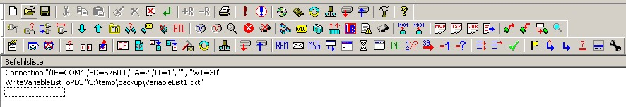
- 执行列表

# 3.附加 - 使用Automation Studio 2.x 和 PVI 传输工具进行备份

使用 Automation Studio 可以更方便地上传系统模块和数据模块。

AS 不能上传任务，但可以将上传的 br 文件插入新项目。AS 会对 CPU 进行必要的热重启和冷重启。

# 3.1 准备项目

- 创建一个包含所有硬件的新项目（名称 = 上传）。
- 选择正确的 AR 版本
- 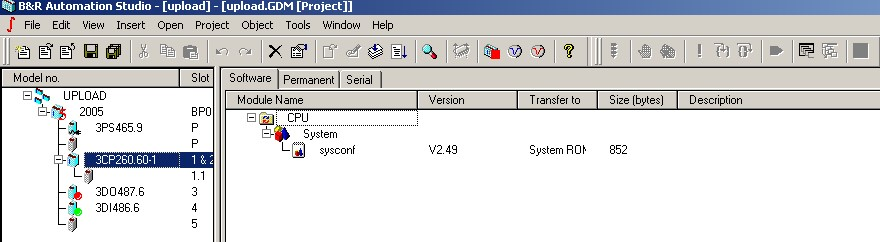
- 启动监控模式（dbtrace 将传输到 CPU）

-   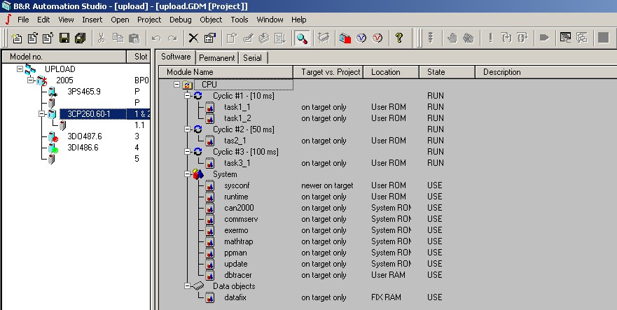

## 3.2 上传系统和数据对象 

- 系统和数据对象可以上传

-   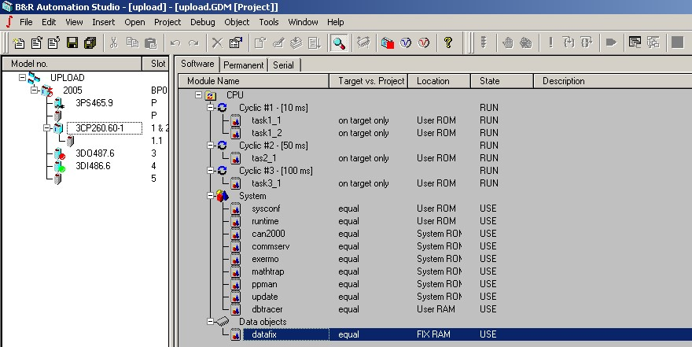

## 3.3 获取任务和 PV 列表 

- 使用 PVI 传输工具获取任务和 PV 列表 
- 使用 PVI 传输工具上传任务和 PV 
- 关闭 AS 并将上传的任务（*.br）复制到文件夹中  ...\upload.pgp\pgm\UPLOAD\CPU

- 任务将作为 br 文件（不含源文件）导入项目，并列在正确的任务类中。
- 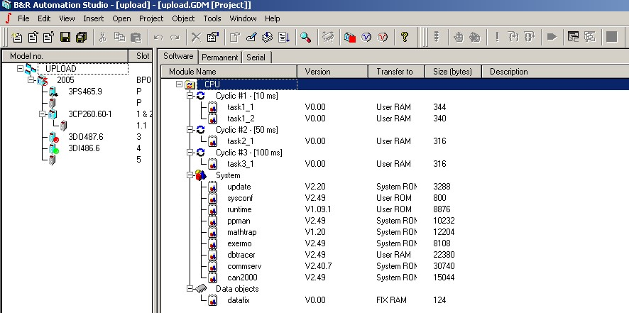

-   将传输目标更改为正确的目标（不要忘记 sysconf）
-   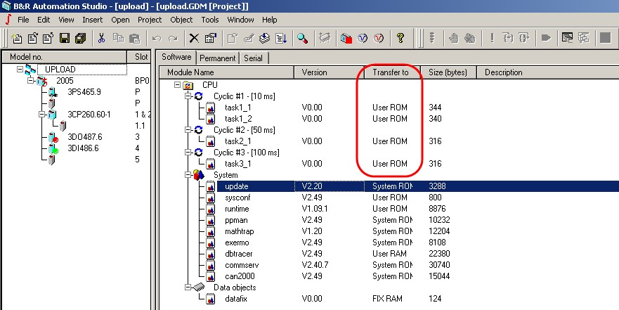
-   删除操作系统任务
- 这样就可以传输操作系统，并以监控模式检查目标上的任务。除 sysconf 外，所有显示的任务都可以删除。
-   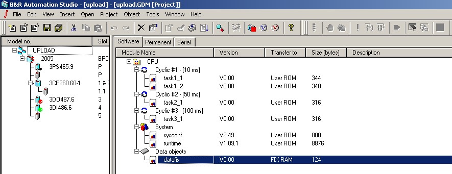

-   除了 PV 值之外，所有必要的数据现在都在这个项目中。

